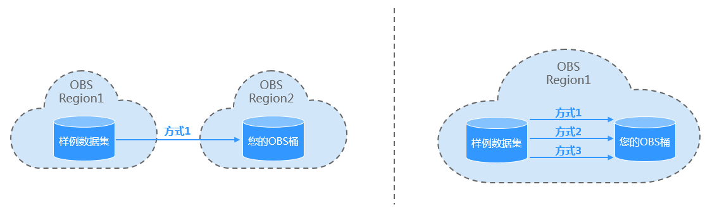
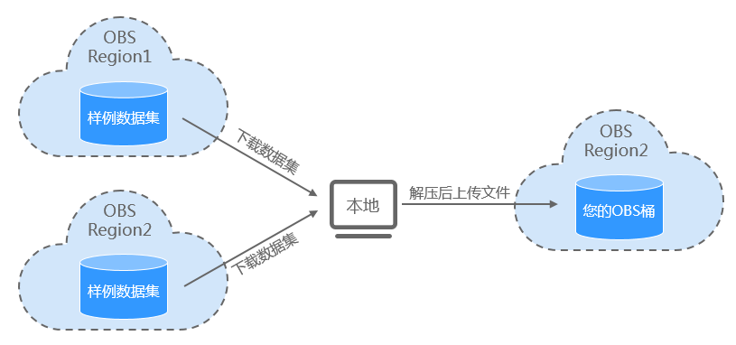

# 获取ModelArts样例使用的数据集<a name="modelarts_10_0017"></a>

ModelArts针对多种AI引擎提供了多个样例，供新手用户学习使用，样例指导请参见《[ModelArts最佳实践](ModelArts样例列表.md)》。针对每个样例，ModelArts已将样例数据集存储在公共OBS桶中，您可以根据自己所在区域，选择对应的OBS路径，获取样例数据集。

各个样例的数据集的存储信息请参见[样例数据集存储路径](#section57121432101515)，基于您所用的OBS桶所在区域不同，您可以使用不同的方法将样例数据集拷贝至您的OBS桶中，不同场景下可使用的方法如[图1](#fig666053791016)所示。当数据集比较大时，推荐采用“方式2”或“方式3”进行拷贝；当数据集比较小时，推荐采用“方式1”获取数据集，操作更加便捷简单。

-   [方式1：下载后再上传](#section187741236112318)
-   [方式2：使用MoXing接口从公共桶拷贝至您的OBS桶](#section1610719538238)
-   [方式3：使用OBS的obsutill工具拷贝](#section154771024132518)

**图 1**  拷贝样例数据集至您的OBS桶<a name="fig666053791016"></a>  


## 样例数据集存储路径<a name="section57121432101515"></a>

样例数据集存储时，分为“压缩包”或“解压版”两种样式，两种样式对应的数据是相同的。

-   **压缩包**：下载后，再上传至您自己的OBS桶中使用。需解压后使用，但是下载方便。
-   **解压版**：直接可以拷贝至您自己的OBS桶中，即OBS桶对桶拷贝，前提是您的OBS桶需与样例数据集的OBS桶属于同一个区域。

**表 1**  样例数据集详细路径

<a name="table889335391016"></a>
<table><thead align="left"><tr id="row979918587101"><th class="cellrowborder" valign="top" width="11.31886811318868%" id="mcps1.2.6.1.1"><p id="p2080011589108"><a name="p2080011589108"></a><a name="p2080011589108"></a>样例名称</p>
</th>
<th class="cellrowborder" valign="top" width="11.218878112188781%" id="mcps1.2.6.1.2"><p id="p3800155861017"><a name="p3800155861017"></a><a name="p3800155861017"></a>数据集样式</p>
</th>
<th class="cellrowborder" valign="top" width="9.749025097490252%" id="mcps1.2.6.1.3"><p id="p28002584105"><a name="p28002584105"></a><a name="p28002584105"></a>所在区域</p>
</th>
<th class="cellrowborder" valign="top" width="52.5947405259474%" id="mcps1.2.6.1.4"><p id="p680065811013"><a name="p680065811013"></a><a name="p680065811013"></a>对应的OBS路径</p>
</th>
<th class="cellrowborder" valign="top" width="15.11848815118488%" id="mcps1.2.6.1.5"><p id="p2573248131514"><a name="p2573248131514"></a><a name="p2573248131514"></a>对应的样例</p>
</th>
</tr>
</thead>
<tbody><tr id="row1723118214473"><td class="cellrowborder" rowspan="4" valign="top" width="11.31886811318868%" headers="mcps1.2.6.1.1 "><p id="p21015519586"><a name="p21015519586"></a><a name="p21015519586"></a>找云宝</p>
</td>
<td class="cellrowborder" rowspan="2" valign="top" width="11.218878112188781%" headers="mcps1.2.6.1.2 "><p id="p14467101714717"><a name="p14467101714717"></a><a name="p14467101714717"></a>压缩包</p>
</td>
<td class="cellrowborder" valign="top" width="9.749025097490252%" headers="mcps1.2.6.1.3 "><p id="p15565125234718"><a name="p15565125234718"></a><a name="p15565125234718"></a>华北-北京一</p>
</td>
<td class="cellrowborder" valign="top" width="52.5947405259474%" headers="mcps1.2.6.1.4 "><p id="p1256555284714"><a name="p1256555284714"></a><a name="p1256555284714"></a>https://modelarts-cnnorth1-market-dataset.obs.cn-north-1.myhuaweicloud.com/dataset-market/Yunbao-Data-Custom/archiver/Yunbao-Data-Custom.zip</p>
</td>
<td class="cellrowborder" rowspan="4" valign="top" width="15.11848815118488%" headers="mcps1.2.6.1.5 "><p id="p45841324161718"><a name="p45841324161718"></a><a name="p45841324161718"></a><a href="找云宝（使用自动学习实现物体检测应用）.md">找云宝（使用自动学习实现物体检测应用）</a></p>
</td>
</tr>
<tr id="row2050035854620"><td class="cellrowborder" valign="top" headers="mcps1.2.6.1.1 "><p id="p856675234718"><a name="p856675234718"></a><a name="p856675234718"></a>华北-北京四</p>
</td>
<td class="cellrowborder" valign="top" headers="mcps1.2.6.1.2 "><p id="p15661652194719"><a name="p15661652194719"></a><a name="p15661652194719"></a>https://modelarts-cnnorth4-market-dataset.obs.cn-north-4.myhuaweicloud.com/dataset-market/Yunbao-Data-Custom/archiver/Yunbao-Data-Custom.zip</p>
</td>
</tr>
<tr id="row7784168184713"><td class="cellrowborder" rowspan="2" valign="top" headers="mcps1.2.6.1.1 "><p id="p1246719174471"><a name="p1246719174471"></a><a name="p1246719174471"></a>解压版</p>
</td>
<td class="cellrowborder" valign="top" headers="mcps1.2.6.1.2 "><p id="p8566165254718"><a name="p8566165254718"></a><a name="p8566165254718"></a>华北-北京一</p>
</td>
<td class="cellrowborder" valign="top" headers="mcps1.2.6.1.3 "><p id="p756635213478"><a name="p756635213478"></a><a name="p756635213478"></a>s3://modelarts-cnnorth1-market-dataset/dataset-market/Yunbao-Data-Custom/unarchiver</p>
</td>
</tr>
<tr id="row678410814474"><td class="cellrowborder" valign="top" headers="mcps1.2.6.1.1 "><p id="p1956625284715"><a name="p1956625284715"></a><a name="p1956625284715"></a>华北-北京四</p>
</td>
<td class="cellrowborder" valign="top" headers="mcps1.2.6.1.2 "><p id="p5566155254719"><a name="p5566155254719"></a><a name="p5566155254719"></a>s3://modelarts-cnnorth4-market-dataset/dataset-market/Yunbao-Data-Custom/unarchiver</p>
</td>
</tr>
<tr id="row18524164318478"><td class="cellrowborder" rowspan="4" valign="top" width="11.31886811318868%" headers="mcps1.2.6.1.1 "><p id="p411691588"><a name="p411691588"></a><a name="p411691588"></a>花卉识别</p>
</td>
<td class="cellrowborder" rowspan="2" valign="top" width="11.218878112188781%" headers="mcps1.2.6.1.2 "><p id="p164361959115713"><a name="p164361959115713"></a><a name="p164361959115713"></a>压缩包</p>
</td>
<td class="cellrowborder" valign="top" width="9.749025097490252%" headers="mcps1.2.6.1.3 "><p id="p155661452154720"><a name="p155661452154720"></a><a name="p155661452154720"></a>华北-北京一</p>
</td>
<td class="cellrowborder" valign="top" width="52.5947405259474%" headers="mcps1.2.6.1.4 "><p id="p1566165211476"><a name="p1566165211476"></a><a name="p1566165211476"></a>https://modelarts-cnnorth1-market-dataset.obs.cn-north-1.myhuaweicloud.com/dataset-market/Flowers-Data-Set/archiver/Flowers-Data-Set.zip</p>
</td>
<td class="cellrowborder" rowspan="4" valign="top" width="15.11848815118488%" headers="mcps1.2.6.1.5 "><p id="p738912182175"><a name="p738912182175"></a><a name="p738912182175"></a><a href="花卉识别（使用TensorFlow预置算法实现图像分类）.md">花卉识别（使用TensorFlow预置算法实现图像分类）</a></p>
</td>
</tr>
<tr id="row15525104384711"><td class="cellrowborder" valign="top" headers="mcps1.2.6.1.1 "><p id="p165661152114712"><a name="p165661152114712"></a><a name="p165661152114712"></a>华北-北京四</p>
</td>
<td class="cellrowborder" valign="top" headers="mcps1.2.6.1.2 "><p id="p6566952154715"><a name="p6566952154715"></a><a name="p6566952154715"></a>https://modelarts-cnnorth4-market-dataset.obs.cn-north-4.myhuaweicloud.com/dataset-market/Flowers-Data-Set/archiver/Flowers-Data-Set.zip</p>
</td>
</tr>
<tr id="row75251438471"><td class="cellrowborder" rowspan="2" valign="top" headers="mcps1.2.6.1.1 "><p id="p6436185913573"><a name="p6436185913573"></a><a name="p6436185913573"></a>解压版</p>
</td>
<td class="cellrowborder" valign="top" headers="mcps1.2.6.1.2 "><p id="p5566195294716"><a name="p5566195294716"></a><a name="p5566195294716"></a>华北-北京一</p>
</td>
<td class="cellrowborder" valign="top" headers="mcps1.2.6.1.3 "><p id="p155661152134712"><a name="p155661152134712"></a><a name="p155661152134712"></a>s3://modelarts-cnnorth1-market-dataset/dataset-market/Flowers-Data-Set/unarchiver</p>
</td>
</tr>
<tr id="row195251143144715"><td class="cellrowborder" valign="top" headers="mcps1.2.6.1.1 "><p id="p17566135214472"><a name="p17566135214472"></a><a name="p17566135214472"></a>华北-北京四</p>
</td>
<td class="cellrowborder" valign="top" headers="mcps1.2.6.1.2 "><p id="p1456675214479"><a name="p1456675214479"></a><a name="p1456675214479"></a>s3://modelarts-cnnorth4-market-dataset/dataset-market/Flowers-Data-Set/unarchiver</p>
</td>
</tr>
<tr id="row198255320107"><td class="cellrowborder" rowspan="4" valign="top" width="11.31886811318868%" headers="mcps1.2.6.1.1 "><p id="p99821653111013"><a name="p99821653111013"></a><a name="p99821653111013"></a>冰山识别</p>
</td>
<td class="cellrowborder" rowspan="2" valign="top" width="11.218878112188781%" headers="mcps1.2.6.1.2 "><p id="p19467101734716"><a name="p19467101734716"></a><a name="p19467101734716"></a>压缩包</p>
</td>
<td class="cellrowborder" valign="top" width="9.749025097490252%" headers="mcps1.2.6.1.3 "><p id="p164673174472"><a name="p164673174472"></a><a name="p164673174472"></a>华北-北京一</p>
</td>
<td class="cellrowborder" valign="top" width="52.5947405259474%" headers="mcps1.2.6.1.4 "><p id="p208761921111616"><a name="p208761921111616"></a><a name="p208761921111616"></a>https://modelarts-cnnorth1-market-dataset.obs.cn-north-1.myhuaweicloud.com/dataset-market/Iceberg-Data-Set/archiver/Iceberg-Data-Set.zip</p>
</td>
<td class="cellrowborder" rowspan="4" valign="top" width="15.11848815118488%" headers="mcps1.2.6.1.5 "><p id="p62911693163"><a name="p62911693163"></a><a name="p62911693163"></a><a href="冰山识别（使用MoXing框架实现图像分类）.md">冰山识别（使用MoXing框架实现图像分类）</a></p>
</td>
</tr>
<tr id="row1198235351015"><td class="cellrowborder" valign="top" headers="mcps1.2.6.1.1 "><p id="p19467191744719"><a name="p19467191744719"></a><a name="p19467191744719"></a>华北-北京四</p>
</td>
<td class="cellrowborder" valign="top" headers="mcps1.2.6.1.2 "><p id="p587622115162"><a name="p587622115162"></a><a name="p587622115162"></a>https://modelarts-cnnorth4-market-dataset.obs.cn-north-4.myhuaweicloud.com/dataset-market/Iceberg-Data-Set/archiver/Iceberg-Data-Set.zip</p>
</td>
</tr>
<tr id="row10982185312106"><td class="cellrowborder" rowspan="2" valign="top" headers="mcps1.2.6.1.1 "><p id="p84671717104711"><a name="p84671717104711"></a><a name="p84671717104711"></a>解压版</p>
</td>
<td class="cellrowborder" valign="top" headers="mcps1.2.6.1.2 "><p id="p6468117174719"><a name="p6468117174719"></a><a name="p6468117174719"></a>华北-北京一</p>
</td>
<td class="cellrowborder" valign="top" headers="mcps1.2.6.1.3 "><p id="p128762213162"><a name="p128762213162"></a><a name="p128762213162"></a>s3://modelarts-cnnorth1-market-dataset/dataset-market/Iceberg-Data-Set/unarchiver</p>
</td>
</tr>
<tr id="row8982105311015"><td class="cellrowborder" valign="top" headers="mcps1.2.6.1.1 "><p id="p184681317164710"><a name="p184681317164710"></a><a name="p184681317164710"></a>华北-北京四</p>
</td>
<td class="cellrowborder" valign="top" headers="mcps1.2.6.1.2 "><p id="p16876172117166"><a name="p16876172117166"></a><a name="p16876172117166"></a>s3://modelarts-cnnorth4-market-dataset/dataset-market/Iceberg-Data-Set/unarchiver</p>
</td>
</tr>
<tr id="row998318531100"><td class="cellrowborder" rowspan="4" valign="top" width="11.31886811318868%" headers="mcps1.2.6.1.1 "><p id="p4983175341012"><a name="p4983175341012"></a><a name="p4983175341012"></a>手写数字识别</p>
</td>
<td class="cellrowborder" rowspan="2" valign="top" width="11.218878112188781%" headers="mcps1.2.6.1.2 "><p id="p498305341016"><a name="p498305341016"></a><a name="p498305341016"></a>压缩包</p>
</td>
<td class="cellrowborder" valign="top" width="9.749025097490252%" headers="mcps1.2.6.1.3 "><p id="p159839537105"><a name="p159839537105"></a><a name="p159839537105"></a>华北-北京一</p>
</td>
<td class="cellrowborder" valign="top" width="52.5947405259474%" headers="mcps1.2.6.1.4 "><p id="p14156539131614"><a name="p14156539131614"></a><a name="p14156539131614"></a>https://modelarts-cnnorth1-market-dataset.obs.cn-north-1.myhuaweicloud.com/dataset-market/Mnist-Data-Set/archiver/Mnist-Data-Set.zip</p>
</td>
<td class="cellrowborder" rowspan="4" valign="top" width="15.11848815118488%" headers="mcps1.2.6.1.5 "><p id="p783745161710"><a name="p783745161710"></a><a name="p783745161710"></a><a href="使用MoXing开发训练脚本-实现手写数字识别.md">使用MoXing开发训练脚本，实现手写数字识别</a></p>
<p id="p9831045121710"><a name="p9831045121710"></a><a name="p9831045121710"></a><a href="使用Notebook实现手写数字识别.md">使用Notebook实现手写数字识别</a></p>
<p id="p1183144531711"><a name="p1183144531711"></a><a name="p1183144531711"></a><a href="使用MXNet实现手写数字识别.md">使用MXNet实现手写数字识别</a></p>
<p id="p784194591719"><a name="p784194591719"></a><a name="p784194591719"></a><a href="使用TensorFlow实现手写数字识别.md">使用TensorFlow实现手写数字识别</a></p>
<p id="p91811205195"><a name="p91811205195"></a><a name="p91811205195"></a><a href="使用Caffe实现手写数字识别.md">使用Caffe实现手写数字识别</a></p>
</td>
</tr>
<tr id="row1998315537102"><td class="cellrowborder" valign="top" headers="mcps1.2.6.1.1 "><p id="p1598325318104"><a name="p1598325318104"></a><a name="p1598325318104"></a>华北-北京四</p>
</td>
<td class="cellrowborder" valign="top" headers="mcps1.2.6.1.2 "><p id="p18156163981617"><a name="p18156163981617"></a><a name="p18156163981617"></a>https://modelarts-cnnorth4-market-dataset.obs.cn-north-4.myhuaweicloud.com/dataset-market/Mnist-Data-Set/archiver/Mnist-Data-Set.zip</p>
</td>
</tr>
<tr id="row1098375341011"><td class="cellrowborder" rowspan="2" valign="top" headers="mcps1.2.6.1.1 "><p id="p2983053191010"><a name="p2983053191010"></a><a name="p2983053191010"></a>解压版</p>
</td>
<td class="cellrowborder" valign="top" headers="mcps1.2.6.1.2 "><p id="p3983185316108"><a name="p3983185316108"></a><a name="p3983185316108"></a>华北-北京一</p>
</td>
<td class="cellrowborder" valign="top" headers="mcps1.2.6.1.3 "><p id="p1315723921610"><a name="p1315723921610"></a><a name="p1315723921610"></a>s3://modelarts-cnnorth1-market-dataset/dataset-market/Mnist-Data-Set/unarchiver</p>
</td>
</tr>
<tr id="row199832535108"><td class="cellrowborder" valign="top" headers="mcps1.2.6.1.1 "><p id="p2983153151014"><a name="p2983153151014"></a><a name="p2983153151014"></a>华北-北京四</p>
</td>
<td class="cellrowborder" valign="top" headers="mcps1.2.6.1.2 "><p id="p5157193951611"><a name="p5157193951611"></a><a name="p5157193951611"></a>s3://modelarts-cnnorth4-market-dataset/dataset-market/Mnist-Data-Set/unarchiver</p>
</td>
</tr>
<tr id="row4984653161019"><td class="cellrowborder" rowspan="4" valign="top" width="11.31886811318868%" headers="mcps1.2.6.1.1 "><p id="p19984053131012"><a name="p19984053131012"></a><a name="p19984053131012"></a>Caltech图像识别</p>
</td>
<td class="cellrowborder" rowspan="2" valign="top" width="11.218878112188781%" headers="mcps1.2.6.1.2 "><p id="p1984165341018"><a name="p1984165341018"></a><a name="p1984165341018"></a>压缩包</p>
</td>
<td class="cellrowborder" valign="top" width="9.749025097490252%" headers="mcps1.2.6.1.3 "><p id="p169841353171019"><a name="p169841353171019"></a><a name="p169841353171019"></a>华北-北京一</p>
</td>
<td class="cellrowborder" valign="top" width="52.5947405259474%" headers="mcps1.2.6.1.4 "><p id="p15679185561615"><a name="p15679185561615"></a><a name="p15679185561615"></a>https://modelarts-cnnorth1-market-dataset.obs.cn-north-1.myhuaweicloud.com/dataset-market/Caltech101-data-set/archiver/Caltech101-data-set.zip</p>
</td>
<td class="cellrowborder" rowspan="4" valign="top" width="15.11848815118488%" headers="mcps1.2.6.1.5 "><p id="p175627252285"><a name="p175627252285"></a><a name="p175627252285"></a><a href="使用MXNet实现Caltech图像识别.md">使用MXNet实现Caltech图像识别</a></p>
</td>
</tr>
<tr id="row1298410537103"><td class="cellrowborder" valign="top" headers="mcps1.2.6.1.1 "><p id="p109841353141013"><a name="p109841353141013"></a><a name="p109841353141013"></a>华北-北京四</p>
</td>
<td class="cellrowborder" valign="top" headers="mcps1.2.6.1.2 "><p id="p17679055171616"><a name="p17679055171616"></a><a name="p17679055171616"></a>https://modelarts-cnnorth4-market-dataset.obs.cn-north-4.myhuaweicloud.com/dataset-market/Caltech101-data-set/archiver/Caltech101-data-set.zip</p>
</td>
</tr>
<tr id="row159846531106"><td class="cellrowborder" rowspan="2" valign="top" headers="mcps1.2.6.1.1 "><p id="p99841453101011"><a name="p99841453101011"></a><a name="p99841453101011"></a>解压版</p>
</td>
<td class="cellrowborder" valign="top" headers="mcps1.2.6.1.2 "><p id="p59841253181015"><a name="p59841253181015"></a><a name="p59841253181015"></a>华北-北京一</p>
</td>
<td class="cellrowborder" valign="top" headers="mcps1.2.6.1.3 "><p id="p1367918550162"><a name="p1367918550162"></a><a name="p1367918550162"></a>s3://modelarts-cnnorth1-market-dataset/dataset-market/Caltech101-data-set/unarchiver</p>
</td>
</tr>
<tr id="row4984185319104"><td class="cellrowborder" valign="top" headers="mcps1.2.6.1.1 "><p id="p49841253131014"><a name="p49841253131014"></a><a name="p49841253131014"></a>华北-北京四</p>
</td>
<td class="cellrowborder" valign="top" headers="mcps1.2.6.1.2 "><p id="p15679145531611"><a name="p15679145531611"></a><a name="p15679145531611"></a>s3://modelarts-cnnorth4-market-dataset/dataset-market/Caltech101-data-set/unarchiver</p>
</td>
</tr>
</tbody>
</table>

## 方式1：下载后再上传<a name="section187741236112318"></a>

针对方式1，其最大的特点是，对区域没有明确限制，您可以选择任意区域下载数据集。为提升操作效率，建议直接下载压缩包样式的样例数据集。但是下载和上传的速度，取决于您本地的网络情况。

**图 2**  方式1的操作示意图<a name="fig133571339131514"></a>  


1.  针对您需要使用的样例，选择其对应的样例数据集存储路径。您可以选择任意区域的OBS桶下面的数据集，建议选择压缩包样式的数据集下载路径。单击链接，样例数据集自动下载至本地。

    例如，单击“找云宝“样例的“华北-北京一“区域的下载地址，样例数据集的压缩包“Yunbao-Data-Custom.zip“将自动存储在本地。

2.  将获得的压缩包解压缩，然后将数据集存储的文件夹全部上传至您使用的OBS路径下。
    1.  首先，创建一个用于存储样例数据集的OBS桶及文件夹。

        例如，您已创建了命名为“test-modelarts“的OBS桶，且创建了一个命名为“dataset-yunbao“的文件夹。

    2.  将“Yunbao-Data-Custom.zip“在本地解压缩至“Yunbao-Data-Custom“文件夹下。
    3.  参考[上传文件](https://support.huaweicloud.com/usermanual-obs/zh-cn_topic_0045829660.html)，将“Yunbao-Data-Custom“文件夹下的所有文件上传至“test-modelarts/dataset-yunbao“OBS路径下。


## 方式2：使用MoXing接口从公共桶拷贝至您的OBS桶<a name="section1610719538238"></a>

针对方式2，其要求样例数据集与您的OBS桶在同一区域，且您熟悉Notebook以及ModelArts MoXing，您可以使用方式2提供的方式将公共桶中的样例数据集拷贝至您的OBS中。

建议在[表1](#table889335391016)中，获取对应样例的解压版数据集的OBS路径（S3格式的路径），然后在ModelArts中创建一个Notebook实例，通过如下操作步骤，将数据集拷贝至您的OBS桶中。

1.  进入ModelArts管理控制台，创建一个Notebook实例，然后在Jupyter页面中新建一个文件。
2.  单击新建的文件进入开发环境。
3.  检查样例数据集所在的公共桶是否可访问。

    例如，在[表1](#table889335391016)中，获取“找云宝“样例在“华北-北京一“的数据集所在位置，其OBS路径为“s3://modelarts-cnnorth1-market-dataset/dataset-market/Yunbao-Data-Custom/unarchiver“。执行如下命令检查。

    ```
    import moxing as mox
    mox.file.exists('s3://modelarts-cnnorth1-market-dataset/dataset-market/Yunbao-Data-Custom/unarchiver')
    ```

    如果返回“True“表示OBS桶正常。

4.  检查您的OBS桶是否可访问。

    例如，您已创建了命名为“test-modelarts“的OBS桶，且创建了一个命名为“dataset-yunbao“的文件夹。执行如下命令检查。

    ```
    import moxing as mox
    mox.file.exists('s3://test-modelarts/dataset-yunbao')
    ```

    如果返回“True“表示OBS桶正常。

5.  确认您是否具备OBS桶的写入权限。

    例如，上文中您要拷贝的目的OBS桶路径为“s3://test-modelarts/dataset-yunbao“。执行如下命令检查，如果未出现异常，表示您具备权限。

    ```
    import moxing as mox
    mox.file.write('s3://test-modelarts/dataset-yunbao/obs_file.txt', 'Hello, OBS Bucket!')
    mox.file.remove('s3://test-modelarts/dataset-yunbao/obs_file.txt', recursive=False)
    ```

6.  执行拷贝命令。将样本数据集从公共桶拷贝至您的OBS桶中。

    ```
    import moxing as mox
    mox.file.copy_parallel('s3://modelarts-cnnorth1-market-dataset/dataset-market/Yunbao-Data-Custom/unarchiver', 's3://test-modelarts/dataset-yunbao
    ')
    print ('Copy procedure is completed')
    ```

    当返回“Copy procedure is completed“和执行时间时，表示拷贝完成。例如如下类似信息。

    ```
    Copy procedure is completed
    CPU times: user 117 ms, sys: 92.3 ms, total: 209 ms
    Wall time: 58.3 s
    ```


## 方式3：使用OBS的obsutill工具拷贝<a name="section154771024132518"></a>

针对方式3，其要求样例数据集与您的OBS桶在同一区域，您可以使用OBS提供的obsutil工具直接拷贝。建议在[表1](#table889335391016)中，获取对应样例的解压版数据集的OBS路径（S3格式的路径），通过[复制对象](https://support.huaweicloud.com/utiltg-obs/obs_11_0017.html)命令拷贝至您的OBS桶中。

obsutil工具的操作指导请参见[OBS工具指南\>obsutil](https://support.huaweicloud.com/utiltg-obs/obs_11_0001.html)。

