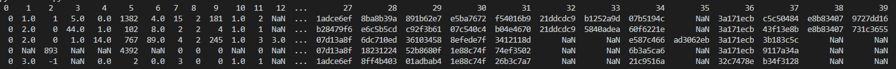
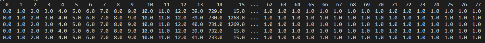
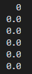

# DeepFM Data Preprocess

数据预处理脚本请参考： [data_process.py](code/data_process.py)

以[Criteo数据集](https://www.kaggle.com/c/criteo-display-ad-challenge/data "Criteo数据集")为例。

## 1. 输入数据


Criteo原始训练数据集为train.txt, 测试集为test.txt。 样例如下。
<center>

 
criteo原始数据
</center>

criteo 原始数据中，第一列为label，表示是否点击，后续39列为特征列，其中前13列为连续值特征，后26列为离散特征（为经过hash处理后的字符串）。


## 2. 预处理

### 2.1 预处理流程

- 统计各连续值列的min-max value; 统计各类别列的词典频次字典；

- 按threshold=100,对频次词典进行过滤，得到类别映射为id的map字典；

- 最后得到feature特征分为两种，id 和 weights 。
   - id特征存储的值都是map id，包括：
     - 连续特征列的map id（本例连续特征共13列，map id分别对应0-12）
     - 离散特征列的map id值（26列）
   - weights特征包括：
     - 连续值weights（MinMaxScaler处理后的值）
     - 离散值weights（有值的部分为1，Nan(空值)的为0）

特征数据共78列(0-38为id特征列，39-77为weights特征列)，内容格式如下：

criteo feature数据
<center>	

 
</center>
 criteo label数据
<center>

  
</center>

### 2.2 预处理参数
 
| 名称                 |  默认值 |  类型  |        描述          |
| --------------------| --------| ----- | -------------------- |
|data_file_path       |None     |string |      数据输入路径，文件夹或者文件路径|
|output_path          |None     |string |  预处理后数据存储路径  |
|value_col_num        |None     |int    |      连续特征列数     |
|category_col_num     |None     |int    |      离散特征列数     |
|multi_category_col_num  |0     |int    |      多值特征列数     |
|test_ratio           |0.1      |float  |      验证集切分占比   |
|threshold            |100      |int    | 词典中词频低于100的会被过滤掉， 会影响data vocab_size 的大小|
|part_rows            |2000000  |int  | 每个文件保存的样本数，样本量大时，可分成多个输出文件 |
|file_pattern         |   *     |string |     文件匹配字段，*默认匹配文件夹下所有文件|
|multi_category_sep   |   ,    |string | 多值特征之间的分隔符，默认","逗号分隔符，无多值特征时参数无用，请根据数据集真实情况填写|
|feat_sep             |   \t    |string | 特征之间的分隔符，包括连续，离散，多值特征，默认"\t"分隔符，请根据数据集真实情况填写|

**预处理脚本支持单文件，多文件。如果为单文件`data\_file\_path`指定为文件路径即可。如果原始数据集包含多个文件，`data\_file\_path`指定到文件的父目录。文件格式可通过`file_pattern`参数匹配。默认读取文件夹下所有的文件。**

### 2.3 命令参考
数据预处理默认使用32进程。可修改预处理脚本`num_process`变量。

    python data_process_multiprocess.py \
	--data_file_path=/home/xxx/deepfm/data/raw/data.txt \  （或者文件夹/home/xxx/deepfm/data/raw/）
	--output_path=/home/xxx/deepfm/output_data/ \
	--value_col_num=13 \
	--category_col_num=26 \
	--multi_category_col_num=0 \
	--test_ratio=0.2 \
	--threshold=50 \
	--part_rows=10000

预处理脚本默认自动进行切分（test_ratio=0.2），如果原始数据已经准备好训练和测试集，需要分开处理训练集和验证集。
参考如下命令。

**每重新执行一次预处理脚本，param.toml文件都会更新。如果训练集和测试集分开处理，处理完训练集后请记录日志中的打印的train\_size（训练集大小）的数值，或者从param.toml文件中查看；再次处理测试集时，将train\_size作为参数传入，否则train\_size为0，需手动改写param.toml文件中的train\_size的值。** param.toml中的参数将用于后续的训练。

训练集预处理：

    python data_process_multiprocess.py \
	--data_file_path=/home/xxx/deepfm/data/raw/train_data.txt \  （或者文件夹/home/xxx/deepfm/data/raw/）
	--output_path=/home/xxx/deepfm/output_data/ \
	--value_col_num=13 \
	--category_col_num=26 \
    --multi_category_col_num=0 \
	--test_ratio=0.0 \
	--threshold=50 \
	--part_rows=10000 \
    --file_pattern=train* (请根据文件具体格式改写）

**请记录日志或者param.toml文件中的train\_size（训练集大小）的数值。**

测试集预处理：

    python data_process_multiprocess.py \
	--data_file_path=/home/xxx/deepfm/data/raw/test_data.txt \  （或者文件夹/home/xxx/deepfm/data/raw/）
    --stats_output_path=/home/xxx/deepfm/output_data/stats_dict \ (处理完训练集后，在output_path路径下生成的stats_dict文件夹路径)
	--output_path=/home/xxx/deepfm/output_data/ \
	--value_col_num=13 \
	--category_col_num=26 \
	--multi_category_col_num=0 \
	--test_ratio=1.0 \
	--threshold=50 \
	--part_rows=10000 \
	--file_pattern=test* \ (请根据文件具体格式改写）
    --train_size=xxx (请根据训练集预处理结果填写）
    
## 3 输出数据
处理之后的数据格式如下：

```shell
output_path
  |- preprocessed_data（预处理后的txt格式数据，可删除，训练使用tfrecord数据）
    |- train_part_xxx.txt
    |- test_part_xxx.txt
    |- ...
  |- stats_dict (特征字典，用于在线推理服务)
    |- cat_count_dict.pkl
    |- val_min_dict.pkl
    |- val_max_dict.pkl
    |- multi_cat_count_dict.pkl
  |- tfrecord (预处理后的tfrecord格式数据，训练使用tfrecord格式）
    |- train_part_xxx.tfrecord
    |- test_part_xxx.tfrecord
    |- ...
  |- fixed（将多值特征中不定长特征转为定长特征的中间产物，自动会删除）
    |- fixed_xxx.txt
    |- ...
  |- param.toml(用于训练和在线推理的数据和模型参数)
```

# 4 数据集和预处理理解

criteo数据集格式（第一列表示label，前n列记录了一些连续特征值，后m列记录了离散特征值，此时n=3,m=2）
```shell
0  240  1  0.01  red    large
0  240  2  0.21  red    smalll
1  120  2  0.21  blue   large
1  30   3  0.31  black  small
```

转换成易于理解的数据格式其实就是针对一些商品的描述，比如商品的颜色（离散特征，枚举值），商品的价格（连续特征）
label则表示预测结果，比如说用户是否购买
```shell
sample     intensity  life    price  color  spec   label
1          240        1       0.01   red    large  0
2          240        2       0.21   red    small  1
3          120        2       0.21   blue   large  0
4          30         3       0.31   black  small  1
```

那么要将这个数据集经过预处理才能训练，预处理首先要针对每个特征建立一个id映射表
每个连续特征单独占一个id，每个离散特征每种取值各占一个id，OOV表示不在范围内的离散特征
```shell
intensity  shopid  life   color_OOV  color_red  color_blue  color_black  spec_OOV  spec_large  spec_small
0          1       2      3          4          5           6            7         8           9
```

针对连续性特征记录最大值和最小值
```shell
     intensity   life    price
max  240         3       0.31
min  30          1       0.01
```

将每一行样本转换成以下的id列表和value列表，ids表示该样本涉及的特征id
例如sample=2这个样本
涉及连续特征值三个intensity、shopid、life，所以ids中要加入[0,1,2]
那么values则要加入这些连续特征的值，并且要在最大值(max)和最小值(min)上做归一化，也就是(x - min) / (max - min)
sample=2这个样本的intensity是240，在intensity的最大最小值上归一化的结果是 (240 - 30) / (240 - 30) = 1.0
sample=2这个样本的life是2，在life的最大最小值上归一化的结果是 (2 - 1) / (3 - 1) = 0.5
sample=2这个样本的price是0.21，在intensity的最大最小值上归一化的结果是 (0.21 - 0.01) / (0.31 - 0.01) = 0.66667
所以values中要加入[1.0, 0.5, 0.66667]
然后涉及离散特征值，color是red，spec是large，所以取ids中加入[4,9]，离散特征的values为[1,1]

转换完毕得到以下特征，就可以进入DeepFM这个网络进行训练了
```shell
sample   ids                values                          label
1        [0, 1, 2, 4, 8]    [1.0,     0.0, 0.0,     1, 1]   0
2        [0, 1, 2, 4, 9]    [1.0,     0.5, 0.66667, 1, 1]   0
3        [0, 1, 2, 5, 8]    [0.42857, 0.5, 0.66667, 1, 1]   1
4        [0, 1, 2, 6, 9]    [0.0   ,  1.0, 1.0,     1, 1]   1
```

如果有多值特征，例如新增一个pages字段，可以取最大可能转换成定长特征，例如以下特征
```shell
sample  intensity  life    price  color   spec    pages     stat    label
1       240        1       0.01   red     large   A,B       X,Y     0
2       240        2       0.21   red     small   C,D,E,F   X,Y,Z   1
3       120        2       0.21   blue    large   A,G,H     X,Y     0
4       30         3       0.31   black   small   A,B,C     X,Y,Z   1
```

pages是一个多值特征，将其转换成定长
```shell
sample  intensity  life    price  color   spec    pages_1  pages_2  pages_3  pages_4  stat_1  stat_2  stat_3  label
1       240        1       0.01   red     large   A        B        OOV      OOV      X       Y       OOV     0
2       240        2       0.21   red     small   C        D        E        F        X       Y       Z       1
3       120        2       0.21   blue    large   A        G        H        OOV      X       Y       OOV     0
4       30         3       0.31   black   small   A        B        C        OOV      X       Y       Z       1
```


得到的映射表为：
```shell
intensity life price color_OOV spec_OOV pages_OOV stat_OOV color_red color_blue color_black spec_large spec_small pages_A pages_B pages_C pages_D pages_E pages_F pages_G pages_H stat_X stat_Y stat_Z
0         1    2     3         4        5         6        7         8          9           10         11         12      13      14      15      16      17      18      19      20     21     22
```

然后再将每个样本转换成ids + values的形式（为了便于示意，连续值未做归一化）
```shell
sample    ids                                values                           label
1         0,1,2,7,10,12,13,5,5,20,21,6       240,1,0.01,1,1,1,1,1,1,1,1,1     0
2         0,1,2,7,11,14,15,16,17,20,21,22    240,2,0.21,1,1,1,1,1,1,1,1,1     1
3         0,1,2,8,10,12,18,19,5,20,21,6      120,2,0.21,1,1,1,1,1,1,1,1,1     0
4         0,1,2,9,11,12,13,14,5,20,21,22     30,3,0.31,1,1,1,1,1,1,1,1,1      1
```
