# ModelArts智能标注提升70%数据标注效率

## 案例内容介绍

在AI开发过程中，数据标注的时间可能占了一半以上，非常消耗人力。本实验基于ModelArts智能数据标注功能，用AI来解决数据标注慢的问题，让开发者体验智能标注越标越准的魅力，高效完成海量数据的标注，大幅度提升标注效率。

在本实验中，您将使用ModelArts的数据标注功能，标注图片中的红灯、绿灯、黄灯、人行横道、限速标志和解除限速标志，并体验使用智能数据标注功能自动批量标注数据。

## 实验目标

- 掌握使用ModelArts手工标注数据的方法。
- 掌握使用ModelArts智能数据标注，提升标注效率的方法。

## 实验步骤

### ModelArts准备工作

 在使用ModelArts之前，您需要做如下工作：注册华为云账号、实名认证、配置访问授权以及创建OBS桶和文件夹。 

#### 注册华为云账号

在使用华为云服务之前您需要注册华为云帐号。通过此帐号，只需为使用的服务付费，即可使用所有华为云服务。 

 参考[此链接](https://support.huaweicloud.com/prepare-modelarts/modelarts_08_0001.html )，注册账号。

#### 实名认证

注册成功后即可自动登录华为云，您需要完成“实名认证”才可以正常使用服务。  

 参考[此链接](https://support.huaweicloud.com/usermanual-account/zh-cn_topic_0133456714.html)，完成实名认证，推荐使用扫码认证。 

#### 配置访问授权  

在您使用自动学习、数据管理、Notebook、训练作业、模型和服务等功能过程中，ModelArts可能需要访问您的OBS、SWR、IEF等依赖服务，若没有授权，这些功能将不能正常使用。

参考[此链接](https://support.huaweicloud.com/prepare-modelarts/modelarts_08_0007.html) ，完成授权配置（推荐使用委托授权）。

#### 创建OBS桶和文件夹

**OBS**，即**Object Storage Service**，对象存储服务，是华为云提供云上数据储存的服务。在使用ModelArts之前您需要创建一个OBS桶。 

登录[OBS管理控制台](https://storage.huaweicloud.com/obs/#/obs/manager/buckets)， 点击页面右上角"**创建桶**"按钮，将进入如下图所示页面：

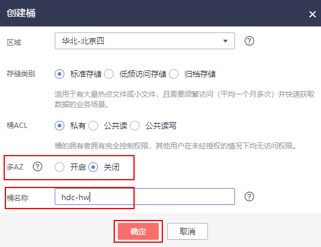

区域，选择“华北-北京四”，

数据冗余存储策略，选择“单AZ存储”，

桶名称，输入一个自定义的桶名，注意需确保该桶名在华为云上全局唯一（本实验创建的桶名称为“hdc-hw”，下文中所有需要填写桶名的地方，请替换为您自己创建的桶名），

其它参数保持默认值即可 ，点击右下角的“立即创建”，将进入桶列表页面。

在桶列表页面，找到刚创建的桶，点击桶名进入，再参考下图，点击“对象”、“新建文件夹”，在弹出对话框中按照命名规则填写“文件夹名称”，如“obs-data”，文件夹名称无需考虑华为云全局唯一，点击“确定”按钮即可完成文件夹创建。  

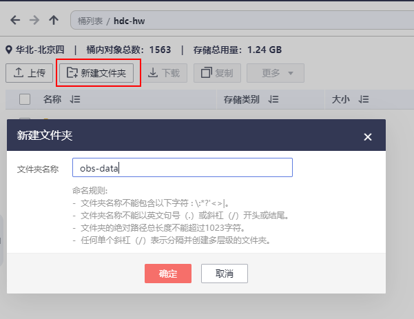

#### 下载实验数据到OBS  

点[此链接](https://marketplace.huaweicloud.com/markets/aihub/datasets/detail/?content_id=06ef28c4-80ec-49cc-a54b-79d96f54eecf)进入数据集详情页面，在右方点击“下载”按钮，区域选择“华北-北京四”，参考下图点击文件夹标志，选择之前创建的桶和文件夹作为目标位置，数据集将会被下载到该位置。

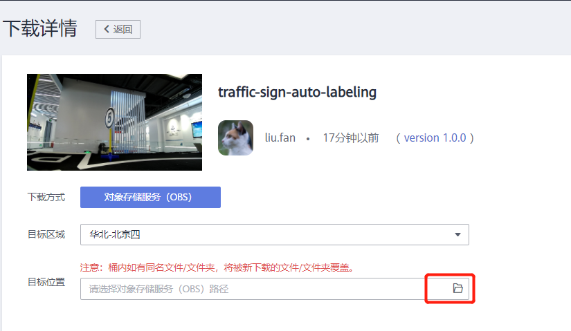

点击右下角的“确定”按钮，将进入下载进度页面，如下图所示。等待下载进度变成100%后，下图中的“目标位置”会变成一个可点击的链接。

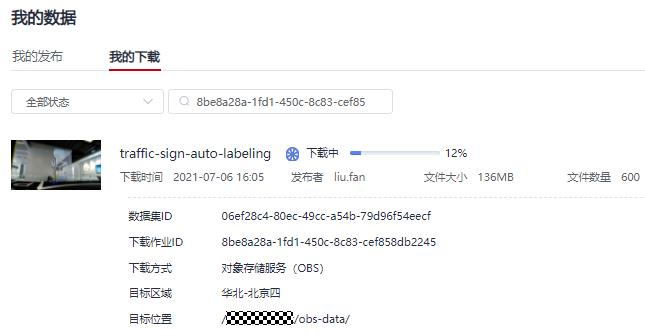

### 智能标注数据

#### 创建数据集  

**步骤1：**点击[此链接](https://console.huaweicloud.com/modelarts/?region=cn-north-4&locale=zh-cn#/dataset)进入ModelArts控制台，点击页面上的“数据管理 --> 数据集 --> 创建数据集”按钮， 进入到创建数据集页面。

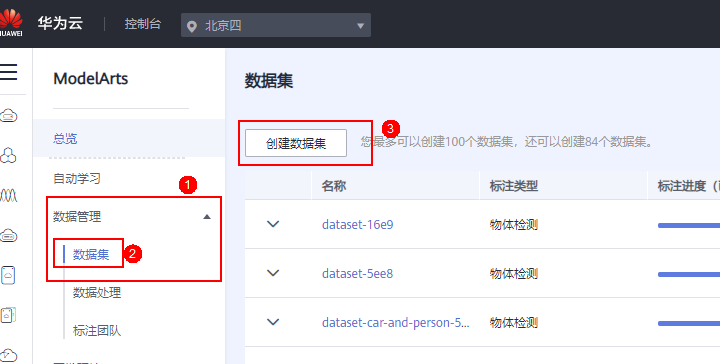

**步骤2：** 根据下图所示完成参数设置  。

**数据集名称**：自定义，如dataset-traffic-sign-auto-labeling

**描述**：自定义

**标注场景**：图片

**标注类型**：物体检测

**数据集输入位置**：traffic-sign-auto-labeling文件夹所在的OBS路径，

如：/hdc-hw/obs-data/traffic-sign-auto-labeling/

**数据集输出位置**：标注数据的输出OBS路径。需要在OBS中创建这个路径，

如： /hdc-hw/obs-data/data-output/

 **填写完成后，如下图所示：**

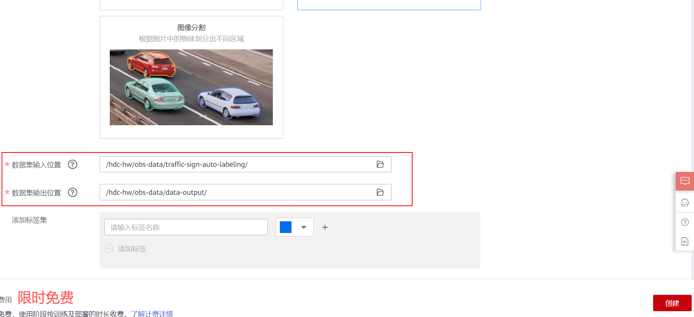

#### 手工标注一部分数据

**步骤1: ** 点击数据集名称，进入刚刚创建的数据集的总览页面。

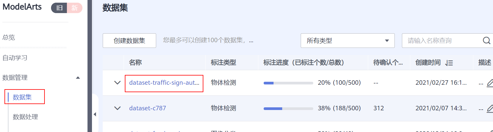

**步骤2: ** 查看当前标注进度，然后点击“开始标注”按钮，进入数据集标注页面。  

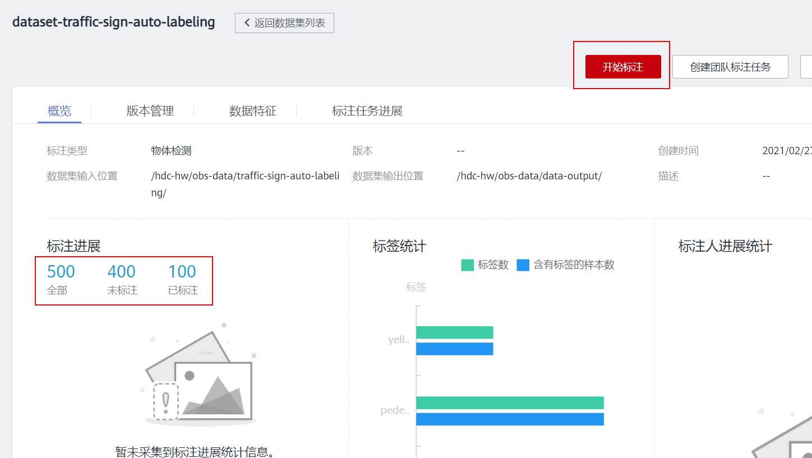

**步骤3: ** 点击“全部”页面的“同步数据源”按钮，数据同步完成后，右上角会出现“数据同步完成”的提示。“同步数据源”按钮的位置如下图所示：

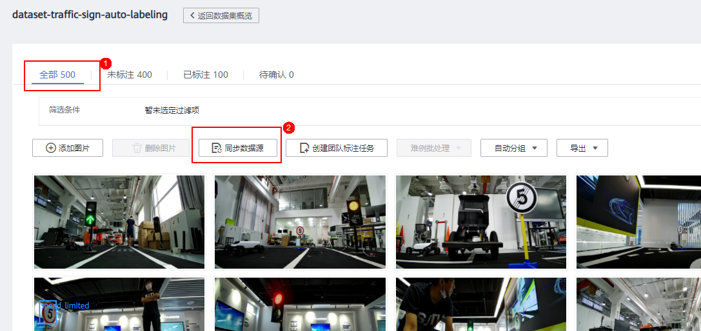

**步骤4: ** 点击进入“未标注”页面，该页面展示了所有未标注的图片。点击其中任意一张图片，进入单张图片的标注页面。进入图片的标注页面后，就可以正式对图片标注了。

**步骤5: ** 手动标注几张图片。

物体检测任务中，标注一个物体的方式是，首先围绕这个物体的外围画一个矩形框，然后打一个类别标签，最后点击“添加”按钮。

在ModelArts标注工具中，画矩形框的方式是先点击选择矩形的左上角，然后再点击选择矩形的右下角。

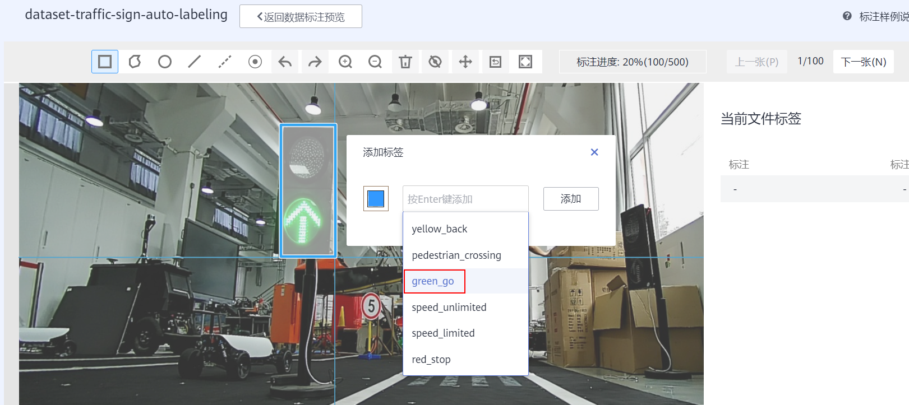

根据上述方法，手工标注几张图片，体验一下物体检测任务的标注工作。

**大家可以感觉到物体检测任务的标注工作量很大，并且枯燥无味，这个时候就可以使用智能标注。**

**智能标注的原理是，使用已标注的部分数据和半监督学习算法来训练一个模型，然后使用模型对剩下未标注的图片进行预测，预测完成后，人只需要对预测结果进行准确性的检查，预测准确的图片就直接使用算法标注的结果，预测不准确的就人工修正一下标注，这种人机协作的方式，就能大幅度提升标注效率。**

#### 智能标注剩余的数据

**步骤1: ** 返回到数据集标注界面，点击“启动智能标注”按钮，选择“主动学习”，然后点击“提交”按钮，启动智能标注作业。

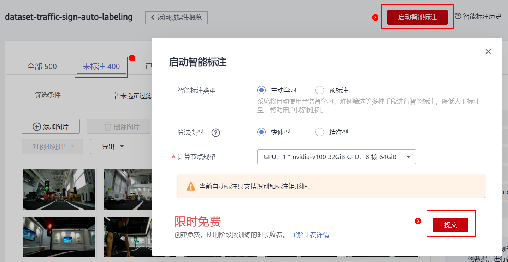

**步骤3:  **在数据集详情页，点击“待确认”页签，即可查看智能标注进度。您也可以在该页签，“启动智能标注”或者查看“智能标注历史”。

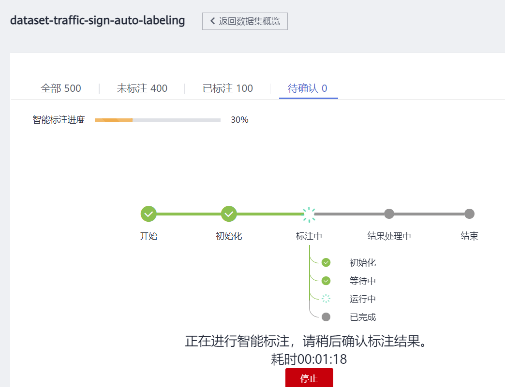

该智能标注作业大概会运行15分钟左右。

#### 修正并确认智能标注结果

**步骤1:  ** 智能标注作业完成后，在“待确认”页面会展示智能标注的结果。

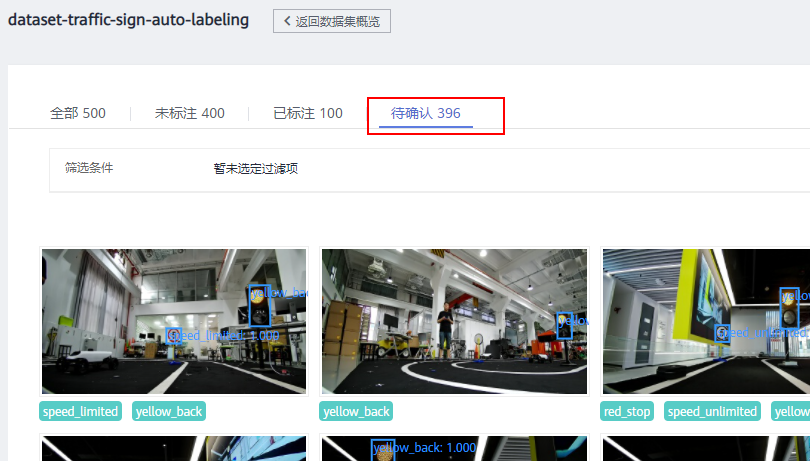

**注：此处的待确认396， 和未标注400，说明智能标注结果有396张图中检测了目标物体，有4张图片中没有目标物体，或者没有检测到目标物体，已经被自动过滤掉了。**

**步骤2:   **点击其中一张图片，进入确认页面，人工确认并修正智能标注的结果。

如果标注框的位置有偏离，或者物体的类别标签不对，可以人工修正智能标注结果。在“当前文件标签”列表中，选中这个标注框，点击“修改”按钮，然后就可以对标注框进行修正。或者点击“修改”按钮，修改类别标签。如果检测框错误，可以将它删除。

修正完标注信息后，就点击“确认标注”按钮，系统会将这张图片及其标注信息加入到已标注数据中。

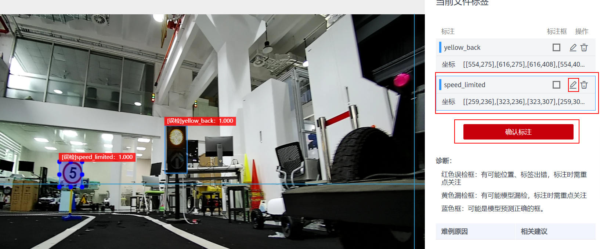

**注：智能标注结果中会出现“红色误检框“，有可能是位置有偏差、标签错误，检查时需重点关注。**

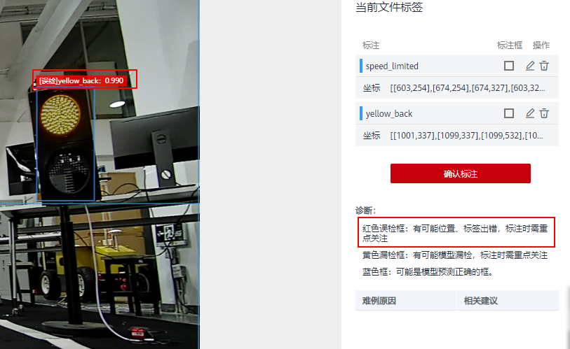

本案例由于时间和已标注数据数量有限，智能标注的结果可能不是很准确。在实际应用场景中，我们可以添加更多的数据，并标注更多的起始数据，这样智能标注的准确率就会提升。

#### 迭代进行智能标注

在实际应用场景中，智能标注是一个迭代的过程，每一轮只确认部分数据，然后继续启动下一轮智能标注，这样会使得智能标注的结果越标越准。

在本案例中，您可以只确认几张图片，然后就结束标注，只标注部分数据的数据集也可以用于训练模型。

### 发布数据集

标注好的数据集可以点击“发布”按钮，在参数设置页面对数据进行8：2的比例切分，点击“确认”按钮，完成数据集的发布。

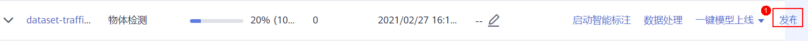

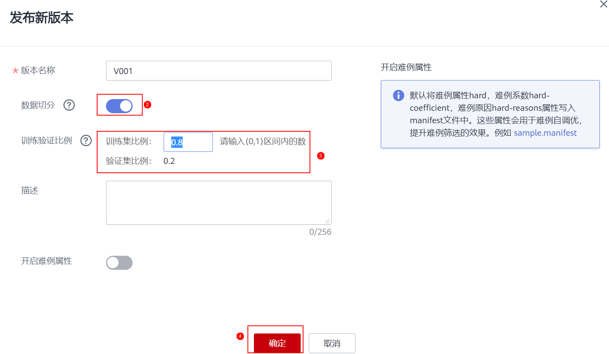

发布好的数据集可以在ModelArts上训练模型的时候使用。

至此，本案例完成。