# ModelArts智能数据标注提升70%效率_进阶版
本案例将详细介绍如何利用ModelArts的数据管理功能，进行数据预处理、自动分组、智能标注、特征分析等操作，完成数据集准备。
ModelArts是一站式的AI开发平台，ModelArts数据管理功能不仅提供了基础的数据标注、版本管理能力，同时还提供了数据处理（数据选择、数据清洗等）、自动分组、智能标注、特征分析等功能，帮助用户提升数据准备效率，在实际业务开发过程中，用户可以根据业务需求选择数据管理的一种或多种功能完成数据准备。

## 准备工作

参考[此文档](https://github.com/huaweicloud/ModelArts-Lab/blob/master/docs/ModelArts%E5%87%86%E5%A4%87%E5%B7%A5%E4%BD%9C/%E5%87%86%E5%A4%87%E5%B7%A5%E4%BD%9C%E7%AE%80%E6%98%93%E7%89%88.md)，完成ModelArts准备工作。包括注册华为云账号、ModelArts全局配置和OBS相关操作。

## 数据准备

数据集介绍：
用于物体检测，包含150张未标注样本。
数据集一共包含4种类别：熊猫、马、鹿、猴子
下载训练数据集：
我们从华为云AI Gallery订阅数据集至ModelArts，然后就可以在ModelArts中使用了。华为云AI Gallery中有开发者分享了丰富的数据集，大家可以前往订阅使用。
1、	单击[animal-150数据集](https://marketplace.huaweicloud.com/markets/aihub/datasets/detail/?content_id=e9098f7f-aa54-4890-a40b-de85bc6b2196)，打开AI Gallery的数据集详情页面。

2、单击右下角“下载”。
3、在弹出的对话框中，填写如下参数，将此数据集下载至数据管理中。

* “下载方式”：ModelArts数据集
* “目标区域”：华北-北京四
* “目标位置”：请选择前期准备工作中创建的OBS桶，可以在弹窗中通过“创建文件夹”，创建命名为animal的文件夹用于存储数据。
* “名称”：定义ModelArts中呈现的数据集名称。您可以自行定义。
	下载数据集:
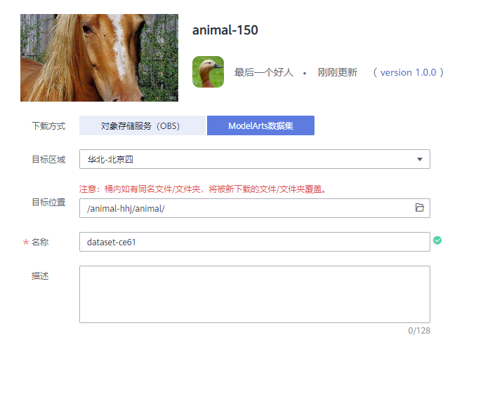

4、单击“确定”开始下载。页面自动进入下载列表，您可以通过进度列查看详细下载进度。
此页面需要自己手动刷新页面查看最新下载进度，下载预计要花费2分钟左右。
5、前往ModelArts管理控制台，在左侧菜单栏中选择“数据管理>数据集”，在数据集列表
中查看数据集状态。从AI Gallery下载数据集后，将在ModelArts数据管理页面创建命名为“dataset-animal”(你自己的命名)的数据集。您可以进入数据集列表，查看到下载任务创建的数据集，单击名称左侧的小三角，展开数据集详情，可查看数据集的导入状态。当状态变为“导入完成”时，表示数据集已准备就绪。
查看导入状态:
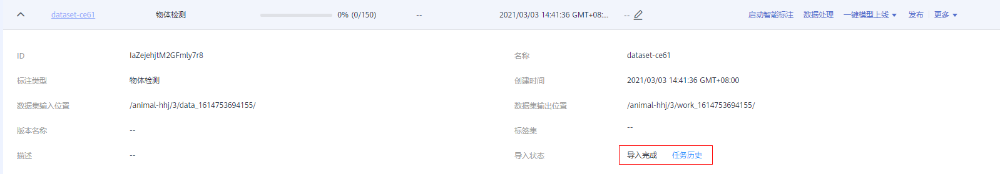

## 数据处理
在AI开发过程中，采集的数据可能存在大量重复数据，重复数据对模型精度提升并没有太大作用，反而需要花费很多时间对其进行标注。此时，可使用数据选择进行数据预处理，对采集到的数据去重，根据相似度删除一些重复度比较高的数据，从而减少数据的标注量 。
**1、发布数据集版本。**
在执行数据选择处理前，我们需要先发布一个数据集版本，作为数据校验算法的输入。
a.进入“数据管理>数据集”页面，选择从AI Gallery下载的数据集，单击右侧操作列的“发布”。
b.在弹出的“发布新版本”对话框中，填写如下参数，然后单击“确定”发布数据集版本。
“版本名称”：系统默认以V001开始，您也可以自行定义版本名称。
其他参数建议使用默认值。
发布数据集版本:
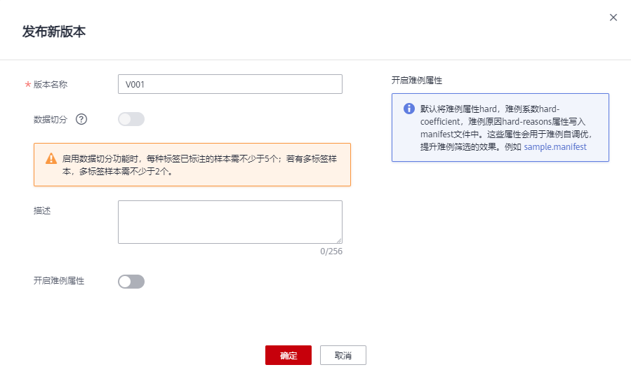

**2、创建数据处理任务。**
在左侧菜单栏中，选择“数据管理>数据处理”，单击“创建”。
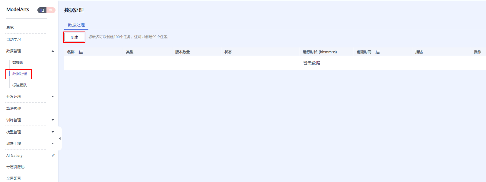  
在“创建数据处理”页面，填写如下参数，然后单击创建，完成数据处理任务的创建。
* “名称”：自定义方便辨识的任务名称。
* “场景类别”：物体检测
* “数据处理类型”：数据选择
* “算法”：SimDeduplication
* “输入”：数据集，选择刚才创建的数据集及其数据集版本
* “输出”：选择刚才创建的数据集作为目标数据集，并指定一个新的数据集版本名称，数据处理结果会保存为该数据集的一个新版本。

创建数据处理任务:
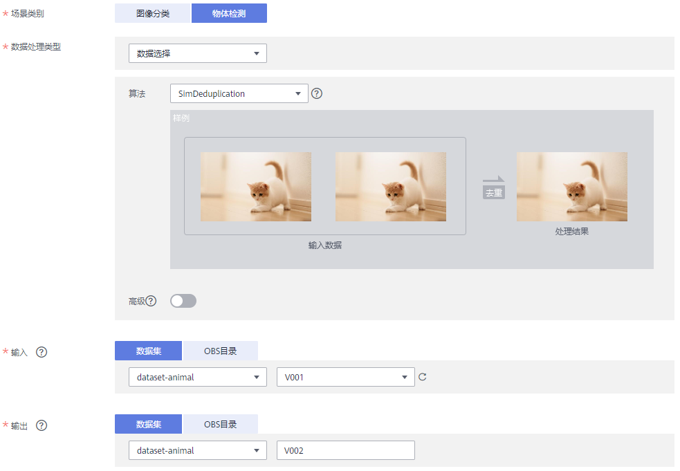
数据处理任务创建完成后，任务将自动启动，且界面自动跳转至数据处理任务列表页面。当数据处理任务状态变为“完成”时，表示任务执行完成。
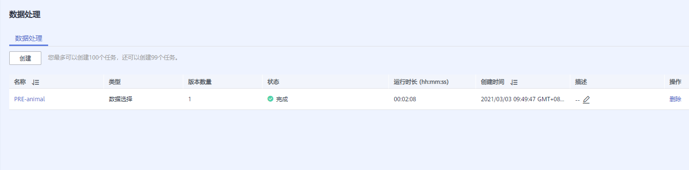
**3、查看数据选择结果。即删除相似图像后的结果。**
数据选择任务完成后，单击任务名称进入详情页面。在详情页面中，选择“结果展示”页签，可查看全部数据、保留数据以及删除的数据。在“删除”页签下，即根据算法规则，删除的相似度较高的图像。
查看数据选择结果:

**4、将数据选择后的版本设置为数据集当前版本。**
数据处理任务执行后，其处理结果对应的数据集版本不会作为当前版本。为方便后续数据标注、特征分析等操作，需要将数据选择后的数据集版本，设置为数据集的当前版本。
a．进入“数据管理>数据集”页面，单击进行处理的数据集名称（dataset-animal），进入数据集概览页。
b. 选择“版本管理”页签，选中数据处理后的版本（即步骤2中输出参数对应的版本），然后单击“设置为当前版本”。
设置为当前版本:
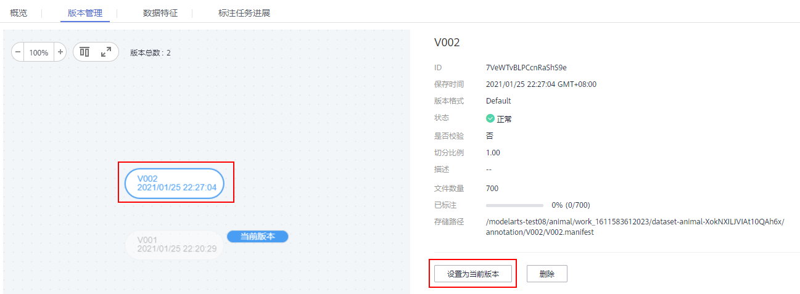
## 自动分组
自动分组可以理解为数据标注的预处理，先使用聚类算法对未标注图片进行聚类，再根据聚类结果进行处理，可以分组打标或者清洗图片。
**1、	启动自动分组任务，并等待任务完成。**
a.	在数据集详情页面，选择“全部”页签，单击“自动分组>启动任务”。
启动自动分组任务:
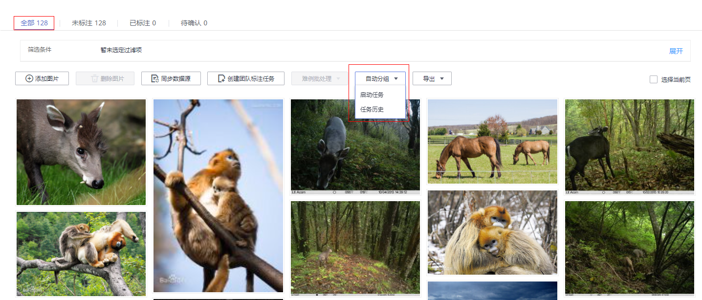
b.	在弹出的“自动分组”窗口中，设置如下参数，然后单击“确定”，启动任务。
* “分组数”：4。由于此数据集中的类别是4种，因此在分组任务中直接定义为4。针对用户的数据，可大致浏览下数据集，对数据集已有类别进行统计，分组数设置为数据集中的类别数。
* “结果处理方式”：更新属性到当前样本中。
* “属性名称”：自定义方便辨识的名称

自动分组任务设置:

自动分组任务执行过程中，右上角将提示任务进展，您可以选择“自动分组>任务历史”，查看任务进展。任务执行预计需要几分钟时间，请耐心等待。当任务状态变更为“成功”时，表示任务运行结束。
任务进展:
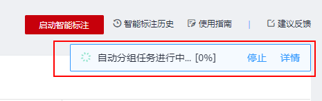

**2、数据筛选查看。**
当自动分组任务完成后，您可以通过数据筛选功能，查看分组后，不同类别的详细数据。
“全部”页签下，单击“筛选条件”右侧的“展开”，在“样本属性”右侧，选择自动分组定义的属性名称，然后选择不同的类别。自动分组任务定义的是4种分类，此时可通过0、1、2、3进行筛选查看4种不同类别下的数据。
筛选数据:
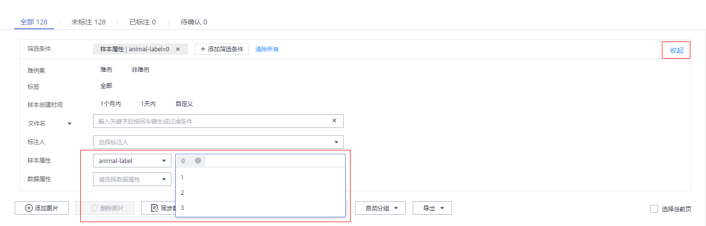
例如选择“2”，下方数据详情页展示同一类别的数据。自动将数据进行分组，可以在筛选结果中，即同一类别数据下，进入标注页面进行某一标签的标注，提升标注效率。针对图像分类任务，则可批量选中图像，进行批量标注，标注效率提升明显
展示同一类别数据:
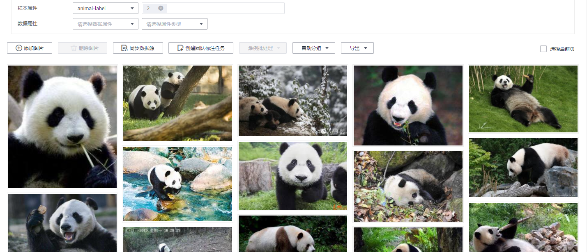
## 智能标注
**1、人工标注部分数据。**
在启动智能标注前，需人工完成少量数据标注，每个标签至少15张图片。
a.	定义标签。在“数据集概览”页面，单击右上角的“修改”，在弹出窗口中定义本数据集将使用的标签名称。例如panda、horse、monkey、deer。
b.	定义标签
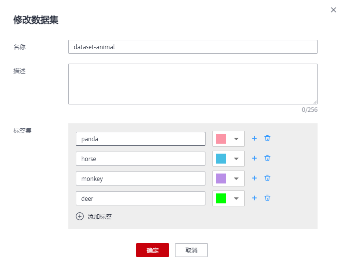
c.	单击“开始标注”，进入详情页面进行标注。可通过“自动分组”先对数据进行分组，筛选出某一种类别的数据，单击图片进入并完成数据标注。每一种类别，建议至少完成15张图片的标注。
框选好检测目标，会自动弹出添加标签页面，点击想要添加的标签，点击“添加”，就算是标注完毕了。点击“下一张”，就可以进行下一张图片的标注。
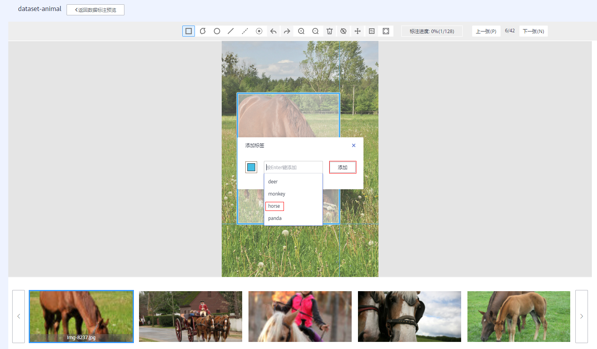
标注完一个类别的图片（建议至少标注15张）后可直接点击“返回数据标注预览”，弹出的提示框点击“确定”（若不弹出提示框，可直接进入下一步，系统会自动保存标注信息）。再进行下一个类别的图片标注。
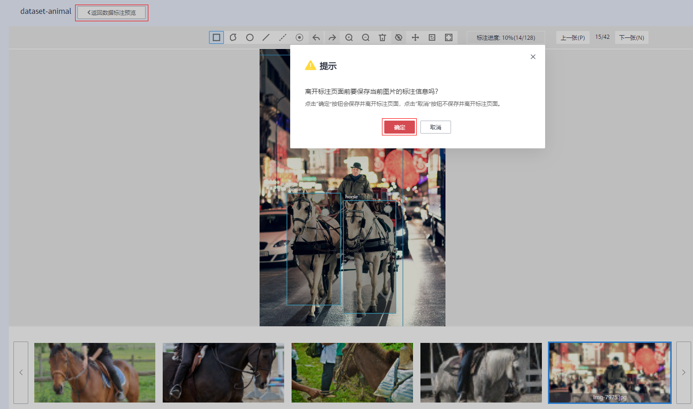 
标注部分数据:
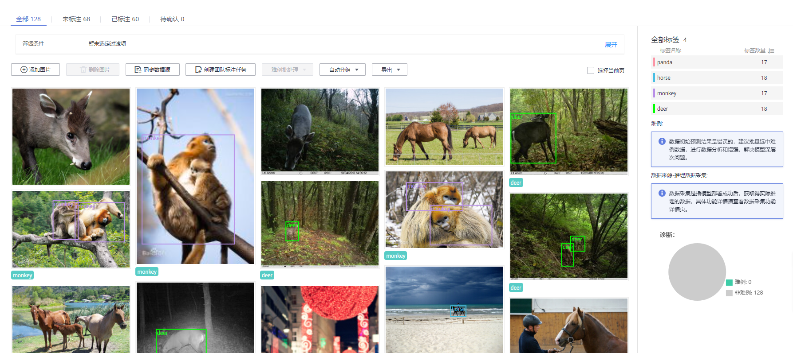
**2、启动智能标注。**
a.在数据集详情页面，单击右上角“启动智能标注任务”。
b.在“启动智能标注”窗口中，填写如下参数，然后单击“提交”。
* “智能标注类型”：主动学习
* “算法类型”：快速型
* 其他参数值请采用默认值。
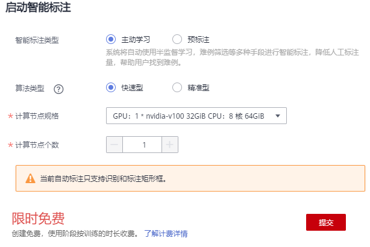

智能标注任务启动后，可以在“待确认”页签下查看智能标注任务进度。60多张图片，预计需等待几分钟，数据越多，任务运行时长越长，请耐心等待。
当任务完成后，即可在“待确认”页签下查看自动标注好的数据。
查看智能标注任务进度:
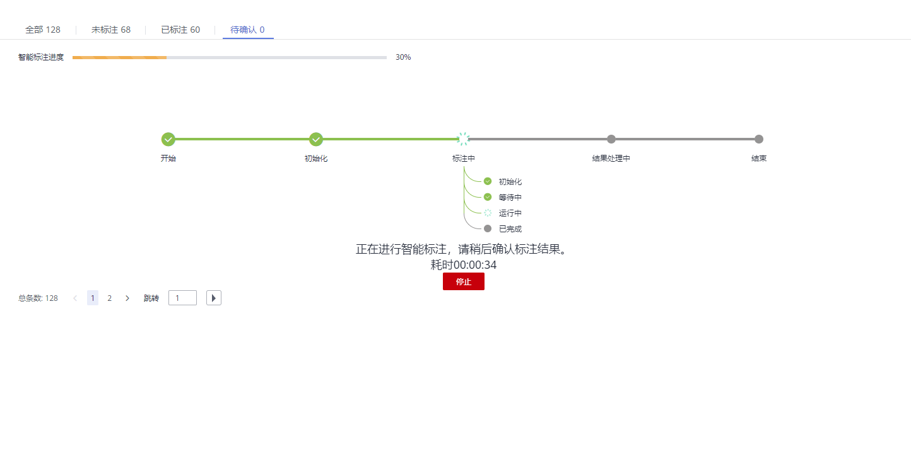
c.确认智能标注结果。
在智能标注任务完成后，在“待确认”页签下，单击具体图片进入标注详情页面，可以查看或修改智能标注的结果。
如果智能标注的数据无误，可单击右侧的“确认标注”，如果标注信息有误，可直接删除错误标注框，然后重新标注，以纠正标注信息。针对物体检测任务，需一张一张确认。确保所有图片已完成确认，然后执行下一步操作。
 确认结果:
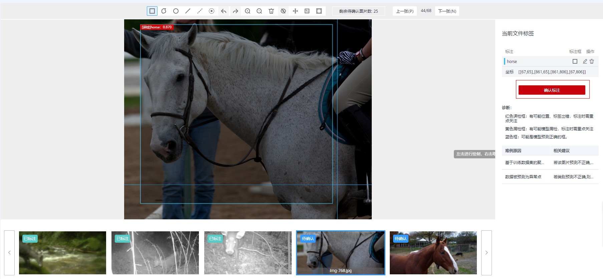
如果有一些图片很模糊，没有识别出检测目标，则需自己手动标注，点击矩形按钮，标注完再点击确认标注即可。
如图：
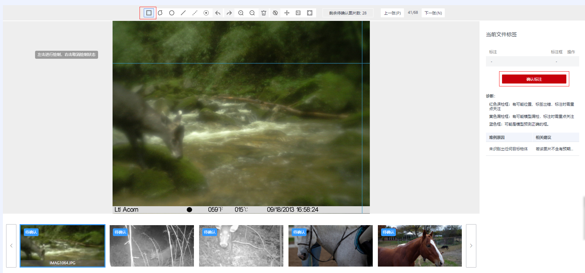
由于智能标注是基于前面个人标注行为来分析数据，所以个人标注得越准确，智能标注也就越准确，但智能标注难免会有一些误检，对于误检，点击右侧删除标识符，然后再重新标注即可。
如图：

## 特征分析
标注完成后，可以基于图片或目标框对图片的各项特征，如模糊度、亮度进行分析，帮助用户更好的分析数据集的数据质量和标注质量，判断数据集是否满足自己的算法和模型要求。
**1、创建特征分析任务。**
a.在执行特征分析前，需先发布一个数据集版本。在智能标注并确认完的数据，单击右上角“返回数据集概览”，然后单击“发布”，发布一个新版本。
b.版本发布完成后，进入数据集概览页。选择“数据特征”页签，单击“特征分析”，在弹窗中选择刚才发布的数据集版本，并单击“确定”，启动特征分析任务。
启动特征分析:
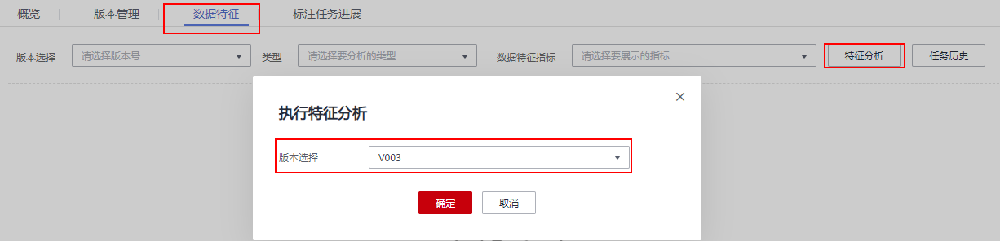
c.查看任务进度。
任务执行过程中，可以单击“任务历史”，查看任务进度。当任务状态变为“成功”时，表示任务执行完成。
查看任务进度:
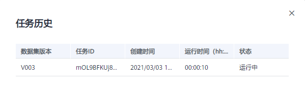
**2、查看特征分析结果。**
特征分析任务执行完成后，可以在“数据特征”页签下，选择“数据集版本”、“类型”和“数据特征指标”，页面将自动呈现您选择对应版本及其指标数据，您可以根据呈现的图表了解数据分布情况，帮助您更好的理解您的数据。
* “版本选择”：根据实际情况选择已执行过特征任务的版本，可以选多个进行对比，也可以只选择一个。
* “类型”：根据需要分析的类型选择。支持“all”、“train”、“eval”和“inference”。分别表示所有、训练、评估和推理类型。

* “数据特征指标”：选择您需要展示的指标。详细指标解释，可参见[特征分析指标列表](https://support.huaweicloud.com/engineers-modelarts/modelarts_23_0185.html#section2)。

查看特征分析结果:
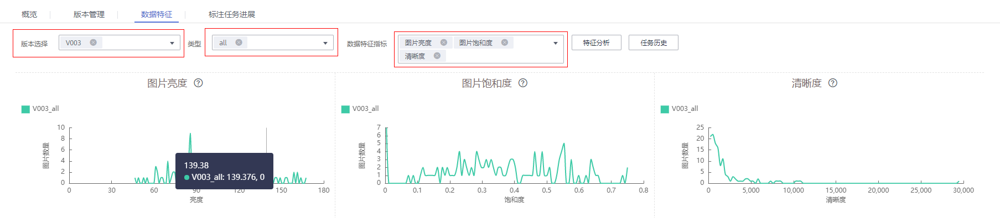

在特征分析结果中，例如图片亮度指标，数据分布中，分布不均匀，缺少某一种亮度的图片，而此指标对模型训练非常关键。此时可选择增加对应亮度的图片，让数据更均衡，为后续模型构建做准备。

至此，本案例完成。