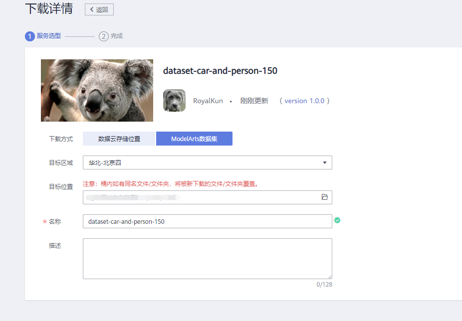
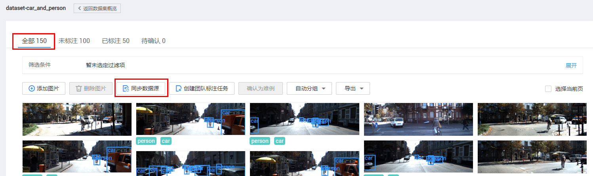
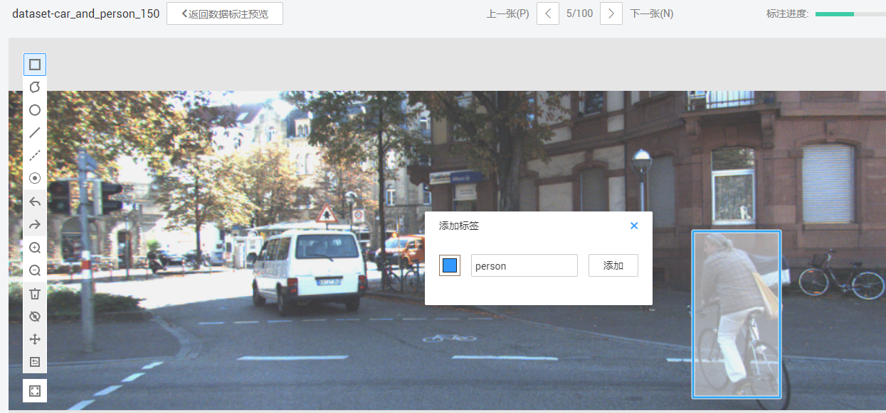
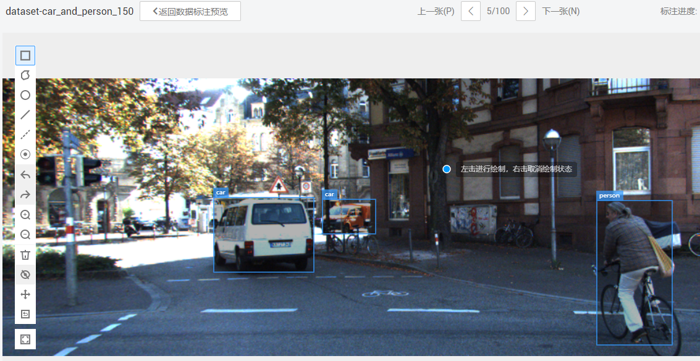
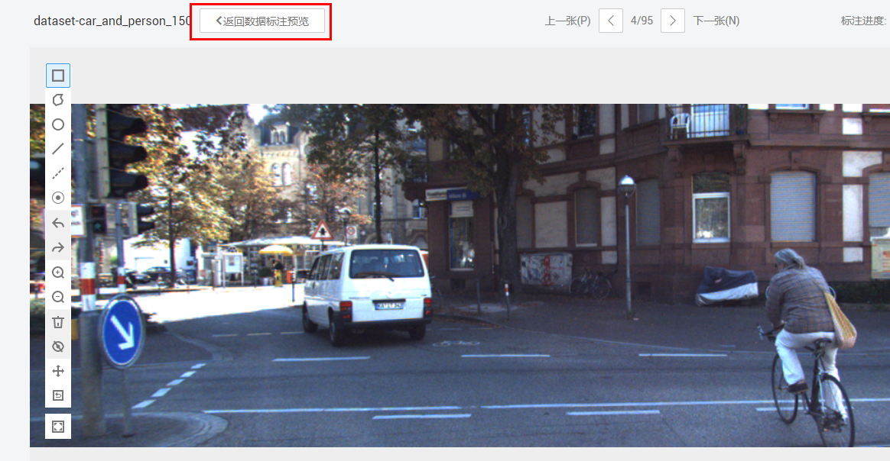
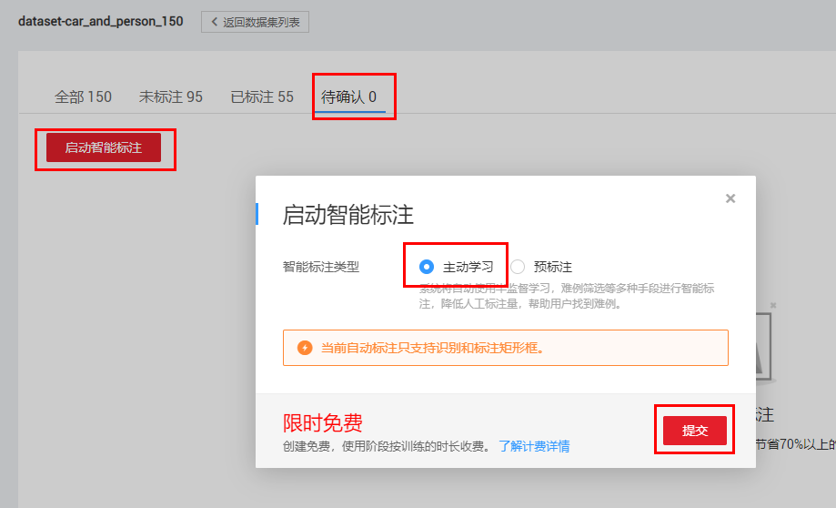
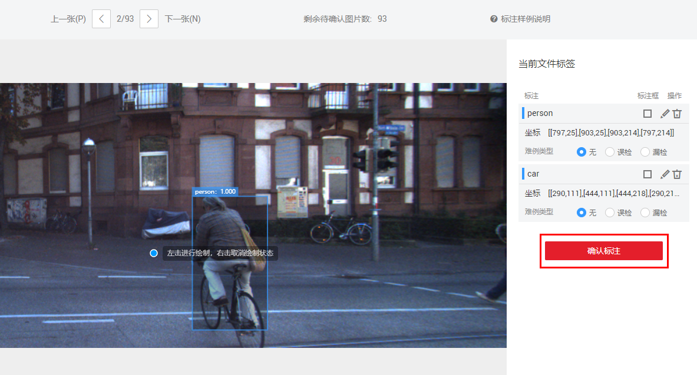
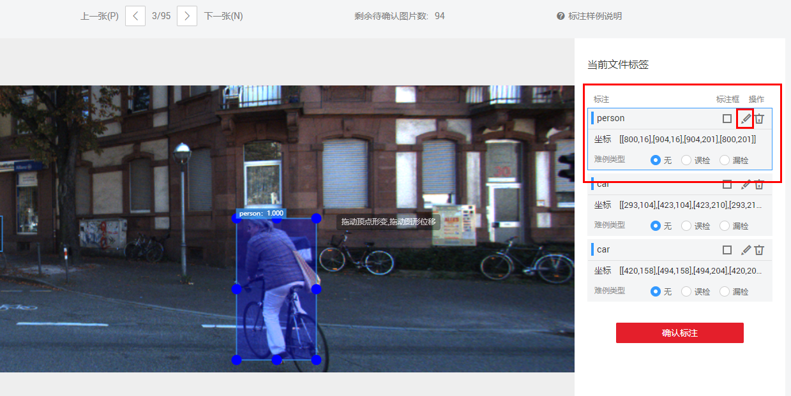
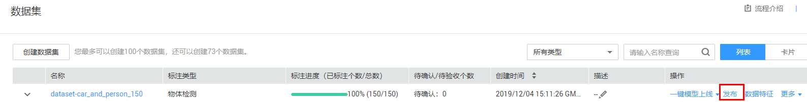

# ModelArts智能数据标注提升70%效率

AI模型开发数据标注的时间往往占了一半，本案例基于ModelArts智能数据标注功能，让开发者体验高效完成海量数据智能标注，越标越准，大幅减少标注人力。

在本案例中， 您将使用ModelArts的数据标注工具，标注图片中的车辆和行人，并体验使用智能数据标注自动批量标注数据。

## 准备工作

参考[此文档](https://github.com/huaweicloud/ModelArts-Lab/blob/master/docs/ModelArts准备工作/准备工作简易版.md)，完成ModelArts准备工作。

## 准备数据

华为云AI市场中有开发者分享了丰富的数据集，大家可以前往订阅使用。本案例采用自动驾驶场景的数据集，数据集中有两种物体，人和车。我们从华为云AI市场订阅数据集至ModelArts，然后就可以在ModelArts中使用了。

请点击[此处](https://marketplace.huaweicloud.com/markets/aihub/datasets/detail/?content_id=39df6b73-c36c-458f-9b50-4b8b559b1d03)，进入该数据集主页，点击,进入下载详情，按照如下提示填写下载详情：

下载方式：选择ModelArts数据集

目标区域：华北-北京四

目标位置：选择一个OBS路径，作为数据集的存储位置。

名称：自定义。

填写好参数后，点击按钮，然后点击按钮。等待数据集状态变为推送成功，即可在[ModelArts数据集列表](https://console.huaweicloud.com/modelarts/?region=cn-north-4#/dataset)中查看到下载的数据集。

## 智能标注数据

本步骤对数据集进行智能标注。

### 手工标注一部分数据

#### 步骤一，进入数据集标注页面

在[ModelArts数据集列表](https://console.huaweicloud.com/modelarts/?region=cn-north-4#/dataset)中找到下载的数据集，点击数据集名称，进入刚刚创建的数据集的总览页面。

#### 步骤二，同步数据集

点击“开始标注”按钮，进入数据集标注页面。

点击“全部”页面的“同步数据源”按钮，数据同步完成后，右上角会出现“数据同步完成”的提示。“同步数据源”按钮的位置如下图所示：

#### 步骤三，手工标注图片

点击进入“未标注”页面，该页面展示了所有未标注的图片。点击其中任意一张图片，进入单张图片的标注页面。进入图片的标注页面后，就可以正式对图片标注了。

物体检测任务中，标注一个物体的方式是，首先围绕这个物体的外围画一个矩形框，然后打一个类别标签，最后点击“添加”按钮。在ModelArts标注系统中，画矩形框的方式是先单击选择矩形的左上角，然后再单击选择矩形的右下角。

一张图片标注完成，如下图所示：

根据上述方法，手工标注一部分图片。根据您的时间，可以标注10到20张图片，体验一下物体检测任务的标注工作。

大家可以感觉到物体检测任务的标注工作量很大并且枯燥无味，这个时候就可以使用智能标注，来提升标注效率，减少人力投入。

### 智能标注剩余的数据

#### 步骤一，启动智能标注作业

点击“返回数据标注预览”按钮，返回到数据集标注页面。“返回数据标注预览”按钮的位置如下图所示：

点击进入“待确认”页面，然后点击“启动智能标注”按钮，选择“主动学习”，最后点击“提交”按钮，启动智能标注作业。“提交”按钮的位置如下图所示：

该智能标注作业需要运行10分钟左右。

智能标注的基本原理是，基于用户已经标注数据，并辅以未标注的数据，训练一个模型，然后对剩余的数据做推理。

#### 步骤二，确认并修正智能标注结果

智能标注作业完成后，在“待确认”页面会展示智能标注的结果。

点击其中一张图片，进入确认页面。

人工确认并修正智能标注的结果。如果智能标注的结果正确，就点击“确认标注”按钮，系统会将这张图片及其标注信息加入到已标注数据中。“确认标注”按钮如下所示：

如果标注框的位置有偏离，或者物体的类别标签不对，可以人工修正智能标注结果。

在“文件标签”列表中，选中这个标注框，点击“修改”按钮，然后就可以对标注框进行修正。或者点击“修改”按钮，修改类别标签。

#### 步骤三，迭代进行智能标注

您可以只确认一部分数据，然后继续启动下一轮的智能标注。智能标志是一个迭代的过程，每一轮只标少量的数据，然后重新训练，会使得智能标注的结果越来越准。循环这个过程，直到所有数据标注完成。

### 发布数据集

标注好的数据集可以点击“发布”按钮发布成一个版本，这个数据集可以在ModelArts上训练模型的时候使用。“发布”按钮位置如下：

发布的时候填写数据集切分比例为0.8:02。

案例完成。

