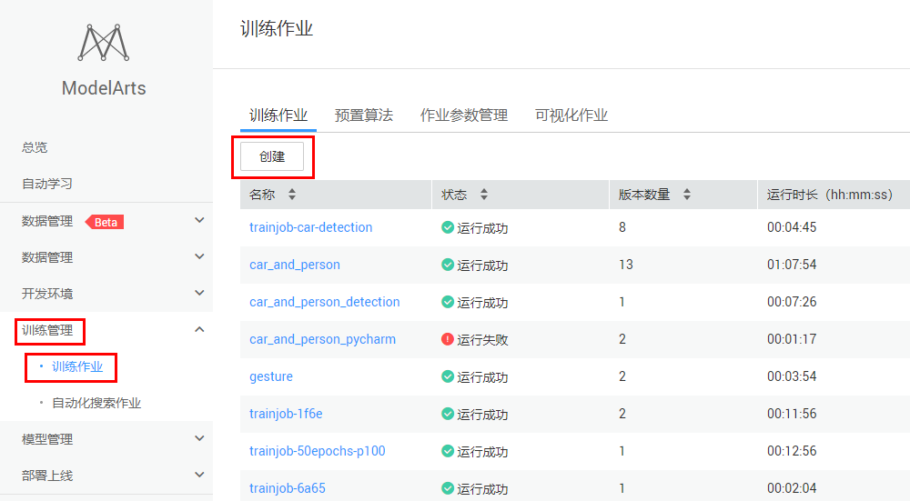
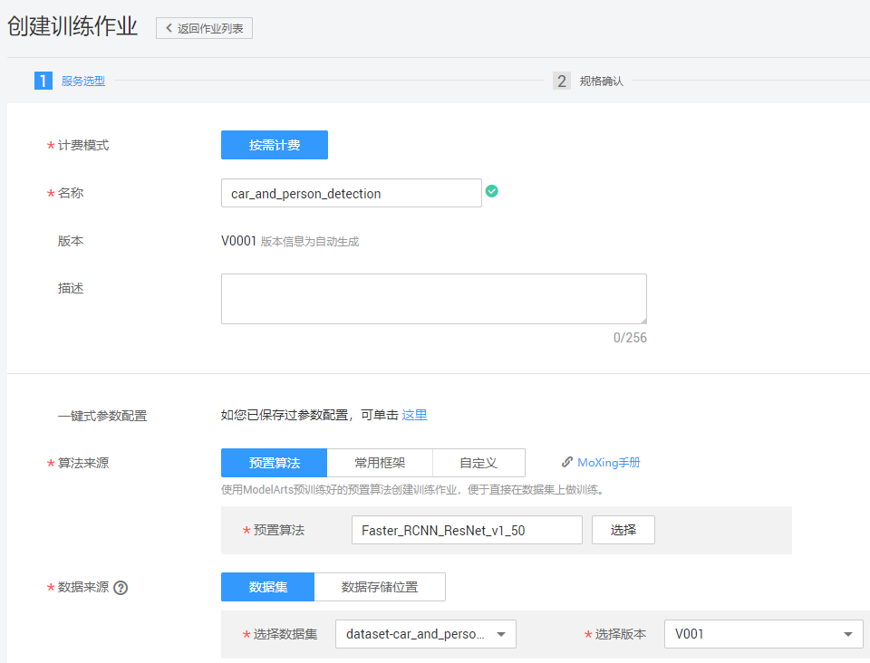
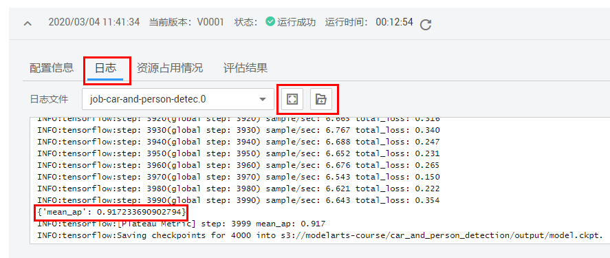
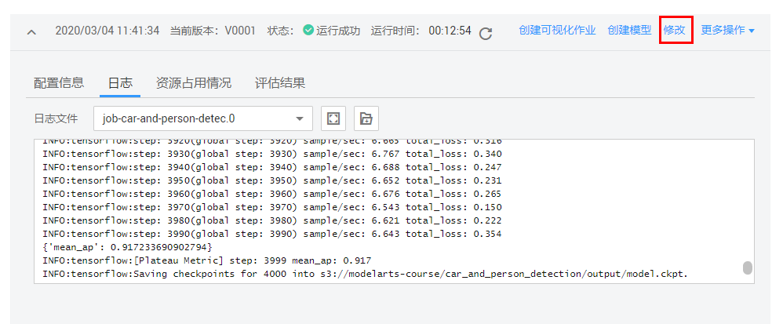
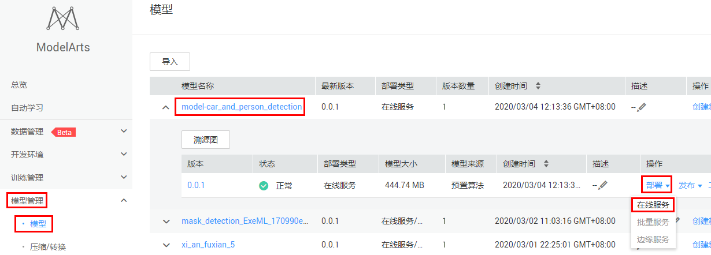
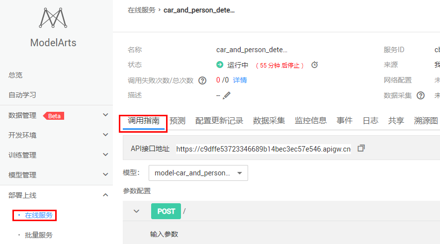
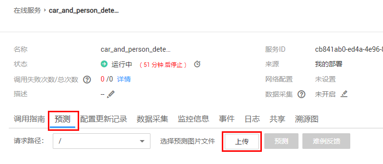
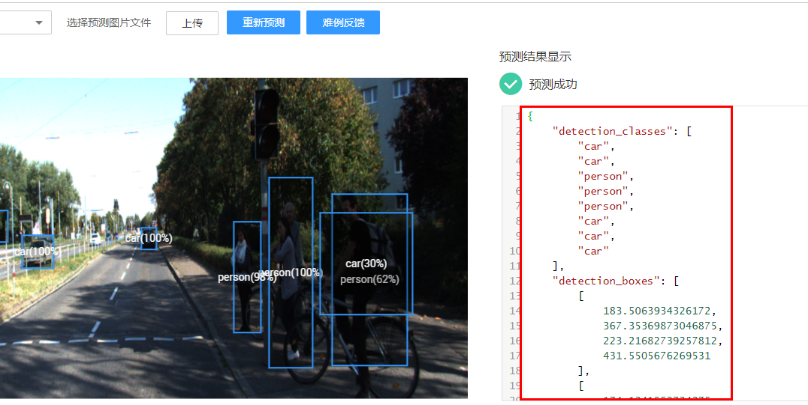

# 自动驾驶场景海量数据的人车检测模型训练和部署

## 案例内容

在自动驾驶方案实现的过程中，物体检测是其中一个重要的技术。本案例基于ModelArts物体检测预置算法，训练一个人车检测模型，并部署成在线服务，开发一个物体检测AI应用。

使用预置算法，无需自己开发训练代码和推理代码，只要准备并标注好数据，就可以快速轻松训练并部署模型。

## 案例目标

- 掌握使用ModelArts预置算法训练模型，并部署成在线服务。

## 准备工作

完成零代码自动驾驶AI模型开发，需要完成以下准备工作

### 创建华为云账号

参考[此链接](https://support.huaweicloud.com/prepare-modelarts/modelarts_08_0001.html)，注册华为云账号。

 **注意:**在使用ModelArts时要及时检查账号状态，避免账号处于欠费或冻结状态时资源被冻结，影响您的使用。 

### 获取访问密钥并完成ModelArts全局配置

参考[此文档](https://support.huaweicloud.com/prepare-modelarts/modelarts_08_0002.html)完成。

**注意**：访问秘钥文件请妥善保存，使用OBS Browser会用到。

### 下载并登录OBS Browser

点击[此链接]( https://support.huaweicloud.com/clientogw-obs/zh-cn_topic_0045829056.html )，根据操作系统版本下载相应版本的OBS Browser。

解压OBS Browser压缩包，参考[此文档](https://support.huaweicloud.com/clientogw-obs/zh-cn_topic_0045829058.html) 登录OBS Browser。

**注意**：AK SK从访问秘钥文件中获取。

### 创建OBS桶

**OBS**，即**Object Storage Service**，对象存储服务，是华为云上提供云上储存的服务。在使用ModelArts之前您需要创建一个OBS桶，并在其中创建一个用于存放数据的文件夹。 

登录[OBS管理控制台](https://storage.huaweicloud.com/obs/#/obs/manager/buckets)， 页面右上角单击"**创建桶**"，系统弹出如下图所示的对话框，选择"区域"为"华北-北京四"，输入自定义的桶名称，其他选项保持默认即可，最后点击页面下方"立即创建"按钮即可成功创建。 

## 准备数据

本案例采用自动驾驶场景的数据集，数据集中有两种物体，人和车。请点击[此链接](https://modelarts-labs.obs.myhuaweicloud.com/end2end/car_and_person_detection/car_and_person_150_labeled.tar.gz)下载数据到本地，解压。可以看到`car_and_person_150`文件夹下有`train`和`test`两个目录，`train`是已经标注好的训练集，`test`是测试集。

通过OBS Browser上传`car_and_person_150`数据集文件夹到刚刚创建的OBS桶下，可以参考[此文档](https://support.huaweicloud.com/qs-obs/obs_qs_0002.html) 。

## 训练

### 创建预置算法训练作业

点击[此链接](https://console.huaweicloud.com/modelarts/?region=cn-north-4#/manage/trainingjobs/)，进入ModelArts训练作业页面，然后点击“创建”按钮，如下图所示：

进入“创建训练作业”页面，按照以下图片和指导填写参数：

计费模式：按需计费

名称：自定义

数据来源：选择数据存储位置

数据存储位置：训练数据集的路径，选择OBS路径`/hdc-2020/car_and_person_detection/car_and_person_150_labeled/train/`

算法来源：预置算法

预置算法：`Faster_RCNN_ResNet_v1_50`

训练输出位置：选择OBS路径`/hdc-2020/car_and_person_detection/output/`（output目录如果不存在，需创建）。训练输出位置用来保存训练生成的模型和TensorBoard日志。

运行参数：预置算法会加载默认参数，但是可以更改和添加参数。更改max_epochs为5，max_epochs可以控制训练的轮数。运行参数中设置的变量会传入到训练脚本中，经过解析，可以使用。此字段用于设置算法中的超参。

作业日志路径：选择OBS路径`/hdc-2020/car_and_person_detection/log/`（log目录如果不存在，需要创建）

资源池：公共资源池。

类型：GPU

规格：选择` CPU：8 核 64GiB GPU：1 * nvidia-v100 32GiB `，V100 GPU的训练性能比P100 GPU会快很多。

计算节点个数：选择1，表示我们运行一个单机训练任务。如果选择多个，就会运行一个分布式训练作业。

所有字段填写好之后，确认参数无误，点击下一步，然后点击提交，开始训练。训练时长预计5分钟左右，如果遇到使用高峰期，会导致作业排队，会有时间延迟。

### 查看训练结果

训练作业完成后，可以查看训练作业的运行结果。

在训练作业页面，点击作业名称，进入配置信息页面。可以查看到训练作业的详情，如下图所示： 

可以点击“日志”页签，查看训练作业的训练日志，还可以点击放大文本框，以及下载日志到本地查看。

训练日志中会打印一些训练的精度和训练速度等信息。

如果觉得精度不够，或者想要尝试其他的数据集和超参数，可以点击“修改”按钮，基于当前的配置和参数，创建一个新版本的训练作业。如下图所示：

预置算法训练生成的模型会放到训练输出位置OBS路径下，可以直接下载到本地使用。

## 模型部署

### 创建模型

点击训练作业详情页面的“创建模型”按钮，创建一个模型，如下图所示：

按照下图和指导填写参数：

名称：自定义

版本：0.0.1

元模型来源：从训练中选择

选择训练作业和版本：选择对应的训练作业，和版本

部署类型：在线服务

其他参数会自动加载，保持默认即可。

最后点击“立即创建”按钮。

### 部署成在线服务

找到模型，点击下拉框，等待模型状态为正常，然后点击部署下拉框中的“在线服务”，如下图所示：

根据下图和指导填写参数：

名称：自定义

是否自动停止：开启，1小时后。会在1小时后自动停止该在线服务。如果不想开启，可以关闭。

资源池：公共资源池。如果您购买了专属资源池，也可以选择专属资源池部署。

选择模型：选择对应的模型和版本。

计算节点规格：选择` CPU：2 核 8 GiB `，CPU实例。如果您开通了GPU推理，也可以选择` CPU：2 核 8 GiB GPU：1*P4 ` P4 GPU实例，GPU可以加速推理速度。在生产环境中，对于物体检测模型，我们建议使用GPU实例部署。

计算节点个数：1。如果想要更高的并发数，可以增加计算节点个数，会以多实例的方式部署。

填写好所有参数，点击下一步，然后点击提交，最后点击查看服务详情。状态栏会显示部署进度，大概需要3到8分钟会部署成功。

### 查看在线服务

在线服务是一个RESTful API，可以通过HTTP请求访问。

在在线服务的“调用指南”页签可以看到该API接口的调用方式，如下所示：

如果想要修改在线服务的计算节点规格（比如从CPU实例切换成GPU实例），或者增加计算节点个数（增加并发数），可以点击“修改”按钮，修改配置，如下图所示：

如果想要修改自动停止时间，可以状态栏的小闹钟按钮进行修改，如下图所示：

### 样本测试

点击进入“预测”页签，然后点击“上传”按钮，从本地`car_and_person_150`文件夹下的`test`目录中选择一张图片，如下图所示：

然后点击“预测”按钮，可以看到预测结果，如下图所示：

右边是API接口返回的详细信息，物体检测任务会将预测结果绘制在图片上，检测框会框住目标，并且显示类别和置信度。

### 关闭在线服务

使用完成后，需要关闭在线服务，在线服务是按使用时长收费。点击“停止”按钮，就会停止收费，如下图所示：

下次想要使用，可以点击启动按钮，就会重启在线服务，API的ULR不会改变。

如果想要彻底删除在线服务，可以点击“删除”按钮，删除在线服务。

### 确认关闭所有计费项

点击[此链接]( https://console.huaweicloud.com/modelarts/?region=cn-north-4#/manage/dashboard )，进入ModelArts总览页面，如果所有计费中的数字都是0，表示所有计费项都关闭了。

**案例完成。**

## 常用链接

华为云ModelArts主页： https://console.huaweicloud.com/modelarts/?region=cn-north-4#/manage/dashboard 

