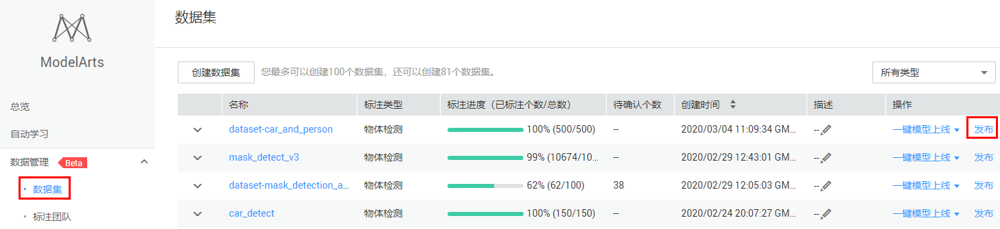
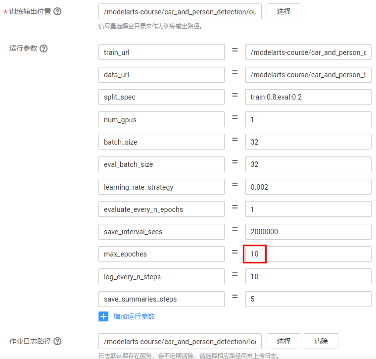
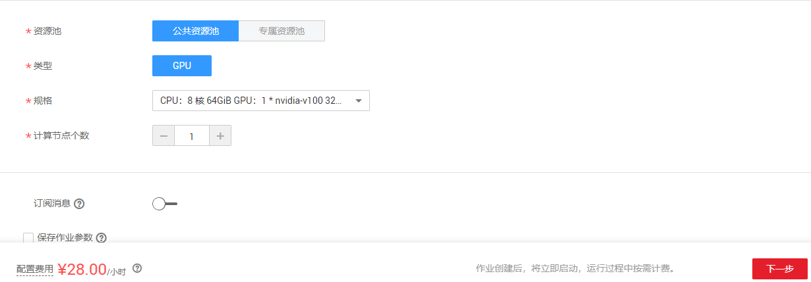
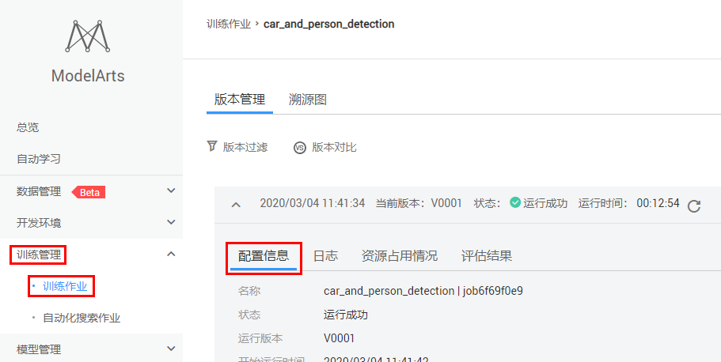
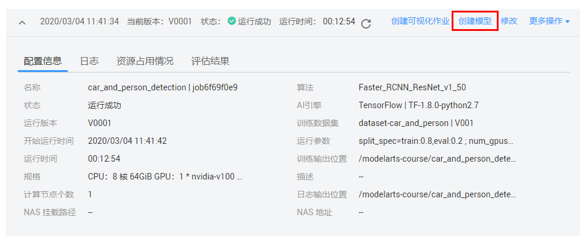
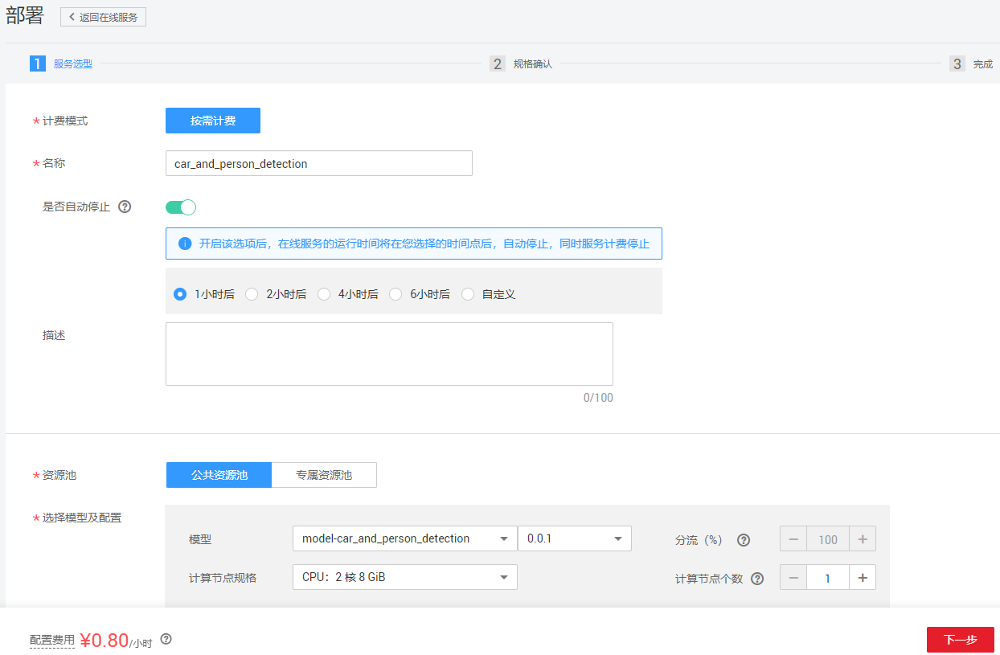
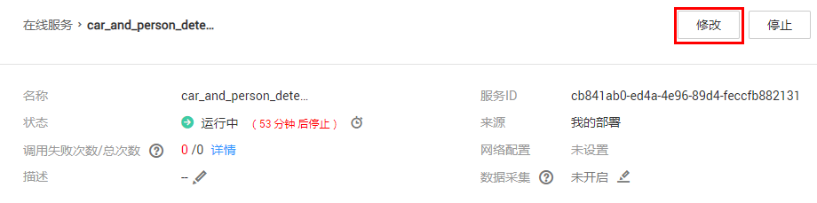

# 使用FasterRCNN预置算法基于海量数据训练人车检测模型

在自动驾驶方案实现的过程中，物体检测是其中一个重要的技术。本案例基于ModelArts物体检测预置算法`FasterRCNN`，训练一个人车检测模型，并部署成在线服务，生成一个人车检测AI应用。

ModelArts有丰富的预置算法，使用ModelArts预置算法，无需自己开发训练代码和推理代码，只要准备并标注好数据，就可以轻松快速训练并部署模型。

## 准备工作

参考[此文档](https://github.com/huaweicloud/ModelArts-Lab/tree/master/docs/ModelArts准备工作)，完成ModelArts准备工作。包括注册华为云账号、ModelArts全局配置和OBS相关操作。

## 准备数据

### 下载数据集

本案例采用自动驾驶场景的数据集，数据集中有两种物体，人和车。

点击[此链接](https://modelarts-labs.obs.myhuaweicloud.com/end2end/car_and_person_detection/car_and_person_500.tar.gz)下载数据到本地，解压，可以得到`car_and_person_500`文件夹。`car_and_person_500`文件夹下有`train`和`test`两个目录，`train`是已经标注好的训练集，共500张图片，`test`是测试集。

### 上传数据至OBS

使用OBS客户端上传本地的`car_and_person_500`文件夹至一个“华北-北京四”区域的OBS桶 。

### 创建数据集

我们在ModelArts上创建一个人车检测数据集。

点击进入[ModelArts数据集](https://console.huaweicloud.com/modelarts/?region=cn-north-4#/dataset)，请确保区域在“华北-北京四”，本案例所有操作在“华北-北京四”。

点击页面上的“创建数据集”按钮， 创建数据集页面填写示例如下：

数据集名称：自定义

数据集输入位置：`train`文件夹所在的OBS路径

数据集输出位置：标注数据的输出OBS路径。需要在OBS中创建这个路径，可以是使用OBS客户端创建。

标注场景：物体

标注类型：物体检测

填写完毕上述字段后，点击“创建”按钮。

训练集中已经包含了标注文件，ModelArts数据集会自动加载标注文件。

### 发布数据集

数据集创建成功后，点击“发布”按钮，发布数据集。数据集发布之后，才可在训练中使用。

等待数据集发布成功，大概需要一分钟。

## 训练

我们使用创建的人车检测数据集，提交一个人车检测训练作业，训练会生成一个人车检测模型。

### 创建预置算法训练作业

点击进入[此链接](https://console.huaweicloud.com/modelarts/?region=cn-north-4#/trainingJobs)，进入ModelArts训练作业页面，然后点击“创建”按钮，如下图所示：

进入“创建训练作业”页面，按照以下图片和指导填写参数：

计费模式：按需计费

名称：自定义

算法来源：预置算法

预置算法：`Faster_RCNN_ResNet_v1_50`

数据来源：数据集

选择数据集和版本：选择刚刚发布的人车检测数据集

训练输出位置：选择OBS路径`/modelarts-course/car_and_person_detection/output/`（此OBS路径如果不存在，可以使用OBS客户端创建）。训练输出位置用来保存训练生成的模型。

运行参数：运行参数用于设置算法中的超参。预置算法会加载默认参数，但是可以更改和添加参数。设置max_epoches=10，max_epoches用来控制训练的轮数。

作业日志路径：选择OBS路径`/modelarts-course/car_and_person_detection/log/`（此OBS路径如果不存在，可以使用OBS客户端创建）。

资源池：公共资源池。

类型：GPU

规格：选择` CPU：8 核 64GiB GPU：1 * nvidia-v100 32GiB `，V100 GPU的训练速度比P100 GPU快很多。

计算节点个数：选择1，表示我们运行一个单机训练任务。如果选择多个，就会运行一个分布式训练作业。

所有字段填写好之后，确认参数无误，点击下一步，然后点击提交，开始训练。

使用V100 GPU资源，训练时长预计12分钟左右。

### 查看训练结果

训练作业完成后，可以查看训练作业的运行结果。

在训练作业页面，点击作业名称，进入配置信息页面。可以查看到训练作业的详情，如下图所示： 

可以点击“日志”页签，查看训练作业的训练日志，还可以下载日志到本地查看。

训练日志中会打印一些训练的精度和训练速度等信息。

如果觉得精度不够，可以训练更多轮数或者添加更多数据。可以点击“修改”按钮，基于当前的配置和参数，创建一个新版本的训练作业。如下图所示：

训练生成的模型会放到训练输出位置OBS路径下，可以直接下载到本地使用。

## 模型部署

### 创建模型

在训练作业详情页面，点击“创建模型”按钮，将模型导入到模型库，如下图所示：

按照下图和指导填写参数：

名称：自定义

版本：0.0.1

元模型来源：从训练中选择

选择训练作业和版本：选择人车检测的训练作业和版本

部署类型：在线服务

其他参数会自动加载，保持默认即可。

最后点击“立即创建”按钮。

### 部署成在线服务

找到模型，点击下拉框，等待模型状态为正常，然后点击部署下拉框中的“在线服务”，如下图所示：

根据下图和指导填写参数：

名称：自定义

是否自动停止：开启，1小时后。会在1小时后自动停止该在线服务。

资源池：公共资源池。如果您购买了专属资源池，也可以选择专属资源池部署。

选择模型：选择人车检测的模型和版本。

计算节点规格：选择` CPU：2 核 8 GiB `，CPU实例。如果您开通了GPU推理，也可以选择` CPU：2 核 8 GiB GPU：1*P4 ` P4 GPU实例，深度学习加速芯片可以加速推理速度。在生产环境中，对于物体检测模型，我们建议使用带深度学习加速芯片的实例部署。

计算节点个数：1。如果想要更高的并发数，可以增加计算节点个数，会以多实例的方式部署。

填写好所有参数，点击下一步，然后点击提交，最后点击查看服务详情。状态栏会显示部署进度，大概5分钟左右会部署完成。

### 查看在线服务

在线服务是一个RESTful API，可以通过HTTP请求访问。

在在线服务的“调用指南”页签可以看到该API接口的调用方式，如下所示：

如果想要修改在线服务的计算节点规格（比如从CPU实例切换成GPU实例），或者增加计算节点个数（增加并发数），可以点击“修改”按钮，修改配置，如下图所示：

如果想要修改自动停止时间，可以状态栏的小闹钟按钮进行修改，如下图所示：

### 样本测试

点击进入“预测”页签，然后点击“上传”按钮，从本地`car_and_person_500`文件夹下的`test`目录中选择一张图片，如下图所示：

然后点击“预测”按钮，可以看到预测结果，如下图所示：

右边是API接口返回的详细信息，物体检测任务会将预测结果绘制在左边的图片上，检测框会框住目标，并且显示类别和置信度。

### 关闭在线服务

使用完成后，需要关闭在线服务，否则会持续收费。点击“停止”按钮，就会停止收费，如下图所示：

下次想要使用，点击启动按钮，就会重启在线服务，API的ULR不会改变。

如果想要彻底删除在线服务，可以点击“删除”按钮，删除在线服务。

### 确认关闭所有计费项

点击[此链接]( https://console.huaweicloud.com/modelarts/?region=cn-north-4#/manage/dashboard )，进入ModelArts总览页面，如果所有计费中的数字都是0，表示所有计费项都关闭了。

**案例完成。**

