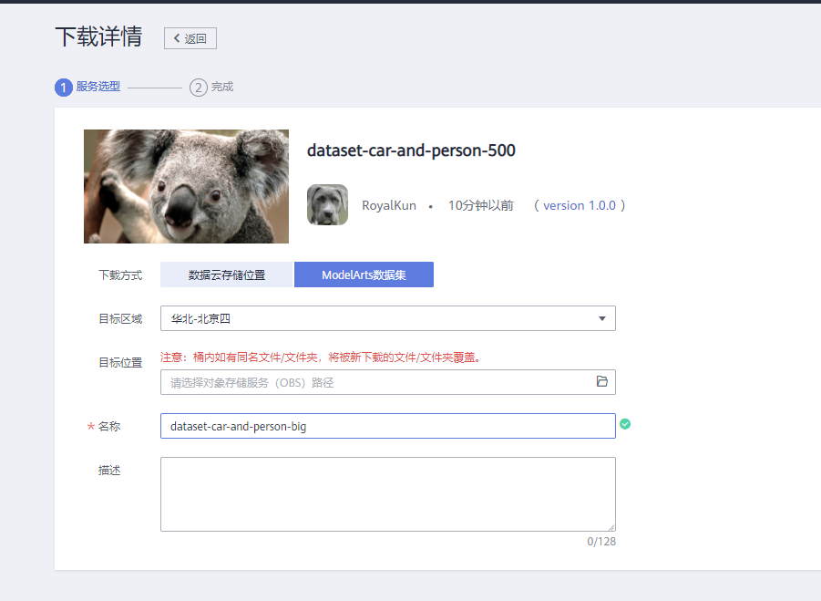
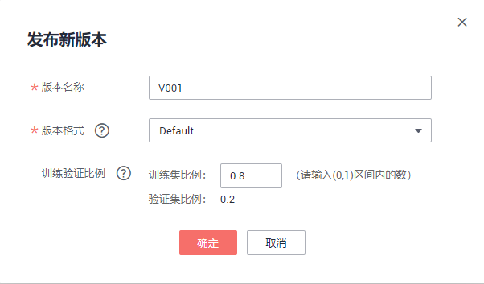

# 使用FasterRCNN预置算法基于海量数据训练人车检测模型

在自动驾驶方案实现的过程中，物体检测是其中一个重要的技术。本案例基于ModelArts AI市场中官方发布的物体检测算法`FasterRCNN`，训练一个人车检测模型，并部署成在线服务，生成一个人车检测AI应用。

ModelArts的AI市场有丰富的算法，使用这些算法，无需自己开发训练代码和推理代码，只要准备并标注好数据，就可以轻松快速训练并部署模型。

## 准备工作

参考[此文档](https://github.com/huaweicloud/ModelArts-Lab/blob/master/docs/ModelArts准备工作/准备工作简易版.md)，完成ModelArts准备工作。包括注册华为云账号、ModelArts全局配置和OBS相关操作。

## 准备数据

### 下载训练数据集

本案例采用自动驾驶场景的数据集，数据集中有两种物体，人和车。

本案例的数据集已经发布在AI市场，我们从华为云AI市场订阅数据集至ModelArts，然后就可以在ModelArts中使用了。点击[此链接](https://marketplace.huaweicloud.com/markets/aihub/datasets/detail/?content_id=3e587ec7-71bc-4949-8dcf-4c9b08673963)进入下载详情页，下载详情页示例如下：

下载方式：选择ModelArts数据集

目标区域：华北-北京四

目标位置：选择一个OBS路径，作为数据集的存储位置。

名称：自定义。

填写好参数后，点击按钮，然后点击按钮。等待数据集状态变为推送成功，即可在[ModelArts数据集列表](https://console.huaweicloud.com/modelarts/?region=cn-north-4#/dataset)中查看到下载的数据集。

### 下载测试数据集

点击[此链接](https://modelarts-labs.obs.cn-north-1.myhuaweicloud.com/end2end/car_and_person_detection/car_and_person_500_test.tar.gz)下载测试数据到本地，解压，可以得到`car_and_person_500_test`文件夹，文件夹里面是测试图片。

### 发布数据集

点击进入[ModelArts数据集列表](https://console.huaweicloud.com/modelarts/?region=cn-north-4#/dataset)，找到刚订阅的数据集，点击“发布”按钮，填写训练集比例为0.8，发布数据集。数据集发布之后，才可在训练中使用。

等待数据集发布成功。

## 订阅算法

本实验中，我们从AI市场订阅ModelArts官方发布的物体检测算法`FasterRCNN`来训练模型。

点击进入AI市场[FasterRCNN算法主页](https://console.huaweicloud.com/modelarts/?region=cn-north-4#/aiMarket/aiMarketModelDetail/overview?modelId=198573e9-b2a9-46ef-aca9-51cc651b6364&type=algo)，点击页面右上方的按钮。然后点击页面下方的按钮，再点击按钮，最后点击按钮进入我的订阅页面，可以看到刚刚订阅的算法。点击超链接，选择华北-北京四区域，进入算法管理页面。

点击“同步”按钮，同步算法，可以点击按钮，刷新状态。当状态变成就绪时，表示同步成功。

## 模型训练

我们使用创建的人车检测数据集，提交一个人车检测训练作业，训练会生成一个人车检测模型。

### 创建训练作业

在算法管理中，点击“创建训练作业”按钮，进入训练作业的创建页面。

按照如下提示，填写创建训练作业的参数。

计费模式：按需计费

名称：自定义

算法来源：算法管理

算法名称：`物体检测-FasterRCNN_ResNet50`

数据来源：数据集

选择数据集和版本：选择刚刚发布的人车数据集及其版本

训练输出：选择OBS路径`/modelarts-course/car_and_person_detection/output/`（此OBS路径如果不存在，可以使用OBS客户端创建）。训练输出位置用来保存训练生成的模型。

调优参数：用于设置算法中的超参。算法会加载默认参数，但是可以更改和添加参数。设置`learning_rate_strategy=20:0.001`，表示训练20轮，学习率固定为0.001。其他调优参数保持默认。

作业日志路径：选择OBS路径`/modelarts-course/car_and_person_detection/log/`（此OBS路径如果不存在，可以使用OBS客户端创建）。

资源池：公共资源池。

规格：V100 GPU，如图所示。

计算节点个数：选择1，表示我们运行一个单机训练任务。

所有字段填写好之后，确认参数无误，点击“下一步”按钮，然后点击“提交”按钮，开始训练。

使用V100 GPU资源，训练时长预计30分钟左右。

### 查看训练结果

训练作业完成后，可以查看训练作业的运行结果。

在训练作业页面，点击作业名称，进入配置信息页面。可以查看到训练作业的详情。

切换到“日志”页签，查看训练作业的训练日志，还可以下载日志到本地查看。

训练日志中会打印一些训练的精度和训练速度等信息。

训练生成的模型会放到训练输出位置OBS路径下，可以直接下载到本地使用。

## 模型部署

### 导入模型

点击“创建模型”按钮，创建模型。

按照如下提示，填写导入模型的字段。

名称：自定义

版本：0.0.1

元模型来源：从训练中选择

选择训练作业及版本：刚刚的训练作业及版本，会自动加载

部署类型：默认

推理代码：自动加载

其他保持默认。

点击“立即创建”按钮，开始导入模型，等待模型导入成功。

### 部署上线

等待模型状态为正常，然后点击部署下拉框中的“在线服务”，如下图所示：

按照如下指导填写参数：

计费模式：按需计费

名称：自定义

是否自动停止：开启，一小时后。会在1小时后自动停止该在线服务。

资源池：公共资源池。如果您购买了专属资源池，也可以选择专属资源池部署。

模型来源：我的模型

模型：选择刚刚导入美食人车检测的模型和版本，会自动加载。

计算节点规格：选择`CPU：2 核 8 GiB`，CPU实例。

计算节点个数：1。如果想要更高的并发数，可以增加计算节点个数，会以多实例的方式部署。

填写好所有参数，点击“下一步”按钮，然后点击“提交”按钮，最后点击查看服务详情。状态栏会显示部署进度，大概3分钟左右会部署完成。

### 在线服务测试

在线服务的本质是RESTful API，可以通过HTTP请求访问，在本案例中，我们直接在网页上访问在线服务。

等待在线服务的状态变成运行中。

切换到“预测”页签。点击上传按钮，上传本地的`car_and_person_500_test`目录中的图片，然后点击“预测”按钮，进行测试：

预测结果会出现在右边的输出框：

右边是API接口返回的详细信息，物体检测任务会将预测结果绘制在左边的图片上，检测框会框住目标，并且显示类别和置信度。

作为在线RESTful API，还可以通过HTTP请求访问，在调用指南页签中有该API的详细信息和调用指南文档。

## 关闭在线服务

为了避免持续扣费，案例完成后，需要关闭在线服务，点击“停止”按钮即可：

当需要使用该在线服务的时候，可以重新启动该在线服务。

### 确认关闭所有计费项

点击[此链接](https://console.huaweicloud.com/modelarts/?region=cn-north-4#/manage/dashboard)，进入ModelArts总览页面，如果所有计费中的数字都是0，表示所有计费项都关闭了。

**案例完成。**

