# 使用ResNet50预置算法基于简单数据训练美食分类模型

本案例将介绍怎样使用AI Gallery中ModelArts官方发布的`ResNet50`算法和`美食分类数据集`，训练一个美食分类模型。

ModelArts的AI Gallery有丰富的算法，使用这些算法，无需自己开发训练代码和推理代码，只要准备并标注好数据，就可以轻松快速训练并部署模型。

## 准备工作

参考[此文档](https://github.com/huaweicloud/ModelArts-Lab/tree/master/docs/ModelArts%E5%87%86%E5%A4%87%E5%B7%A5%E4%BD%9C)，完成ModelArts准备工作。包括注册华为云账号、ModelArts全局配置和OBS操作。

## 准备数据

### 下载数据

本案例的数据集已经发布在AI Gallery，我们从华为云AI Gallery订阅数据集至ModelArts，然后就可以在ModelArts中使用了。点击[此链接](https://console.huaweicloud.com/modelarts/?region=cn-north-4#/aiMarket/datasetDetail/metadata?content_id=c2b35c4a-20d2-4a3f-a4eb-60f4767b3ecd)进入下载详情页，点击确定按钮下载数据集。下载详情页示例如下：

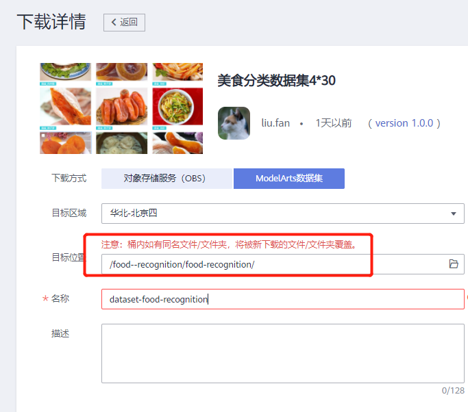

该数据集共包含4类美食，及其标注数据。4类美食的种类如下所示：

```
美食/凉皮,
美食/柿子饼,
美食/灌汤包,
美食/肉夹馍。
```

## 数据观察

### 创建数据集

点击[此链接](https://console.huaweicloud.com/modelarts/?region=cn-north-4#/dataset)，进入ModelArts数据集，在这里可看到刚才下载的数据集。。请确保区域在“华北-北京四”，本案例所有操作在“华北-北京四”。  


进入数据集观察各样本信息。

## 订阅算法

本实验中，我们从AI Gallery订阅ModelArts官方发布的图像分类算法`ResNet50`来训练模型。

点击进入AI Gallery[ResNet50算法](https://console.huaweicloud.com/modelarts/?region=cn-north-4#/aiMarket/aiMarketModelDetail/overview?modelId=40b66195-5bbe-463d-b8a2-03e57073538d&type=algo)，点击页面右上方的按钮，然后再点击，点击

，云服务区域，选择“华为-北京四”，确定，进入算法管理页面。算法会自动同步最新版本，当状态变成就绪时，表示同步成功。


## 模型训练

我们使用创建的美食数据集和订阅的图像分类算法，提交一个图像分类的训练作业，训练会生成一个美食分类模型。

### 创建训练作业

在算法管理中，点击“创建训练作业”按钮，进入训练作业的创建页面。


按照如下提示，填写创建训练作业的参数。  
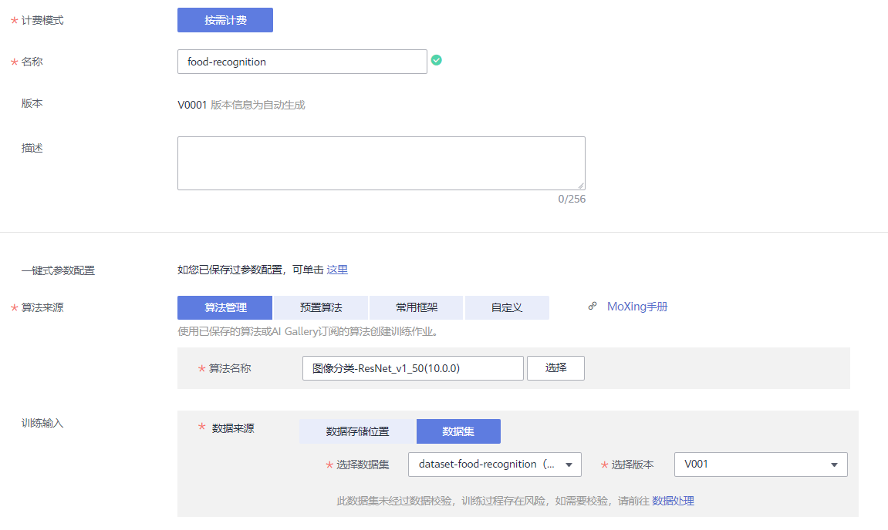

计费模式：按需计费

名称：自定义

算法来源：算法管理

算法名称：`图像分类-ResNet_v1_50`

数据来源：数据集

选择数据集和版本：选择刚刚发布的美食数据集及其版本

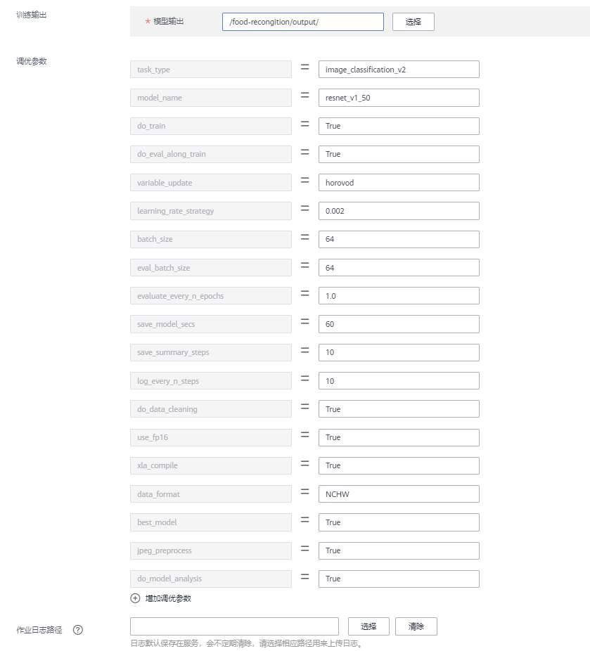

训练输出：选择 OBS路径`modelarts-course/food_recognition/output/`（此OBS路径如果不存在，可以使用OBS客户端创建）。训练输出位置用来保存训练生成的模型。

调优参数：用于设置算法中的超参。算法会加载默认参数，但是可以更改和添加参数。设置`learning_rate_strategy=20:0.001`，表示训练20轮，学习率固定为0.001。其他调优参数保持默认。

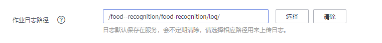

作业日志路径：选择OBS路径`/food_recognition/log/`（此OBS路径如果不存在，可以使用新建文件夹创建）。

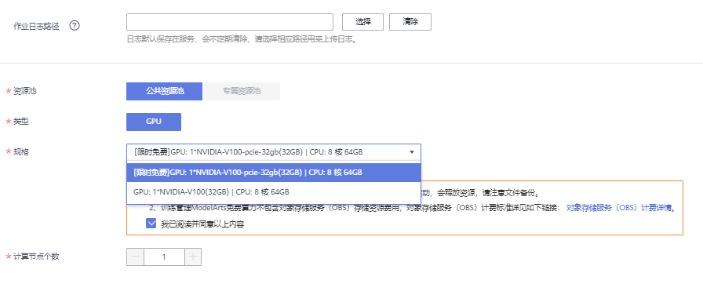

资源池：公共资源池

规格：modelarts.p3.large.ex（即V100 GPU），如图所示

计算节点个数：选择1，表示我们运行一个单机训练任务

所有字段填写好之后，确认参数无误，点击“下一步”、“提交”按钮，后台则开始训练

点击“查看作业详情”会回到训练作业详情页面，此时训练作业的状态会经历“初始化”和“运行中”两个状态，等待8分钟左右，训练完成，状态变成”运行成功“。

### 查看训练结果

训练作业完成后，可以查看训练作业的运行结果。

在训练作业页面，点击作业名称，进入配置信息页面。可以查看到训练作业的详情。

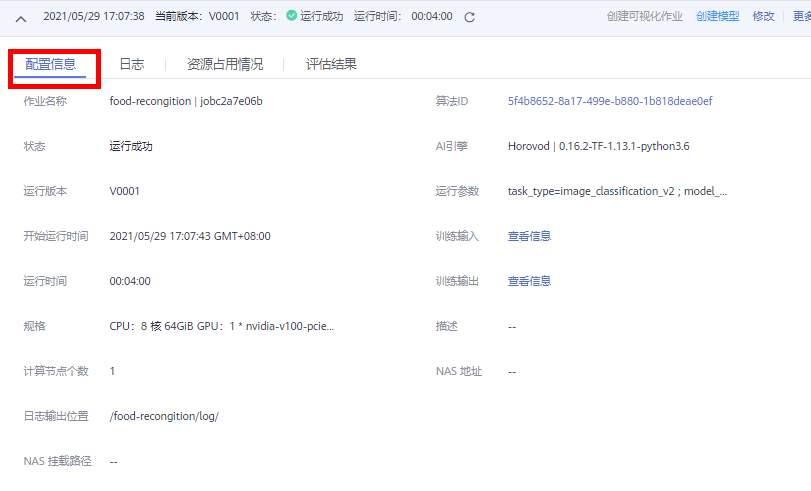

切换到“日志”页签，查看训练作业的训练日志，还可以下载日志到本地查看。

训练日志中会打印一些训练的精度和训练速度等信息。

训练生成的模型会放到训练输出位置OBS路径下，可以直接下载到本地使用。

## 模型部署

### 导入模型

点击“创建模型”按钮，创建模型。


按照如下提示，填写导入模型的字段。  
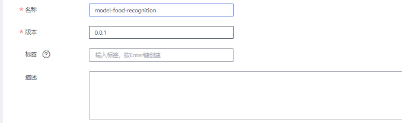

名称：自定义

版本：0.0.1

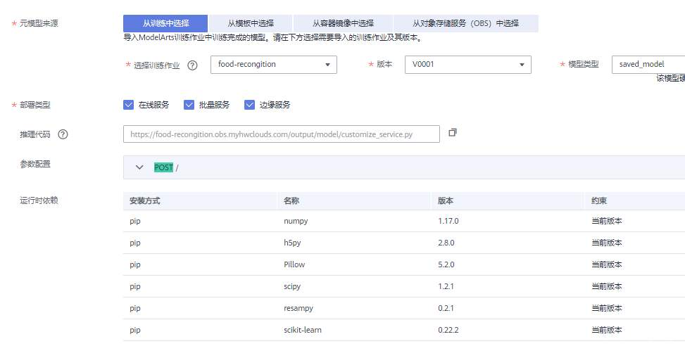

元模型来源：从训练中选择

选择训练作业及版本：刚刚的训练作业及版本，会自动加载

部署类型：默认

推理代码：自动加载

其他保持默认。

点击“立即创建”按钮，开始构建模型，等待5分钟左右，模型的状态变成”正常“，则表示模型已导入成功。

### 部署上线

模型导入成功后，然后点击部署下拉框中的“在线服务”，如下图所示：

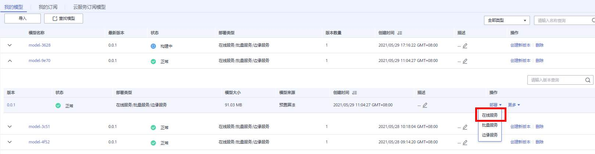

按照如下指导填写参数：  
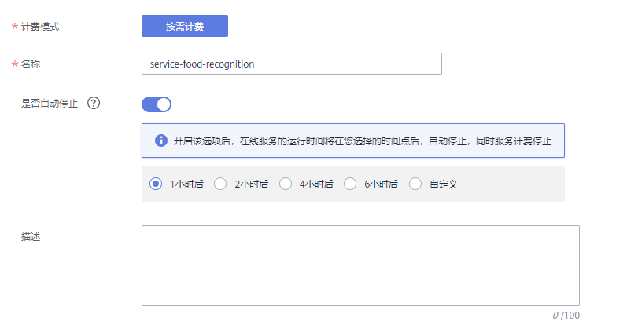

计费模式：按需计费

名称：自定义

是否自动停止：开启，一小时后。会在1小时后自动停止该在线服务。

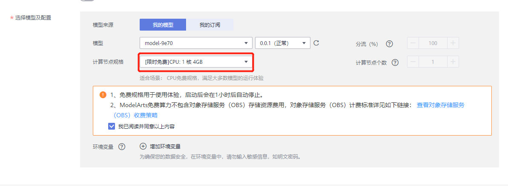

资源池：公共资源池

模型来源：我的模型

模型：选择刚刚导入美食分类的模型和版本，会自动加载

计算节点规格：选择`CPU：2 核 8 GiB`，CPU实例

计算节点个数：1，如果想要更高的并发数，可以增加计算节点个数，会以多实例的方式部署。

填写好所有参数，点击“下一步”按钮，然后点击“提交”按钮，最后点击”查看服务详情“。状态栏会显示部署进度，等待3分钟左右，部署完成，服务的状态变成”运行中“，接下来就可以上传图片进行测试了。

### 在线服务测试

在线服务的本质是RESTful API，可以通过HTTP请求访问，在本案例中，我们直接在网页上访问在线服务。

切换到“预测”页签。点击上传按钮，上传本地的`foods_recongition_4*30\test`目录中的图片（可从OBS桶下载到本地）也可通过[此链接](https://modelarts-labs-bj4.obs.cn-north-4.myhuaweicloud.com/ExeML/ExeML_Foods_Recognition/foods_recongition_4x30.zip)下载，然后点击“预测”按钮，进行测试：

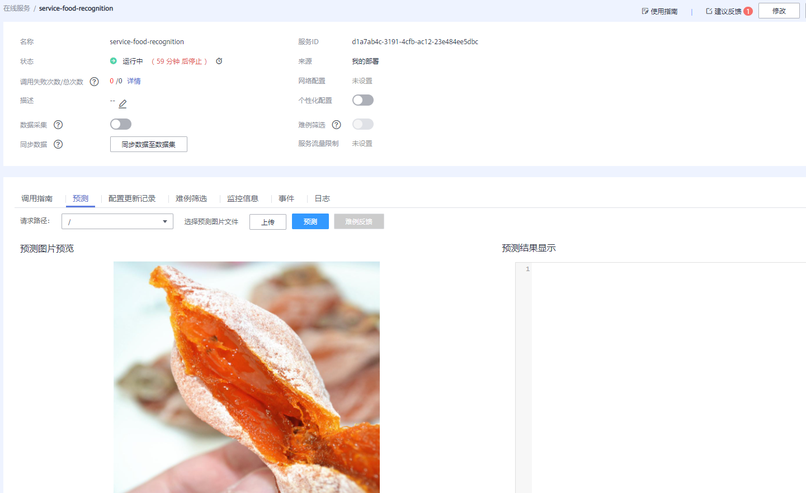

预测结果会出现在右边的输出框：

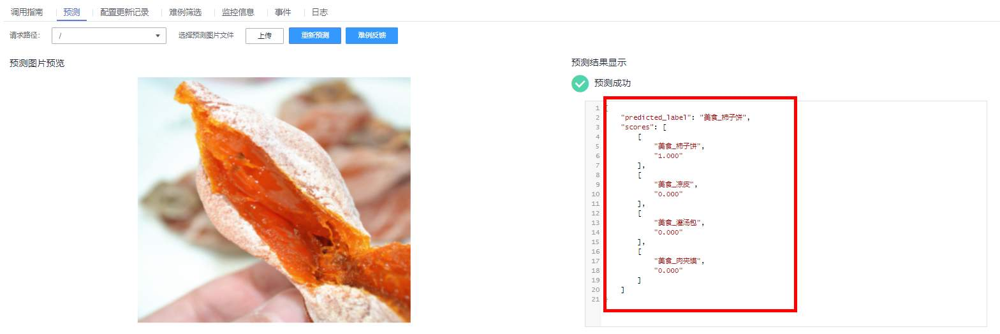

预测结果中的scores字段，包含了图片为每种类别的置信度

您也可以从网上下载4种美食范围内的图片来测试，评估模型的准确度

作为在线RESTful API，还可以通过HTTP请求访问，在调用指南页签中有该API的详细信息和调用指南文档。

## 关闭在线服务

为了避免持续扣费，案例完成后，需要关闭在线服务，点击“停止”按钮即可：  
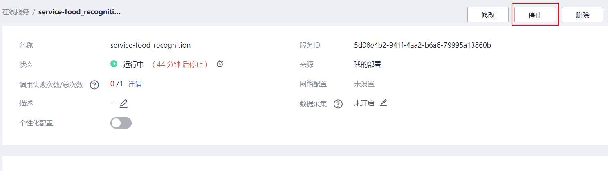

当需要使用该在线服务的时候，可以重新启动该在线服务。

### 确认关闭所有计费项

点击[此链接](https://console.huaweicloud.com/modelarts/?region=cn-north-4#/manage/dashboard)，进入ModelArts总览页面，如果所有计费中的数字都是0，表示所有计费项都关闭了。

至此，该案例完成。