# 使用ResNet50预置算法基于海量数据训练美食分类模型

本案例将介绍怎样使用ModelArts数据标注能力和AI市场中ModelArts官方发布的`ResNet50`算法，基于海量美食数据训练一个美食分类模型。

ModelArts的AI市场有丰富的算法，使用这些算法，无需自己开发训练代码和推理代码，只要准备并标注好数据，就可以轻松快速训练并部署模型。

## 准备工作

参考[此文档](https://github.com/huaweicloud/ModelArts-Lab/tree/master/docs/ModelArts准备工作)，完成ModelArts准备工作。包括注册华为云账号、ModelArts全局配置和OBS相关操作。

## 准备数据

### 下载数据

点击[此链接](https://modelarts-labs.obs.cn-north-1.myhuaweicloud.com/end2end/foods_recongition/foods_recongition_23.tar.gz)，下载数据集压缩包至本地，解压，可以得到文件夹`foods_recongition_23`，其中的`train`目录是训练数据集，`test`目录是测试数据集。

该数据集共包含23类美食，及其部分标注数据。23类美食的种类如下所示：

```
美食/八宝玫瑰镜糕,
美食/凉皮,
美食/凉鱼,
美食/德懋恭水晶饼,
美食/搅团,
美食/枸杞炖银耳,
美食/柿子饼,
美食/浆水面,
美食/灌汤包,
美食/烧肘子,
美食/石子饼,
美食/神仙粉,
美食/粉汤羊血,
美食/羊肉泡馍,
美食/肉夹馍,
美食/荞面饸饹,
美食/菠菜面,
美食/蜂蜜凉粽子,
美食/蜜饯张口酥饺,
美食/西安油茶,
美食/贵妃鸡翅,
美食/醪糟,
美食/金线油塔
```

### 上传数据至OBS

在OBS Browser+中，进入进入刚刚创建的“华为北京四”区域的OBS桶，然后点击上传按钮，上传本地文件夹`foods_recongition_23`至OBS桶：


## 数据标注

### 创建数据集

点击[此链接](https://console.huaweicloud.com/modelarts/?region=cn-north-4#/dataset)，进入ModelArts数据集。请确保区域在“华北-北京四”，本案例所有操作在“华北-北京四”。

点击页面上的“创建数据集”按钮， 创建数据集页面填写示例如下：


数据集名称：自定义

数据集输入位置：`train`文件夹所在的OBS路径

数据集输出位置：标注数据的输出OBS路径。需要在OBS中创建这个路径，创建方式见准备工作中的创建OBS文件夹。

标注场景：物体

标注类型：图像分类

填写完毕上述字段后，点击创建按钮。

### 标注数据

#### 步骤一，进入数据集标注页面

点击数据集名称，进入刚刚创建的数据集的总览页面。

#### 步骤二，同步数据集

点击“开始标注”按钮，进入数据集标注页面。

点击“全部”页面的“同步数据源”按钮，数据同步完成后，右上角会出现“数据同步完成”的提示。“同步数据源”按钮的位置如下图所示：


#### 步骤三，手工标注图片

本数据集中的绝大部分图片已经标注完成，为了让大家体验数据标注的过程，留了一小部分图片没有标注。点击进入“未标注”页面，该页面展示了所有未标注的图片。

点击图片的左上角的选择框，选中图片，可以批量选择图片，然后输入标签名，可以从下拉列表中选择已有标签，然后点击“确认”按钮。如下图所示：


按照此方法标注完所有数据。

### 发布数据集

点击“返回数据集预览”按钮，进入数据集主页：


训练集比例填写0.8，点击“发布”按钮，发布数据集：


点击“返回数据集列表“按钮，等待数据集发布成功：


## 订阅算法

本实验中，我们从AI市场订阅ModelArts官方发布的图像分类算法`ResNet50`来训练模型。

点击进入AI市场[ResNet50算法主页](https://console.huaweicloud.com/modelarts/?region=cn-north-4#/aiMarket/aiMarketModelDetail/overview?modelId=40b66195-5bbe-463d-b8a2-03e57073538d&type=algo)，点击页面右上方的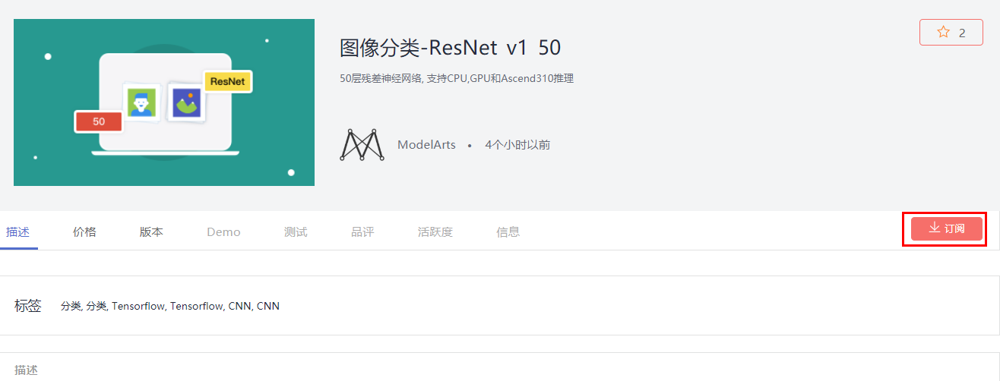按钮。然后点击页面下方的按钮，再点击按钮，最后点击按钮进入我的订阅页面，可以看到刚刚订阅的算法。点击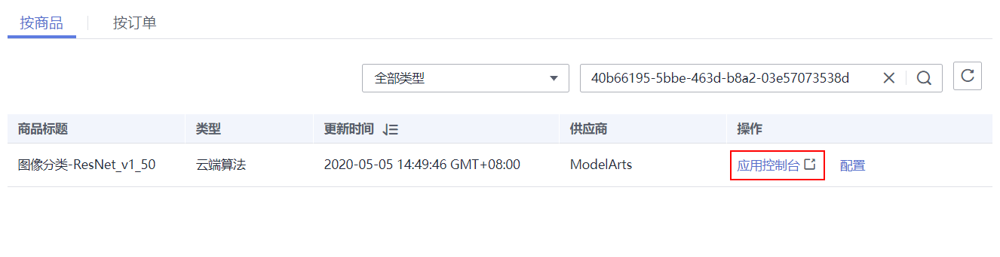超链接，进入算法管理页面。

点击“同步”按钮，同步算法，可以点击按钮，刷新状态。当状态变成就绪时，表示同步成功。

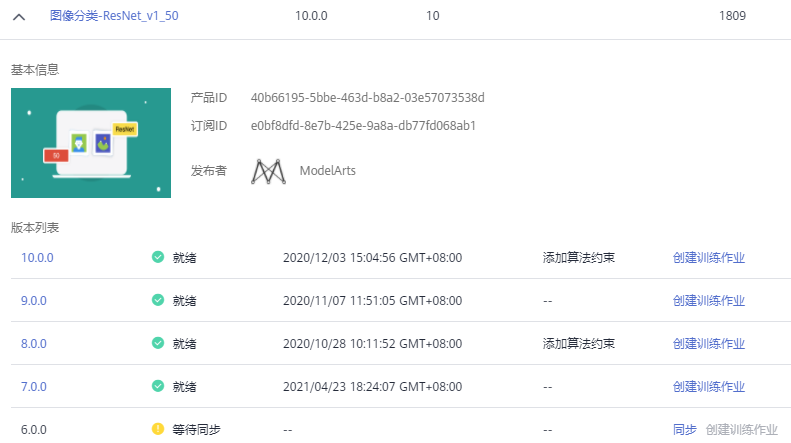

## 模型训练

我们使用创建的美食数据集和订阅的图像分类算法，提交一个图像分类的训练作业，训练会生成一个美食分类模型。

### 创建训练作业

在算法管理中，点击“创建训练作业”按钮，进入训练作业的创建页面。

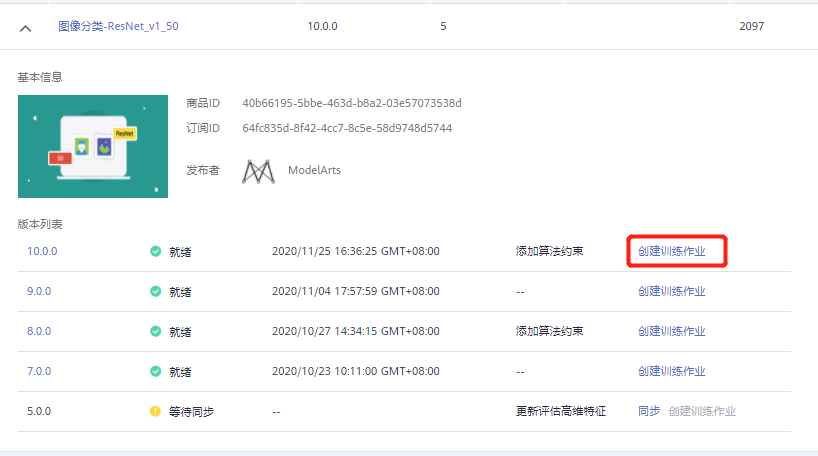

按照如下提示，填写创建训练作业的参数。

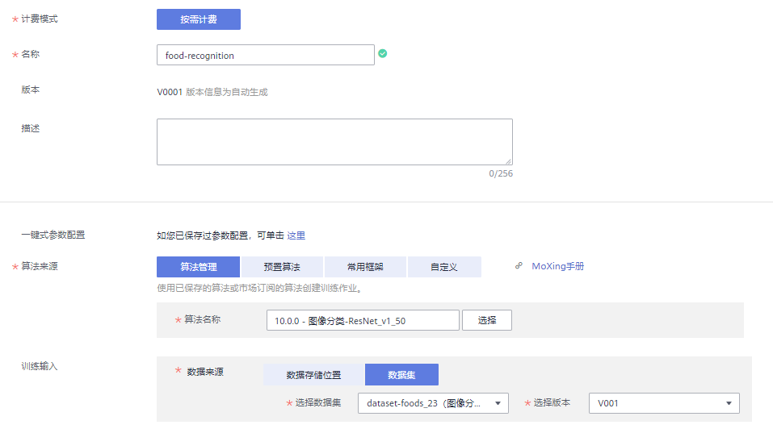

计费模式：按需计费

名称：自定义

算法来源：算法管理

算法名称：`图像分类-ResNet_v1_50`

数据来源：数据集

选择数据集和版本：选择刚刚发布的美食数据集及其版本

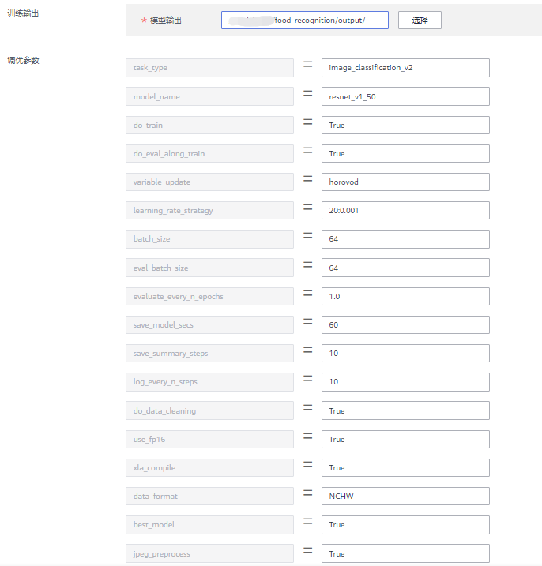

训练输出：选择OBS路径`/modelarts-course/food_recognition/output/`（此OBS路径如果不存在，可以使用OBS客户端创建）。训练输出位置用来保存训练生成的模型。

调优参数：用于设置算法中的超参。算法会加载默认参数，但是可以更改和添加参数。设置`learning_rate_strategy=20:0.001`，表示训练20轮，学习率固定为0.001。其他调优参数保持默认。


作业日志路径：选择OBS路径`/modelarts-course/food_recognition/log/`（此OBS路径如果不存在，可以使用OBS客户端创建）。

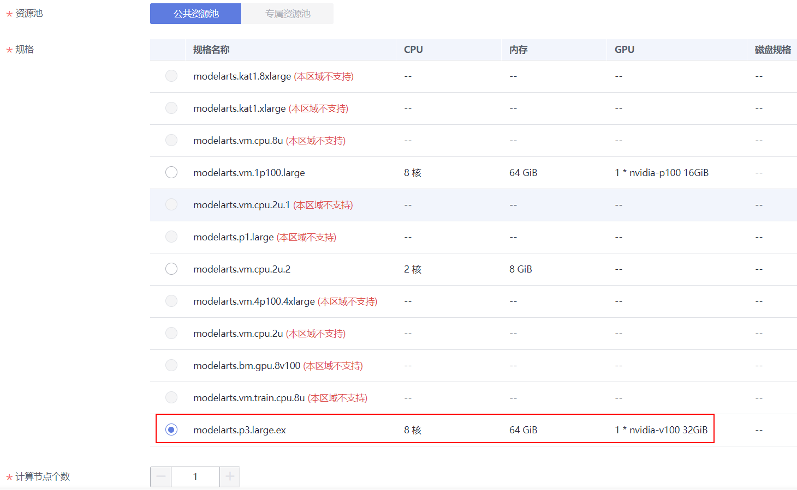

资源池：公共资源池。

规格：V100 GPU，如图所示。

计算节点个数：选择1，表示我们运行一个单机训练任务。

所有字段填写好之后，确认参数无误，点击“下一步”按钮，然后点击“提交”按钮，开始训练。

使用V100 GPU资源，训练时长预计3分钟左右。

### 查看训练结果

训练作业完成后，可以查看训练作业的运行结果。

在训练作业页面，点击作业名称，进入配置信息页面。可以查看到训练作业的详情。

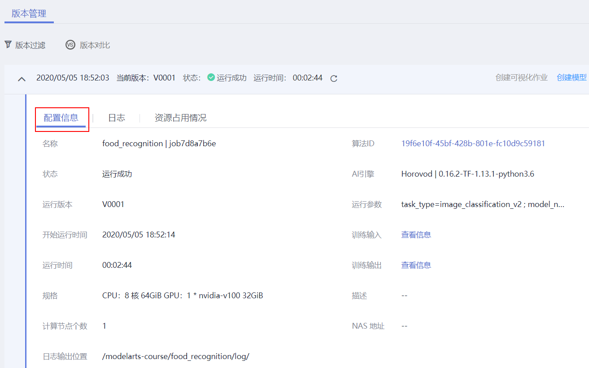

切换到“日志”页签，查看训练作业的训练日志，还可以下载日志到本地查看。

训练日志中会打印一些训练的精度和训练速度等信息。

训练生成的模型会放到训练输出位置OBS路径下，可以直接下载到本地使用。

## 模型部署

### 导入模型

点击“创建模型”按钮，创建模型。


按照如下提示，填写导入模型的字段。

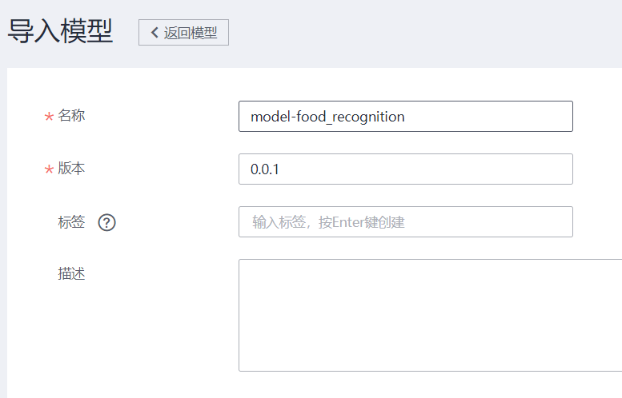

名称：自定义

版本：0.0.1

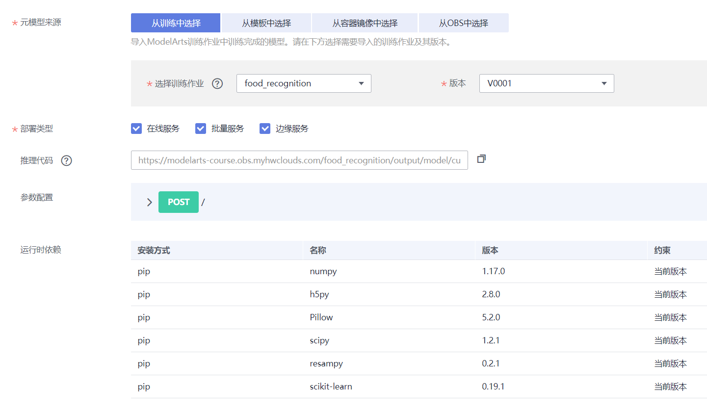

元模型来源：从训练中选择

选择训练作业及版本：刚刚的训练作业及版本，会自动加载

部署类型：默认

推理代码：自动加载

其他保持默认。

点击“立即创建”按钮，开始导入模型，等待模型导入成功。

### 部署上线

等待模型状态为正常，然后点击部署下拉框中的“在线服务”，如下图所示：

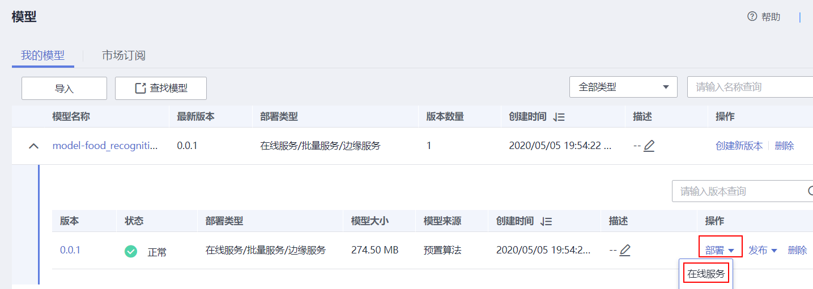

按照如下指导填写参数：


计费模式：按需计费

名称：自定义

是否自动停止：开启，一小时后。会在1小时后自动停止该在线服务。

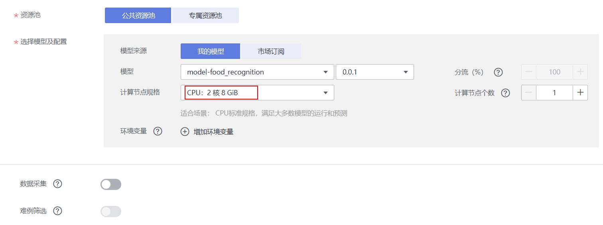

资源池：公共资源池。如果您购买了专属资源池，也可以选择专属资源池部署。

模型来源：我的模型

模型：选择刚刚导入美食分类的模型和版本，会自动加载。

计算节点规格：选择`CPU：2 核 8 GiB`，CPU实例。

计算节点个数：1。如果想要更高的并发数，可以增加计算节点个数，会以多实例的方式部署。

填写好所有参数，点击“下一步”按钮，然后点击“提交”按钮，最后点击查看服务详情。状态栏会显示部署进度，大概3分钟左右会部署完成。

### 在线服务测试

在线服务的本质是RESTful API，可以通过HTTP请求访问，在本案例中，我们直接在网页上访问在线服务。

等待在线服务的状态变成运行中。

切换到“预测”页签。点击上传按钮，上传本地的`foods_recongition_23\test`目录中的图片，然后点击“预测”按钮，进行测试：

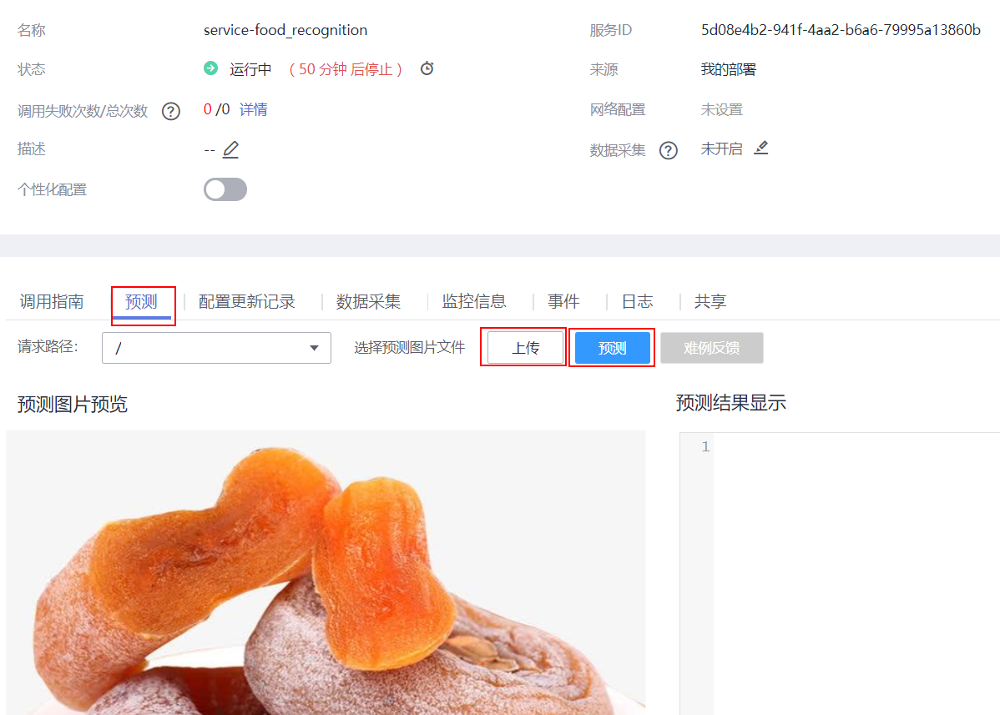

预测结果会出现在右边的输出框：


预测结果中的scores字段，包含了图片为每种类别的置信度。

也可以从网上下载23种美食范围内的图片来测试，评估模型的准确度。

作为在线RESTful API，还可以通过HTTP请求访问，在调用指南页签中有该API的详细信息和调用指南文档。

## 关闭在线服务

为了避免持续扣费，案例完成后，需要关闭在线服务，点击“停止”按钮即可：


当需要使用该在线服务的时候，可以重新启动该在线服务。

### 确认关闭所有计费项

点击[此链接](https://console.huaweicloud.com/modelarts/?region=cn-north-4#/manage/dashboard)，进入ModelArts总览页面，如果所有计费中的数字都是0，表示所有计费项都关闭了。


至此，该案例完成。


