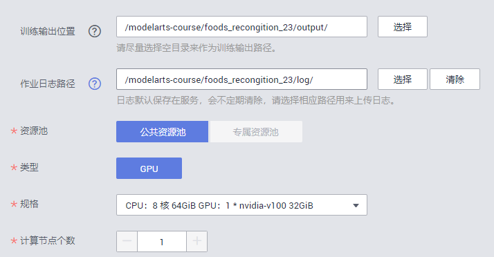

# 使用ResNet50预置算法基于海量数据训练美食分类模型

本案例将介绍怎样使用ModelArts数据标注能力和预置算法ResNet50基于海量美食数据训练一个美食分类模型。

ModelArts自动学习具有零代码、零AI背景、泛化能力强的特点，用户无需编码，无需AI背景，就可以使用自动学习快速构建自己的AI应用。

## 准备工作

参考[此文档](https://github.com/huaweicloud/ModelArts-Lab/tree/master/docs/ModelArts准备工作)，完成ModelArts准备工作。包括注册华为云账号、ModelArts全局配置和OBS相关操作。

## 准备数据

### 下载数据

点击[此链接](https://modelarts-labs.obs.cn-north-1.myhuaweicloud.com/end2end/foods_recongition/foods_recongition_23.tar.gz)，下载数据集压缩包至本地，解压，可以得到文件夹`foods_recongition_23`，其中的`train`目录是训练数据集，`test`目录是测试数据集。

该数据集共包含23类美食，及其部分标注数据。23类美食的种类如下所示：

```
美食/八宝玫瑰镜糕,
美食/凉皮,
美食/凉鱼,
美食/德懋恭水晶饼,
美食/搅团,
美食/枸杞炖银耳,
美食/柿子饼,
美食/浆水面,
美食/灌汤包,
美食/烧肘子,
美食/石子饼,
美食/神仙粉,
美食/粉汤羊血,
美食/羊肉泡馍,
美食/肉夹馍,
美食/荞面饸饹,
美食/菠菜面,
美食/蜂蜜凉粽子,
美食/蜜饯张口酥饺,
美食/西安油茶,
美食/贵妃鸡翅,
美食/醪糟,
美食/金线油塔
```

### 上传数据至OBS

在OBS Browser+中，进入进入刚刚创建的“华为北京四”区域的OBS桶，然后点击上传按钮，上传本地文件夹`foods_recongition_23`至OBS桶：


## 数据标注

### 创建数据集

点击[此链接](https://console.huaweicloud.com/modelarts/?region=cn-north-4#/manage/dataLabel_Beta)，进入ModelArts数据集。请确保区域在“华北-北京四”，本案例所有操作在“华北-北京四”。

点击页面上的“创建数据集”按钮， 创建数据集页面填写示例如下：


数据集名称：自定义

数据集输入位置：`train`文件夹所在的OBS路径

数据集输出位置：标注数据的输出OBS路径。需要在OBS中创建这个路径，创建方式见准备工作中的创建OBS文件夹。

标注场景：物体

标注类型：图像分类

填写完毕上述字段后，点击创建按钮。

### 标注数据

#### 步骤一，进入数据集标注页面

点击数据集名称，进入刚刚创建的数据集的总览页面。

#### 步骤二，同步数据集

点击“开始标注”按钮，进入数据集标注页面。

点击“全部”页面的“同步数据源”按钮，数据同步完成后，右上角会出现“数据同步完成”的提示。“同步数据源”按钮的位置如下图所示：


#### 步骤三，手工标注图片

本数据集中的绝大部分图片已经标注完成，为了让大家体验数据标注的过程，留了一小部分图片没有标注。点击进入“未标注”页面，该页面展示了所有未标注的图片。

点击图片的左上角的选择框，选中图片，可以批量选择图片，然后输入标签名，可以从下拉列表中选择已有标签，然后点击“确认”按钮。如下图所示：


按照此方法标注完所有数据。

### 发布数据集

点击“返回数据集预览”按钮，进入数据集主页：


点击“发布”按钮，发布数据集：


点击“返回数据集列表“按钮，等待数据集发布成功：


## 一键模型上线

数据集发布成功后，可以使用一键模型上线功能，训练模型，并将模型部署成在线API服务。

### 创建一键模型上线任务

点击“任务创建”按钮：


进入“一键模型上线”任务创建页面，按照以下样例和指导填写参数：


名称：自定义


预置算法：选择`ResNet_v1_50`

运行参数：`ResNet_v1_50`自带默认运行参数。将`max_oepoches`改为20，其他运行参数保持默认。这些运行参数会控制的模型训练过程，有经验的用户可以调节这些运行参数。



训练输出位置：选择OBS路径`/modelarts-course/foods_recongition_23/output/`（output文件夹需要自己创建，创建方式见准备工作中的创建OBS文件夹），训练输出位置用来保存训练输得到的模型和TensorBoard日志。

作业日志路径：选择OBS路径`/modelarts-course/foods_recongition_23/log/`（log文件夹需要自己创建，创建方式同训练输出位置），用于保存训练日志文件。

资源池：公共资源池

类型：GPU

规格：`CPU：8 核 64GiB GPU：1 * nvidia-p100 16GiB`

计算节点：1


部署：公共资源池

计算节点规格：`CPU：2 核 8 GiB`。如果开通了GPU部署权限，可以尝试GPU部署。

计算节点个数：1。如果是多个计算节点，就是多实例部署，可以提高API的并发数。

填写好这些参数后，点击“下一步”按钮，确认参数无误，然后提交“提交”按钮。

一键模型上线任务包含了三个子任务，首先会在[训练作业](https://console.huaweicloud.com/modelarts/?region=cn-north-4#/manage/trainingjobs)中创建一个训练作业，会训练得到一个模型，然后将训练所得模型导入到[模型管理](https://console.huaweicloud.com/modelarts/?region=cn-north-4#/manage/models/)中，最后将模型在[在线服务](https://console.huaweicloud.com/modelarts/?region=cn-north-4#/manage/webservice/real-time)中部署为一个在线API服务。以一键模型上线任务的名称为前缀可以找到这些任务。

训练作业耗时5分钟左右，模型导入耗时3分钟左右，启动在线服务耗时5分钟作业。

### 查看训练作业

点击进入[训练作业](https://console.huaweicloud.com/modelarts/?region=cn-north-4#/manage/trainingjobs)，通过一键模型上线任务的名称找到对应的训练作业，点击作业名称进入作业详情。

“配置信息”页面展示了训练作业的配置详情：


“日志”页面展示了训练过程日志，可以看到模型在训练过程中打印的日志，比如模型精度、训练速度等，同时也可以下载日志文件到本地查看：


## 在线服务测试

在线服务的本质是RESTful API，可以通过HTTP请求访问，在本案例中，我们直接在网页上访问在线服务。

使用一键模型上线任务的名称为前缀，在[在线服务](https://console.huaweicloud.com/modelarts/?region=cn-north-4#/manage/webservice/real-time)中找到相应的在线服务，等待启动成功。

然后点击“预测”按钮，进入在线服务预测页面。如下图所示：


点击上传按钮，上传本地的`foods_recongition_23\test`目录中的图片，然后点击“预测”按钮，进行测试：


预测结果会出现在右边的输出框：


预测结果中的scores字段，包含了图片为每种类别的置信度。

也可以从网上下载23种美食范围内的图片来测试，评估模型的准确度。

作为在线RESTful API，还可以通过HTTP请求访问，在调用指南中有该API的详细信息和调用指南文档，如下图所示：


## 关闭在线服务

为了避免持续扣费，案例完成后，需要关闭在线服务，点击“停止”按钮即可：


当需要使用该在线服务的时候，可以重新启动该在线服务。

至此，该案例完成。


