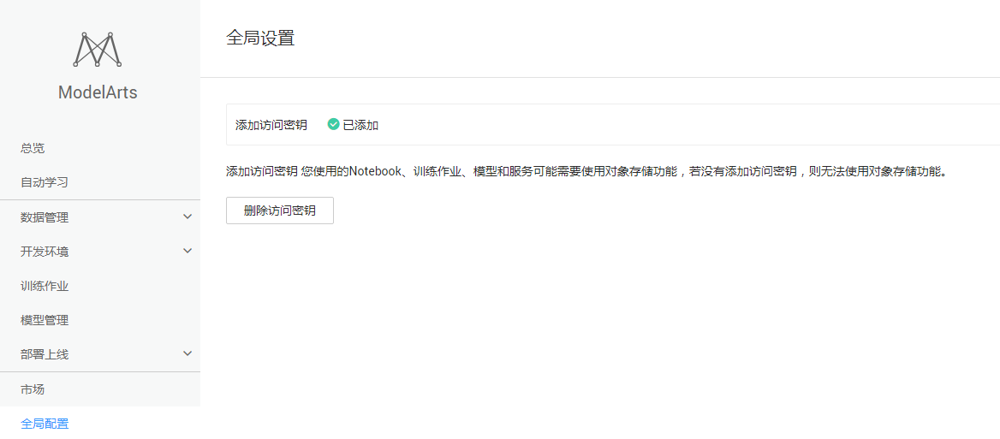
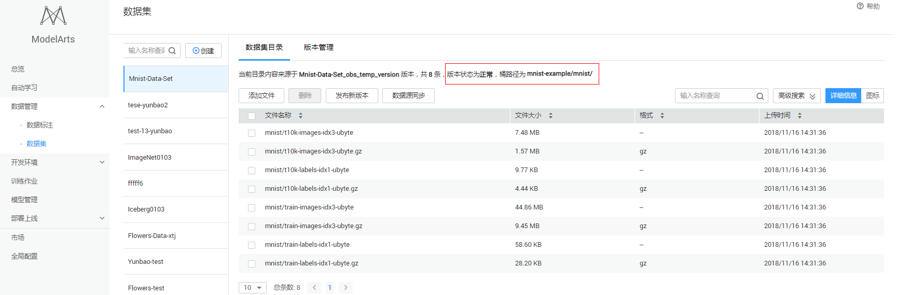
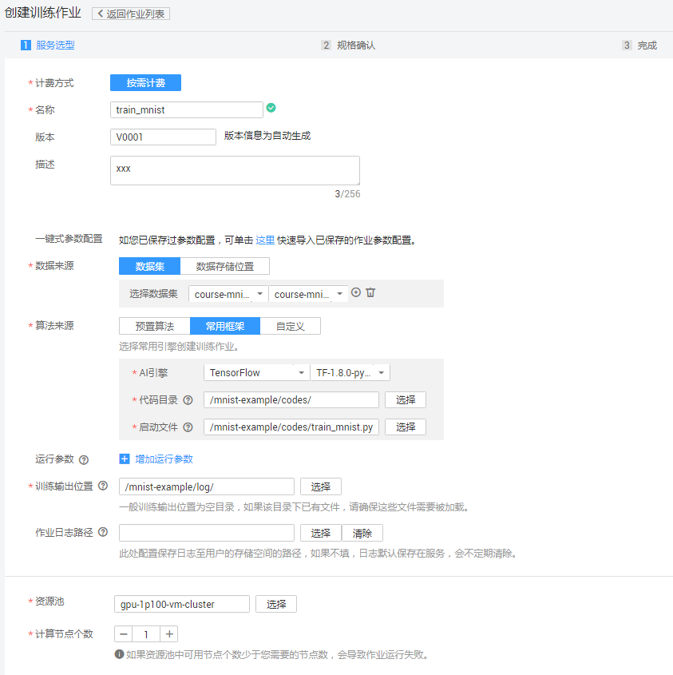
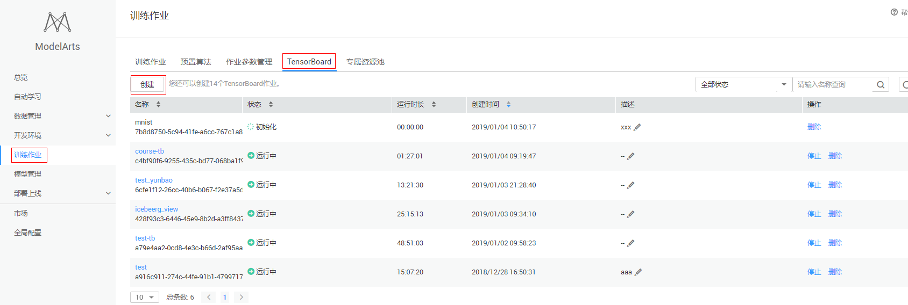
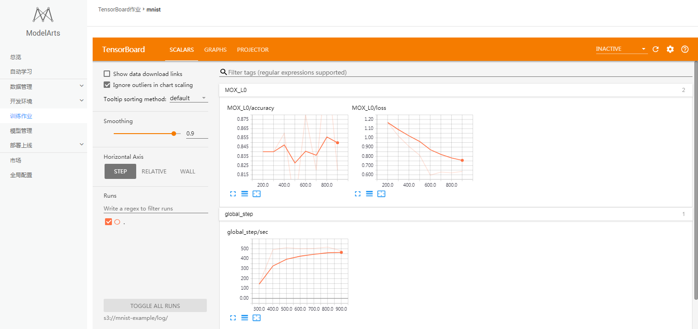
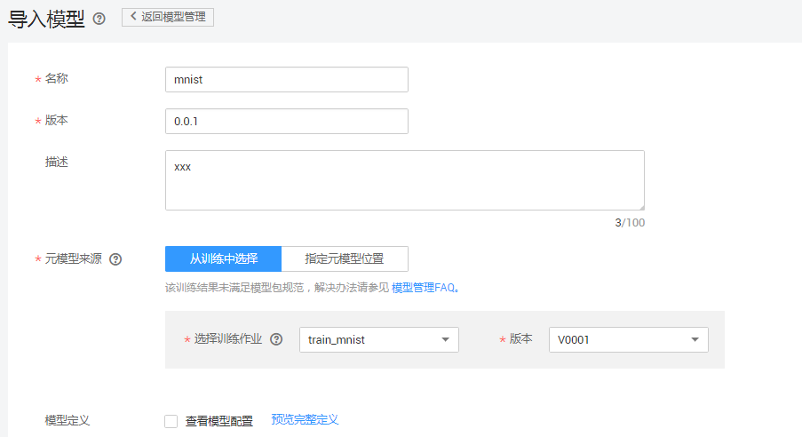
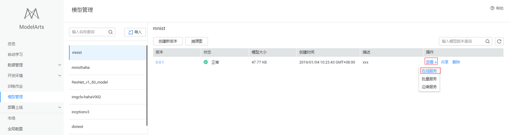
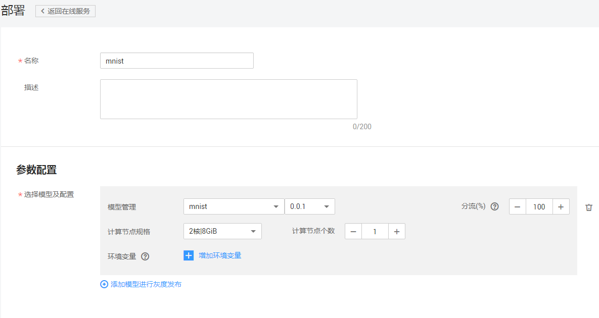
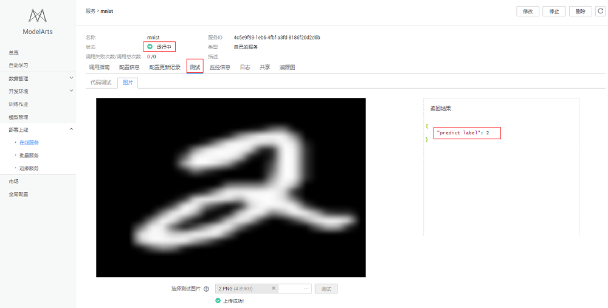

# 使用MoXing实现手写数字图像识别应用

本案例介绍在华为云ModelArts平台如何使用MoXing实现MNIST数据集的手写数字图像识别应用，操作的流程分为一下4个步骤：

### 1. 准备数据
通过ModelArts的“AI市场“预置数据集创建本案例所需数据集版本，具体操作如下：

**步骤 1**  &#160; &#160; 登录“[ModelArts](https://console.huaweicloud.com/modelarts/?region=cn-north-1#/manage/dashboard)”管理控制台，在“全局配置”界面添加访问秘钥，如图（如已添加密钥，可跳过此步）：

**步骤 2**  &#160; &#160; 返回“ModelArts”管理控制台，单击左侧导航栏的“AI市场”。 切换到ModelArts市场的“数据集”页面，找到数据集“Mnist-Data-Set”。

**步骤 3**  &#160; &#160; 进入到该预置数据集“Mnist-Data-Set”的详情页面，执行“导入到我的数据集”操作，输入“桶名”，本例中为“mnist-example”，点击确定，完成创建，页面会跳转到“数据管理>数据集”页面。

**步骤 4**  &#160; &#160; 在“ModelArts”管理控制台的“数据管理>数据集”页面查看直到mnist数据集（Mnist-Data-Set）创建完成，数据详细信息完全加载。

**步骤 5**  &#160; &#160; 在数据集目录页面获取创建的mnist数据集的桶信息mnist-example/mnist/。请参考下图:

### 2. 训练模型
接下来，要编写模型训练脚本代码（本案例中已编写好了训练脚本），并完成模型训练，操作步骤如下：

**步骤 1**  &#160; &#160; 下载模型训练脚本文件<a href ="codes/train_mnist.py">train\_mnist.py</a>。参考<a href="https://support.huaweicloud.com/usermanual-dls/dls_01_0040.html">“上传业务数据”</a>章节内容，将脚本文件上传至华为云OBS桶 （假设OBS桶路径为：/mnist-example/codes/）。(mnist数据集文件与模型训练脚本文件不能放在同一文件夹下)。

**步骤 2**  &#160; &#160; 在“训练作业”界面，单击左上角的“创建”, “名称”和“描述”可以随意填写；“数据来源”请选择“数据集”Mnist-Data-Set{或者“数据的存储位置”(本例中为mnist-example/mnist)}；“算法来源”请选择“常用框架”，“AI引擎”选择“TensorFlow"；“代码目录”请选择型训练脚本文件train\_mnist.py所在的OBS父目录（/mnist-example/codes/）；“启动文件”请选择“train\_mnist.py”；“训练输出位置”请选择一个路径（例如/mnist-example/log/）用于保存输出模型和预测文件，“资源池“请选择“计算型GPU P100“，下图填写的训练作业参数，仅供参考，以真实环境的参数配置为准。

**步骤 3**  &#160; &#160;  参数确认无误后，单击“立即创建”，完成训练作业创建。

**步骤 4**  &#160; &#160; 在模型训练的过程中或者完成后，通过创建TensorBoard作业查看一些参数的统计信息，如loss， accuracy等。在“训练作业”界面，点击TensorBoard，再点击“创建”按钮，参数“名称”可随意填写，“日志路径”请选择步骤3中“训练输出位置”参数中的路径（/mnist-example/log/），或者直接进入训练作业界面点击作业名称，点击右上角的“创建TensorBoard”。（）

 tensorboard界面显示

训练作业完成后，即完成了模型训练过程。如有问题，可点击作业名称，进入作业详情界面查看训练作业日志信息。

### 3. 部署模型

模型训练完成后，将模型部署为在线预测服务，操作步骤如下：

**步骤 1**  &#160; &#160; 将推理代码[customize\_service.py](https://github.com/huawei-clouds/modelarts-example/blob/master/Using%20MoXing%20to%20Create%20a%20MNIST%20Dataset%20Recognition%20Application/codes/customize_service.py)和配置文件[config.json](https://github.com/huawei-clouds/modelarts-example/blob/master/Using%20MoXing%20to%20Create%20a%20MNIST%20Dataset%20Recognition%20Application/codes/config.json) 上传到OBS对象存储：/mnist-example/log/model/目录下；customize_service.py文件为推理代码，config.json 为推理需要获取的相关配置信息。

**步骤 2**  &#160; &#160;点击“训练作业”->"train_mnist"，进入训练作业后点击右上角的“创建模型”（或者进入“模型管理”界面，单击左上角的“导入”），参考下图填写参数。名称可随意填写，“版本”按照要求输入，“元模型来源”选择“从训练中选择”->“选择训练作业”和“版本”（或者选择“指定元模型位置”，“选择元模型”的路径与训练模型中“训练输出位置”保持一致：/mnist-example/log/）。

下图填写的训练作业参数，仅供参考，以真实环境的参数配置为准。

**步骤 2**  &#160; &#160; 参数确认无误后，单击“立即创建”，完成模型创建。

当模型状态为“正常”时，表示创建成功。单击部署-在线服务，创建预测服务，参考下图填写参数。

部署在线服务界面

部署在线服务参数配置

### 4. 发起预测请求

完成模型部署后，在部署上线-在线服务界面可以看到已上线的预测服务名称，当预测服务显示为“运行中”时，点击进入可以进行在线预测。

注意：预测图片可参考[mnist图片](https://github.com/huawei-clouds/modelarts-example/tree/master/Using%20MXNet%20to%20Create%20a%20MNIST%20Dataset%20Recognition%20Application/mnist_pic)，预测图片需为单通道28*28手写数字图片,jpg格式，mnist案例不支持彩色图片预测，若为其他不符合格式的单通道图片，预测结果可能会存在偏差。

在线服务测试

