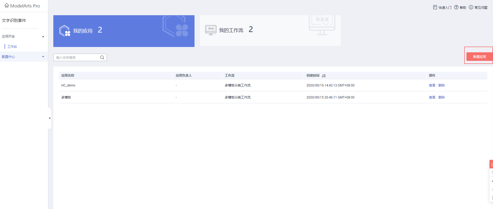

# ModelArts Pro 快速开发AI应用-文字套件案例

**文字套件案例内容**
此案例将带领开发者体验ModelArts Pro 开发套件，首先使用ModelArts Pro文字识别套件训练多模板的识别的服务

**准备工作**
体验多模板识别分类工作流，需要完成以下准备工作。

**完成ModelArts Pro准备工作**
注册华为云账号、切换到北京四，进入 ModelArts Pro <a href="https://console.huaweicloud.com/mapro/#/home" target="_blank">主页</a>，申请文字识别套件的公测。

## 准备数据
### 下载数据集

本案例包含4张图片，2张图片属于文档类模板，2张图片属于表格类模板。我们从<a href="https://bbs.huaweicloud.com/forum/thread-78758-1-1.html" target="_blank">活动论坛帖</a>（文末附件）进行下载，文件名：modelarts\_pro\_ocr\_dataset，下有“表格”及“文档”两个子文件夹

## 创建应用
公测白名单审批完成以后，点击“进入套件”，开始使用文字识别套件

创建应用，点击“新建应用”。

根据业务需求填写“应用名称”、“应用负责人”和“应用描述”，选择“所属行业”和“多模板分类工作流”，点击确定。

## 使用工作流
点击“创建分类器”，开始使用工作流。

### 上传模板图片
在“应用开发>上传模板图片”页面，填写基本信息，配置模板。

**基本信息**
输入多模板分类器的“名称”和“描述”。

**模板配置**

* 单击添加多个模板，选择数据集中的 **modelarts\_pro\_ocr\_dataset/文档/模板1.png**文件上传，命名为“文档”。

	“模板类型”：选择模板类型，当前可选“文档”、“通用”、“票证”，选择“文档”。

* 单击上传另外一张模板图片，选择数据集中的 **modelarts\_pro\_ocr\_dataset/表格/模板2.png** 文件上传，命名为“表格”。

### 定义预处理
可跳过，直接点击下一步

### 框选参照字段
在文字识别过程中，如果需要核对所识别的图片和模板图片的板式一致性，这就需要在图片模板中框选参照字段。所有需要识别的图片中都会包含参照字段，且位置固定不变，因此模型可以通过识别参照字段核对图片板式。

参照字段指为了核对所识别的图片和模板图片的板式一致性，需要做一致性对照的字段。所有需要识别的图片中都会包含参照字段，且位置固定不变。

可按照以下方式框选

“文档”模板框选完成后，通过点击上方的下一个按钮，切换到“表格”模板的框选。

### 框选识别区
在文字识别过程中，需要确定图片中识别的文字位置，这就需要在图片模板中框选识别区。所有需要识别的图片中都会包含此识别区的字段，且位置固定不变，因此模型可以通过识别区找到需要识别内容的位置。

识别区指图片中待识别的文字位置。所有需要识别的图片中都会包含此识别区的字段，且位置固定不变，因此模型可以通过识别区找到需要识别内容的位置。

单击左上方操作图标，调整当前模板图片到合适大小。

单击框选操作图标，单击待识别文字的左上角，移动鼠标框选识别区，使得矩形框覆盖待识别的文字。

框选识别区应尽量扩大识别区范围，使所框选识别区覆盖字段值可能出现的区域。

可按以下方式操作。

“文档”模板框选完成继续通过 切换到“表格”模板进行框选。

### 上传训练集
确定模板图片的参照字段和识别区后，多模板分类工作流在模板数量较多，或版式相似度较高的情况下，建议针对不同的模板上传对应的训练集数据，用于训练模板分类模型，使服务能够精准地分类多个模板图片，然后对多个模板图片进行文字识别和结构化提取。

上传训练集

在“应用开发>上传训练集”页面，选择模板，单击操作列的“上传训练集”。

弹出上传文件对话框。

单击上传文件对话框，在下载的本地数据集里分别选择已经准备好的“zip”包文件：
* ”文档”模板上传“modelarts\_pro\_ocr\_dataset/文档/训练数据.zip”文件
* ”表格”模板上传“modelarts\_pro\_ocr\_dataset/表格/训练数据.zip”文件

上传成功后页面右上方会提示“文件上传成功”。

确定每个模板上传训练集后，单击“开始训练”。

服务进入“应用开发>评估”页面，开始训练模型。

待模型训练完毕，进入下一步。

### 评估模板

通过上传测试图片，在线评估模型训练的模板分类器是否能正确分类模板。

在“应用开发>评估”页面，您可以选择本地上传测试图片，也可以上传在线图片。

图1 评估分类器

####  本地上传图片

默认进入“本地上传”页签，根据自身需要选择打开“分类模式”和“动态识别”开关，单击“上传图片”，或者拖拽测试图片至虚线框内上传图片区域，上传本地数据集的图片（modelarts\_pro\_ocr\_dataset\文档\测试1.png文件）作为测试图片。

### 部署模板
确定模板图片的参照字段和识别区后，需要对模板图片进行评估和考察。您可以通过上传测试图片，在线评估模板的识别情况，保证能正确识别同样模板下其他图片中的识别区文字。
