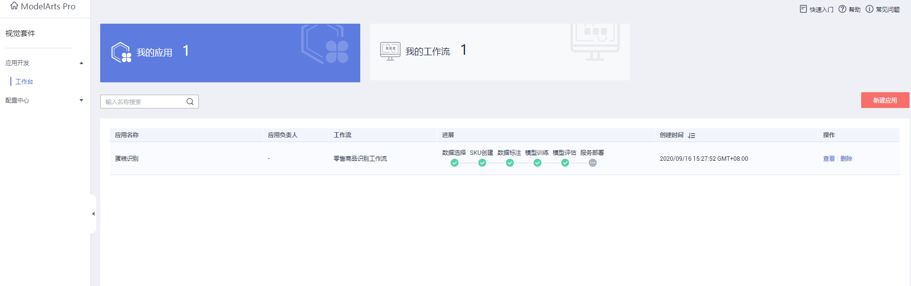
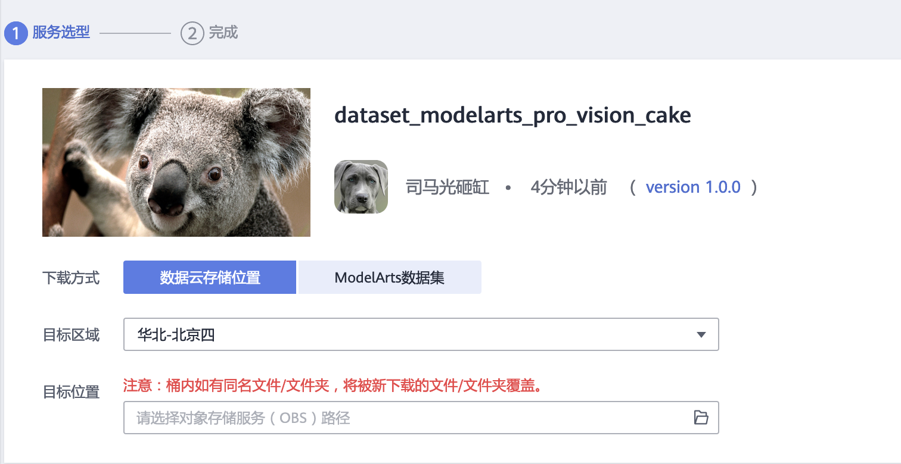
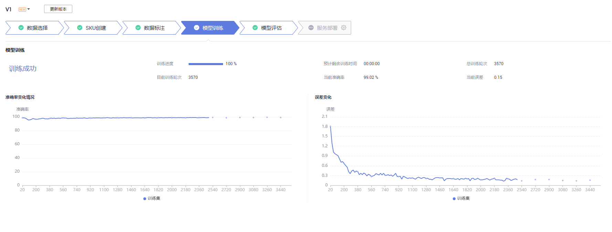

# ModelArts Pro 快速开发AI应用-视觉套件案例

**视觉套件案例内容**
此案例将带领开发者体验ModelArts Pro视觉套件中的零售商品识别服务。

**完成ModelArts Pro准备工作**
注册华为云账号、切换到北京四，进入 ModelArts Pro <a href="https://console.huaweicloud.com/mapro/#/home" target="_blank">主页</a>，申请视觉套件的公测。

## 创建应用

公测审批完成以后，点击“进入套件”，开始使用视觉套件

创建应用，点击“新建应用”。

根据业务需求填写“应用名称”、“应用负责人”和“应用描述”，选择“所属行业”和“零售商品识别工作流”，点击确定。

## 使用工作流

### 数据集选择

**本案例需要用到两个数据集，训练用数据集及SKU数据集**
* 训练用数据集从OBS进行订阅(见下方操作示例)
* SKU数据集请从<a href="https://bbs.huaweicloud.com/forum/thread-78758-1-1.html" target="_blank">论坛帖附件下载</a>

#### 训练用数据集

在使用零售商品识别工作流开发应用时，您需要新建训练数据集，后续训练模型操作是基于您创建的训练数据集。

* 新建训练数据需要获取访问OBS权限，在未进行委托授权之前，无法使用此功能。您需要提前获得OBS授权，详情请见<a href="https://support.huaweicloud.com/usermanual-modelartspro/modelartspro_01_0003.html" target="_blank">获取访问秘钥并完成ModelArts全局配置</a>。
* 创建用于存储数据的OBS桶及文件夹，且数据存储的OBS桶与ModelArts Pro在同一区域（建议北京四），详情请见<a href="https://support.huaweicloud.com/usermanual-modelartspro/modelartspro_01_0004.html" target="_blank">创建OBS桶</a>。

我们从华为云AI市场订阅训练数据集至OBS，然后就可以在ModelArts Pro中使用了。点击<a href="https://console.huaweicloud.com/modelarts/?locale=zh-cn&region=cn-north-4#/aiMarket/datasetDownload?content_id=7a52dbac-03d5-4e6f-a71f-95864b124ffb" target="_blank">此链接</a>进入下载详情页，详情页示例如下：

* 目标区域选择北京四，目标位置选择上面创建的OBS桶。
* 填写好参数后，点击“下一步”按钮，然后点击“确定”按钮。等待数据集状态变为推送成功（可以点击右上角“刷新”按钮刷新状态），即可在OBS对应的桶中看到下载的数据集。

在“应用开发>数据选择”页面，单击“新建训练数据集”，右侧弹出“新建数据集”页面，根据数据存储位置和数据标注情况，按<a href="https://support.huaweicloud.com/usermanual-modelartspro/modelartspro_01_0060.html#modelartspro_01_0060__table1455214220167" target="_blank">表3</a>填写数据集基本信息，然后单击“确定”，**本案例中，输入位置为导入的数据集中的cake\_data文件夹，输出位置选择或新建一个空文件夹**。

确定后，在页面中选择刚刚新建的数据集，点击“下一步”进行SKU创建，此时还不需要标注

### SKU创建
当一次性上传一个SKU，即一种类别的商品时，您可以通过新建SKU操作上传SKU图片。

1. 在“SKU创建”页面，单击“新建SKU”。
    弹出“新建SKU”对话框。

2. 在“新建SKU”对话框中，按<a href="https://support.huaweicloud.com/usermanual-modelartspro/modelartspro_01_0063.html#modelartspro_01_0063__table3131146191013" target="_blank">表1</a>填写信息，然后单击“确定”。

|  **参数**   | **说明**  |
|  :----:  | :---- |
| SKU名称  | 输入SKU的名称。 |
| SKU单品图  | 在本地选择提前准备好的SKU单品图，后续存储至OBS中。单击“SKU单品图”右侧的“选择文件”，在本地选择图片，可选择多个图片。   **说明**：文件放置方式请按照“单品文件夹/单品图”或者“父文件夹/单品文件夹/单品图”的组织方式，选择单品文件夹或者父文件夹，平台将自动生成单品。每个单品的图片必须大于20张。|
| SKU存储位置（OBS）  | 选择SKU单品图上传至OBS的桶和文件夹。单击“SKU存储位置（OBS）”右侧输入框，在“SKU存储位置（OBS）”对话框中选择SKU存储的OBS桶和文件夹，单击“确定”。 |

本案例中，需要创建**3个SKU**，第一个名称填 blueberry\_cheesecake，SKU单品图选择SKU数据集中的：cake\_hc\_demo/sku/ blueberry\_cheesecake，点击确认。同理，完成red\_velvet\_cake 和 tiramisu 的SKU创建及文件上传。

### 数据标注
智能标注自动开始，会显示自动标注的进度，如果自动标注完成，标注进度为100%。

标注完成后，您可以单击“标注结果确认”中的“前往确认”，进入标注概览页。

在标注概览页单击右上方的“开始标注”，进入手动标注数据页面，针对“已标注”的数据进行核对和检查，详情请见<a href="https://support.huaweicloud.com/usermanual-modelartspro/zh-cn_topic_0272489069.html" target="_blank">手动标注数据</a>。
针对标注错误的数据<a href="https://support.huaweicloud.com/usermanual-modelartspro/zh-cn_topic_0272489069.html#ZH-CN_TOPIC_0272489069__section0534612151819" target="_blank">修改标注</a>。

### 模型训练
模型训练一般需要运行一段时间，等模型训练完成后，“开发应用>模型训练”页面下方显示训练详情。
    

### 模型评估
训练得到模型之后，整个开发过程还不算结束，需要对模型进行评估和考察。往往不能一次性获得一个满意的模型，需要反复的调整算法、数据，不断评估训练生成的模型。

一些常用的指标，如精准率、召回率、F1值等，能帮助您有效的评估，最终获得一个满意的模型。
    

### 服务部署

模型准备完成后，您可以部署应用，对应用进行预测和调用
    
