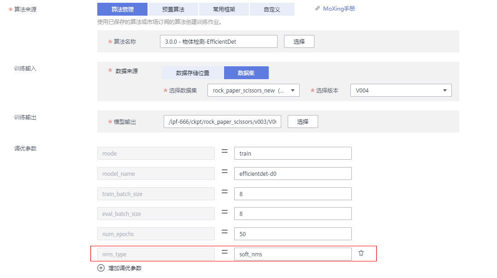
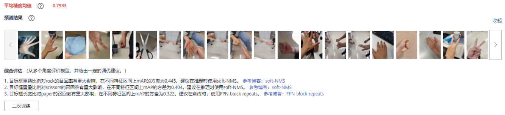
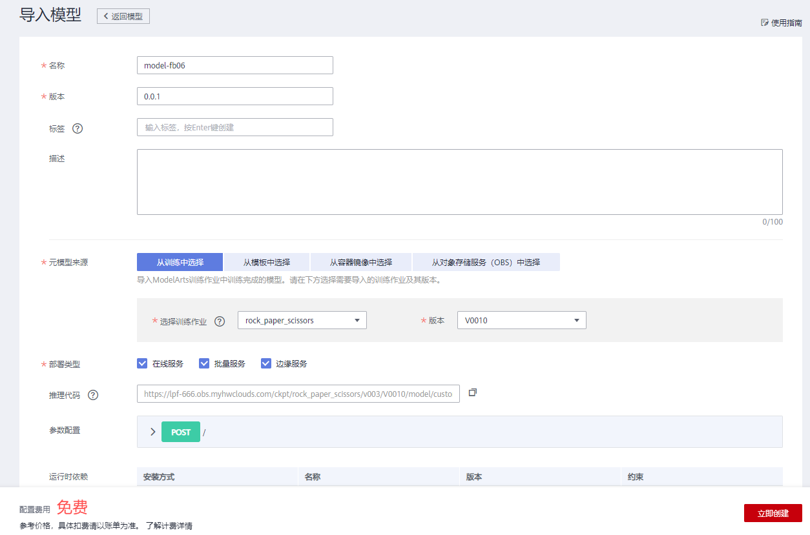
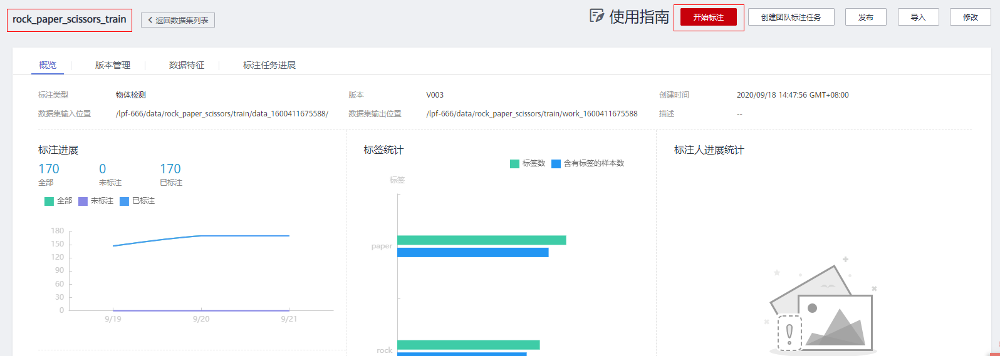
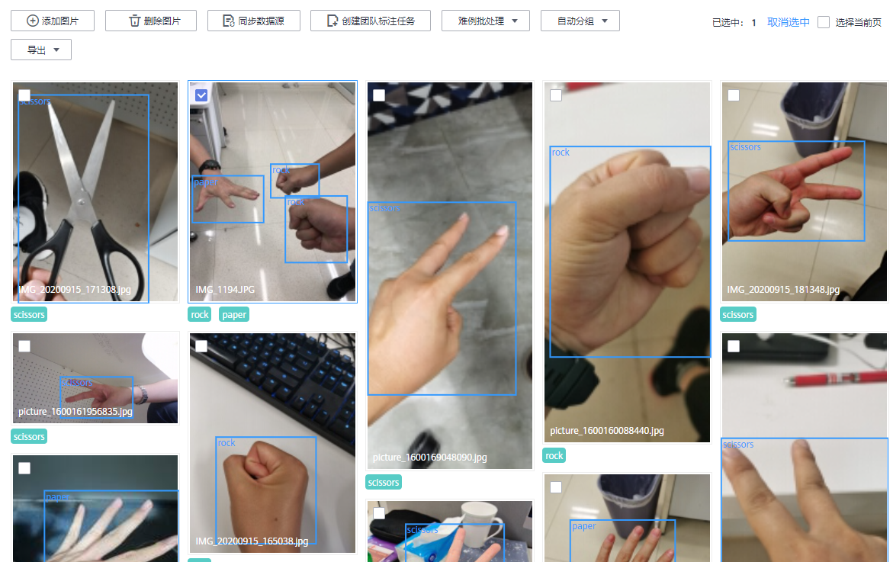
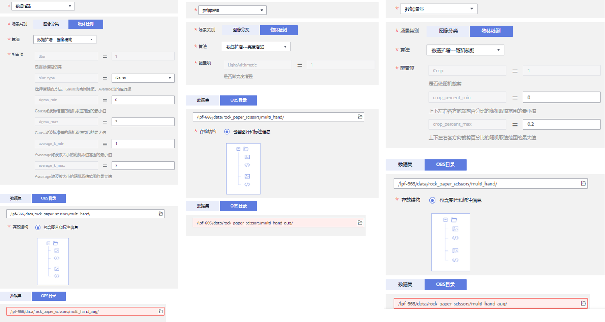
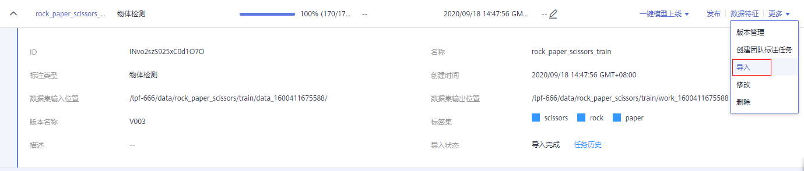
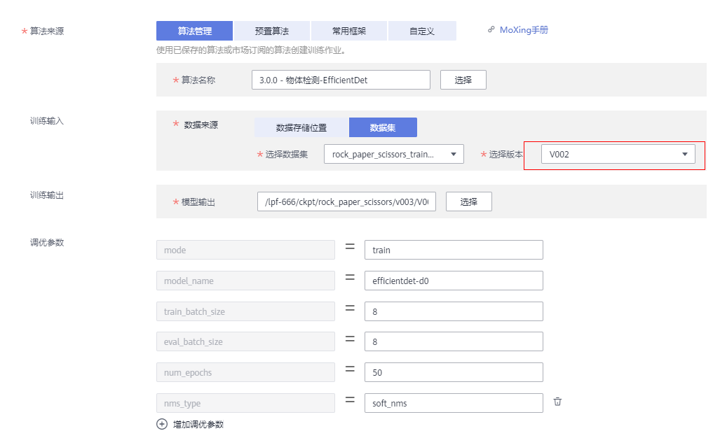
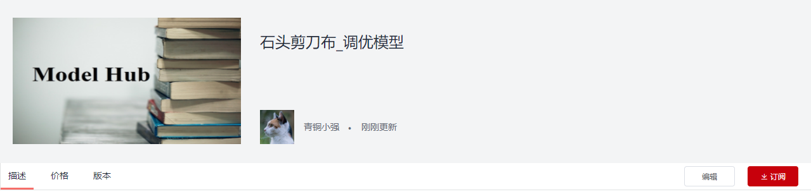
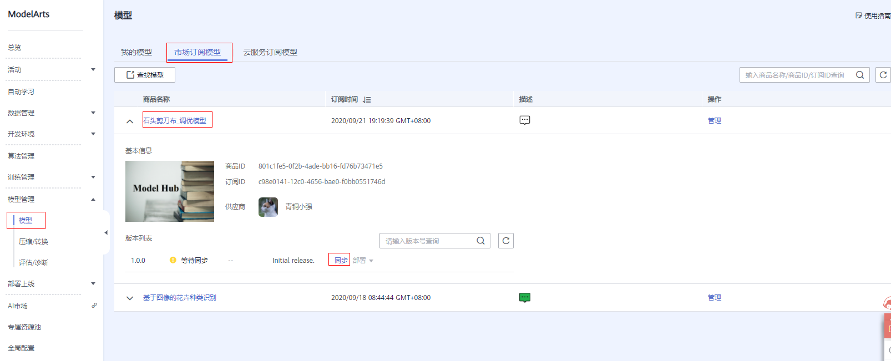

## 终端分歧机模型训练与调优_完整体验版

### 案例内容

此案例将带领开发者体验深度学习模型开发调优的过程，包括从市场订阅数据、算法、模型，数据处理的校验、增强功能，训练功能，模型评估功能，部署在线服务功能，端到端掌握数据处理、训练、调优、发布的技能。

### 准备工作

根据[此文档](https://github.com/huaweicloud/ModelArts-Lab/blob/master/docs/ModelArts准备工作/准备工作简易版.md)，完成ModelArts准备工作。包括注册华为云账号、ModelArts全局配置和OBS相关操作。

申请“数据处理”功能的白名单权限（[详见论坛帖](https://bbs.huaweicloud.com/forum/thread-78758-1-1.html)）。

### 实验内容

#### 准备训练数据集

从数据集市场下载训练用数据集（石头剪刀布\_训练集\_修正版），直接下载到新数据集。

发布训练用数据集（0.6切分训练集）

#### 订阅模型

从市场订阅 物体检测-EfficientDet 算法

在算法管理页签，同步订阅的算法

#### 模型训练

同步完成后，在算法管理页面点击“创建训练作业”，进入创建页面。

训练集选前面发布过的训练用数据集（一定是切分后的数据集），模型输出路径可以选择任意一个空目录。

为了缩短训练时间，可以适当减小num_epochs的值，设为50时，约耗时10min。

****

#### 准备测试数据集

从市场下载石头剪刀布_测试集（含标注，坏数据），到obs路径。

 创建数据校验作业，选择数据集校验，场景类别为“数据检测”，输入为上一步下载的obs目录，输出到新空目录。

从校验输出的obs目录创建测试用数据集，数据集输入位置为上一步校验输出的目录，输出目录为任意空目录。

创建完成后，会生成一个已标注的数据集，发布版本时，训练集比例设为0，因为这个数据集只用作测试。

#### 查看第一次训练结果

训练结束后，可以在训练详情页面点击“评估结果”页签，查看训练的各种指标。

#### 二次训练模型（可选）

点击评估页面的“二次调优”按钮，即可跳转的新的训练作业创建页面，模型调优用的参数会被默认加载进来。

调优训练结束后，可以再次查看评估结果，精度指标大概率提升（由于数据集较小，精度会比较飘，出现下降的情况也有可能）。

#### 发布模型

点击训练详情页面的“创建模型”按钮，进入发布页面。

导入模型页面，默认参数下，直接点击“立即创建”按钮。

等待模型发布成功。

#### 创建评估作业

在左侧选择“评估/诊断”功能，点击“创建”按钮。

在创建页面，选择上一步发布的模型，AI引擎选择TF-2.1.0-python3.6，数据集选择前面发布的测试用数据集。之后点击“下一步”，创建作业。

#### 分析评估结果

评估作业完成后，查看评估结果，点击预测结果中的图像，放大展示。发现错误推理大部分来自图像中有多个手的图片。

#### 筛选待扩增数据（可选）

回到数据集页面，点击进入训练用数据集，点击“开始标注按钮”，

选择出现多个手的数据，并导出到obs目录。

#### 数据扩增---亮度、模糊、裁剪（可选）

在数据处理作业中，选择“数据增强”，分别创建“亮度”，“模糊”，“裁剪”3个作业，输入为上一步导出的obs目录，输出到obs目录。

#### 更新训练集（可选）

回到训练数据集页面，导入上一步扩增的数据，导入目录为上一步的输出目录。重新发布数据集版本。

#### 再次训练（可选）

重新创建训练作业，数据集选择上一步发布的版本。

#### 再次发布模型并创建评估作业，查看结果（可选）

创建评估作业的方式跟之前一样，查看新模型在测试集上的表现，大概率出现精度指标提升。

#### 订阅训练好的模型

订阅市场中已调优好的模型

订阅成功后，会在市场订阅模型页签中找到已订阅的模型，点击“同步”按钮。

#### 部署在线服务

在模型管理页面，点击“部署”按钮下拉框中的“在线服务”按钮。

选择带GPU的资源规格。

#### 手机端测试

在手机端，打开浏览器，输入网址：https://aidetect.huaweicloud.com；
进入服务页面，填写自己的用户名、密码进行登录，选择上面部署的服务名称，进行手机端推理。

    

