## 终端分歧机模型训练与调优_HC现场体验版

### 案例内容

此案例将带领开发者体验深度学习模型开发调优的过程，包括从市场订阅数据、算法，数据处理的校验、增强功能，训练功能，模型评估功能，部署在线服务功能，端到端掌握数据处理、训练、调优、发布的技能。

### 准备工作

根据<a href="https://github.com/huaweicloud/ModelArts-Lab/blob/master/docs/ModelArts准备工作/准备工作简易版.md" target="_blank">此文档</a>，完成ModelArts准备工作。包括注册华为云账号、ModelArts全局配置和OBS相关操作。

申请“数据处理”功能的白名单权限（<a href="https://bbs.huaweicloud.com/forum/thread-78758-1-1.html" target="_blank">详见论坛帖</a>）。

### 实验内容

#### 准备训练数据集

从数据集市场下载训练用数据集，请点击访问：<a href="https://marketplace.huaweicloud.com/markets/aihub/datasets/detail/?content_id=890d3449-42dd-4a13-b50e-7eb79045b40e" target="_blank">石头剪刀布\_训练集\_修正版</a>。

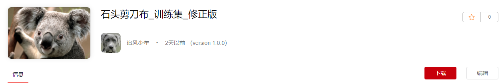

点击“下载”进入下载详情页，**下载方式选择“ModelArts数据集”，区域选择“北京四”，目标位置和名称根据自己实际情况选择和填写，请勿照抄**。

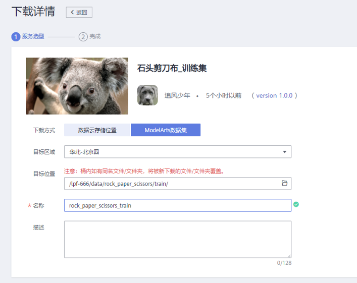

填写完成后，点击“下载”，进入启动下载页，然后点击“确定”，可以看到推送状态，推送成功后回到 <a href="https://console.huaweicloud.com/modelarts/?region=cn-north-4#/dataset" target="_blank">ModelArts数据集管理</a>,可以看到刚刚推送的数据集，点击数据集后的“发布”按钮。

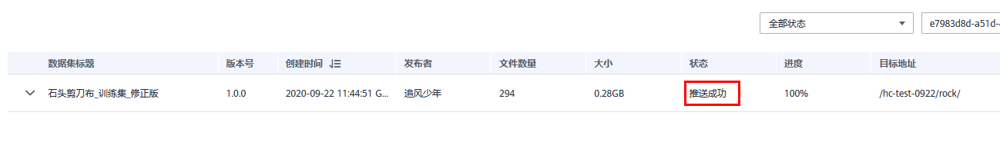

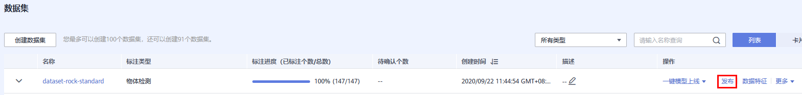

发布训练用数据集（0.6切分训练集）

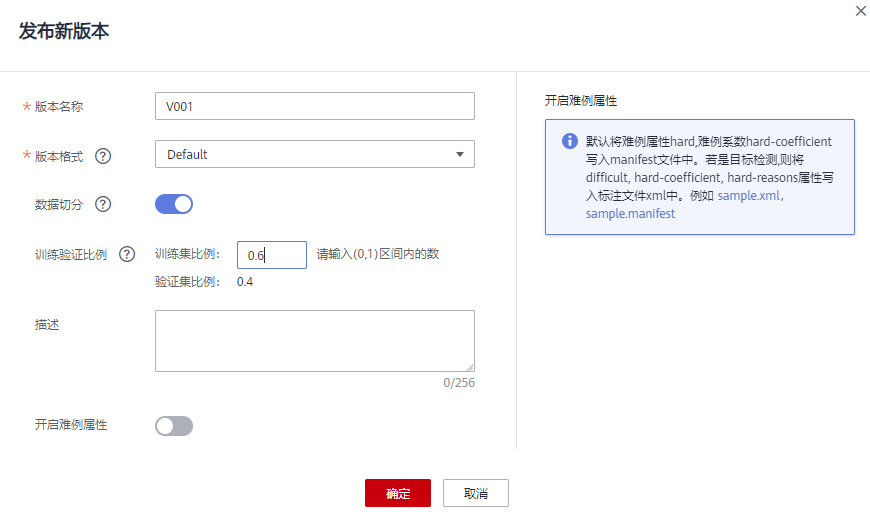

发布成功后，点击上方“数据标注”按钮，可查看到以下信息

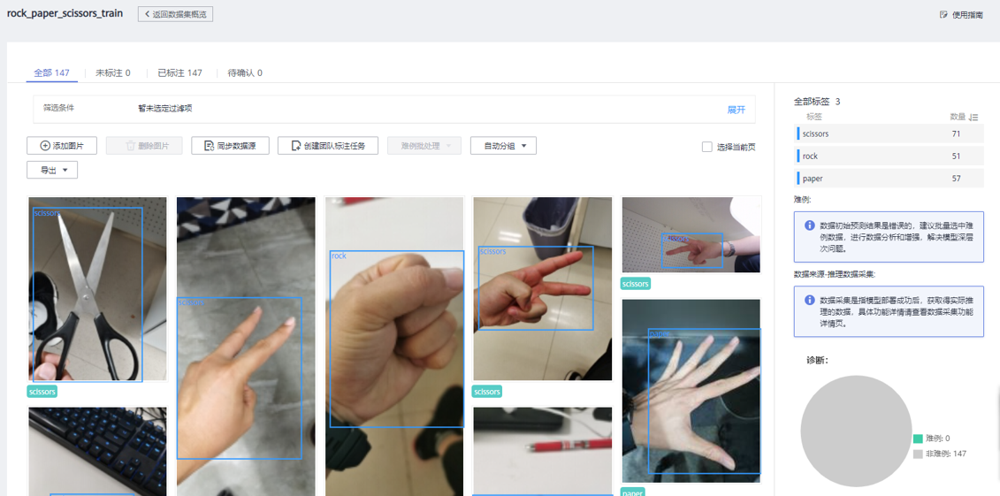

#### 订阅算法

点击从AI市场订阅 <a href="https://marketplace.huaweicloud.com/markets/aihub/modelhub/detail/?id=e48f4e4d-5ebb-4753-a613-b44a5d965e7c" target="_blank">物体检测-EfficientDet 算法</a>

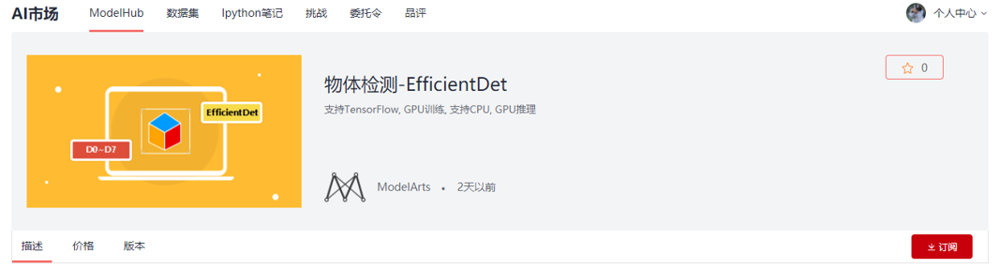

订阅成功后，回到 <a href="https://console.huaweicloud.com/modelarts/?region=cn-north-4#/algorithms?activeTab=subscribedAlgos" target="_blank">ModelArts算法管理</a> 页签，同步订阅的算法

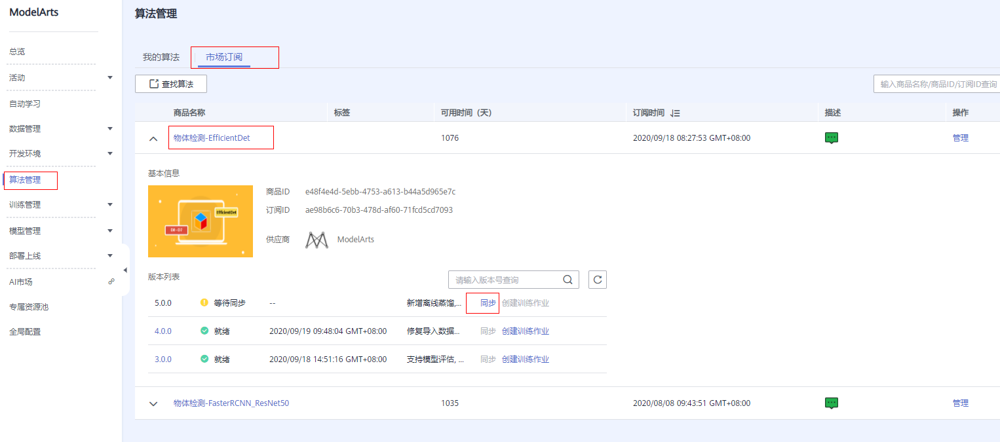

#### 模型训练

同步完成后，点击“同步”按钮后的“创建训练作业”按钮，进入训练创建页面。

训练集选前面发布过的训练用数据集（一定是切分后的数据集），模型输出路径可以选择OBS桶中任意一个空目录。

为了缩短训练时间，**可以适当减小 “num_epochs”的值，设为50时，约耗时10min**。

资源选择“公共资源”，规则选择 “modelarts.p3.large.ex”。

其它可默认，点击“下一步”进入模型训练，等待模型训练完成（**等待时可先进行下一步的“准备测试数据集”**）.

**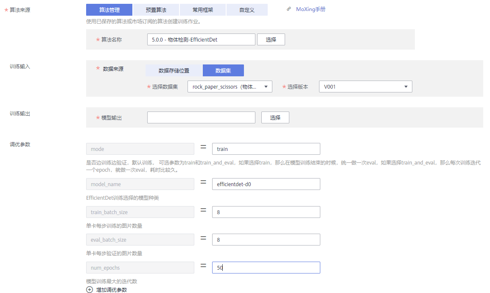**

#### 查看第一次训练结果

这时候，我们回到上上一步正在在训练的模型，看是否训练完成。训练结束后，点击训练作业名称，可以在训练详情页面点击“评估结果”页签，查看训练的各种指标。

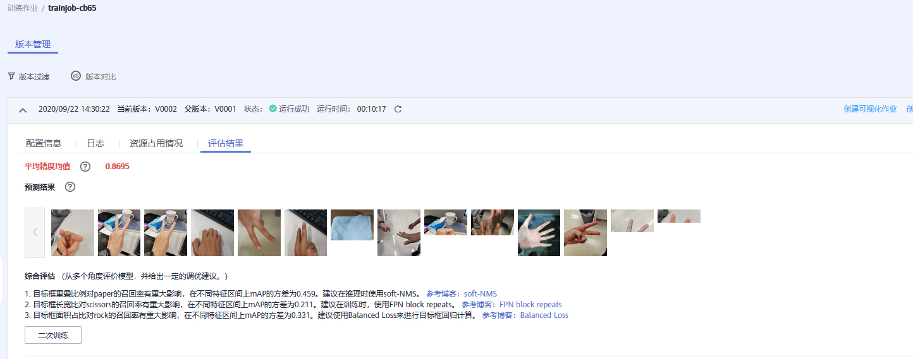

#### 导入训练好的模型(无需等待训练完成)
下载训练好的<a href="https://hc2020-ai.obs.cn-north-4.myhuaweicloud.com/HC2020-AI.zip">模型</a>，并解压。上传到obs上。

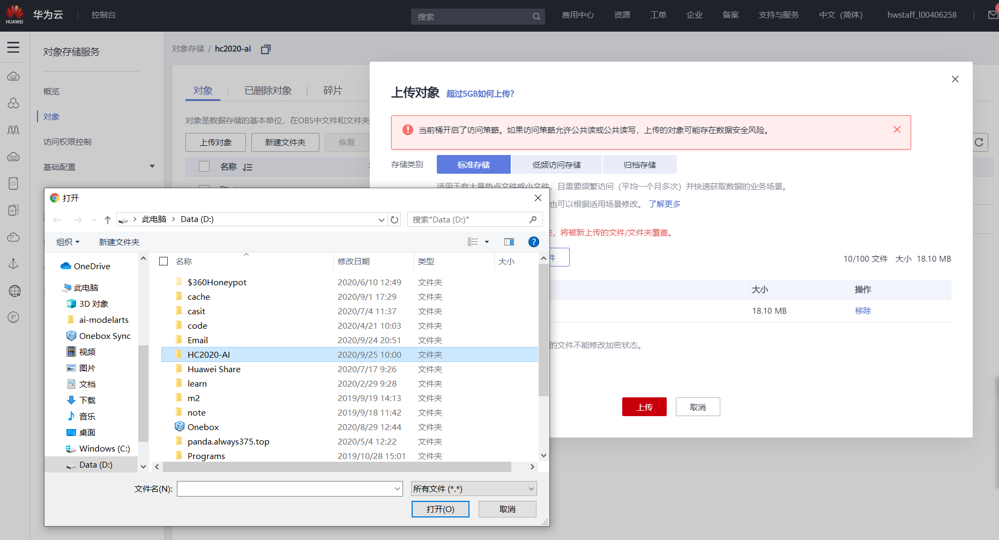

点击训练详情页面的“创建模型”按钮，进入发布页面，选择从obs导入，直接点击“立即创建”按钮。

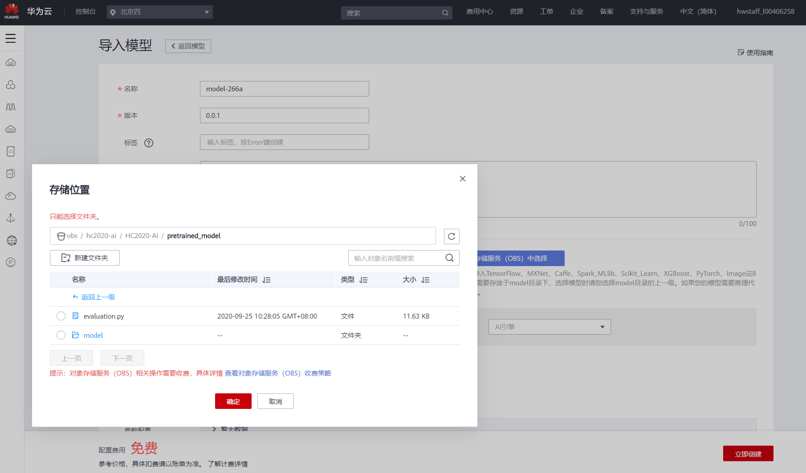

等待模型发布成功。

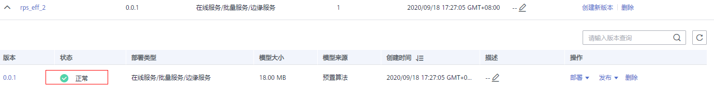

#### 准备测试数据集

从市场下载： <a href="https://marketplace.huaweicloud.com/markets/aihub/datasets/detail/?content_id=deb27377-a44f-4bfc-8471-f07509a67823" target="_blank">石头剪刀布_测试集（含标注，坏数据）</a>，下载方式选择“数据云存储位置”，区域选择“北京四”，目标位置根据自己自己实际情况选择，点击“下一步”进行数据集推送。

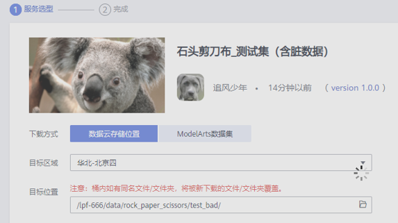

数据推送成功后，回到 <a href="https://console.huaweicloud.com/modelarts/?region=cn-north-4#/featureengineering?activeTab=preData&flag=false" target="_blank">ModelArts-数据管理-数据处理</a> 页签，点击“创建”数据校验作业，选择“数据校验”，场景类别为“物体检测”，输入为上一步下载的脏数据所在OBS目录，输出到新空目录。

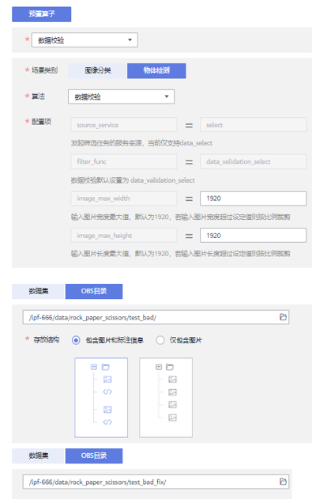

设置完成后，点击“创建”即可，等待数据处理任务“完成”。

完成后，回到 <a href="https://console.huaweicloud.com/modelarts/?region=cn-north-4#/dataset" target="_blank">数据管理-数据集</a> 页签，创建一个新测试数据集，用上面“数据校验”输出的OBS目录创建**测试用数据集**，数据集输入位置为上一步校验输出的目录，输出目录为任意空目录。

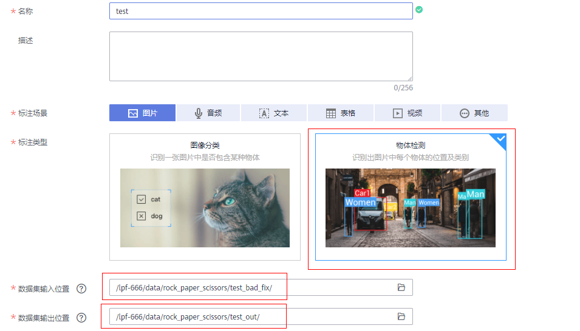

创建完成后，会生成一个已标注的数据集，点击数据集后的“发布”按钮进行版本版本，训练集比例设为0，因为这个数据集只用作测试。

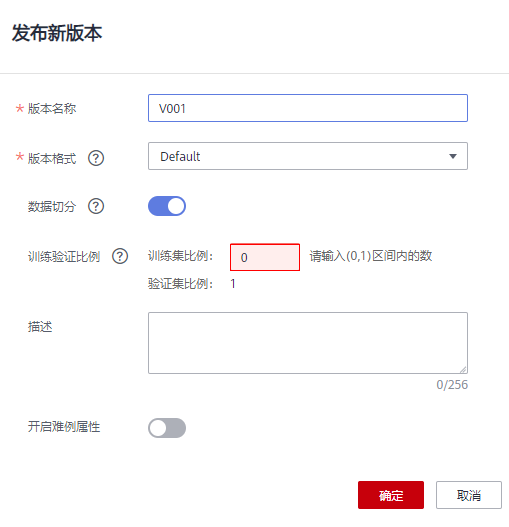

#### 创建评估作业

模型发布成功后，在左侧菜单选择 <a href="https://console.huaweicloud.com/modelarts/?region=cn-north-4#/model-evalBeta-list" target="_blank">模型管理-评估/诊断</a> 功能，点击“创建”按钮。

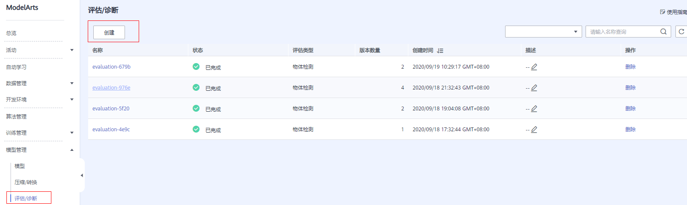

在创建页面，选择上一步发布的模型，AI引擎选择TF-2.1.0-python3.6，数据集选择前面使用脏数据发布的**测试用数据集**。之后点击“下一步”，“提交”创建作业。

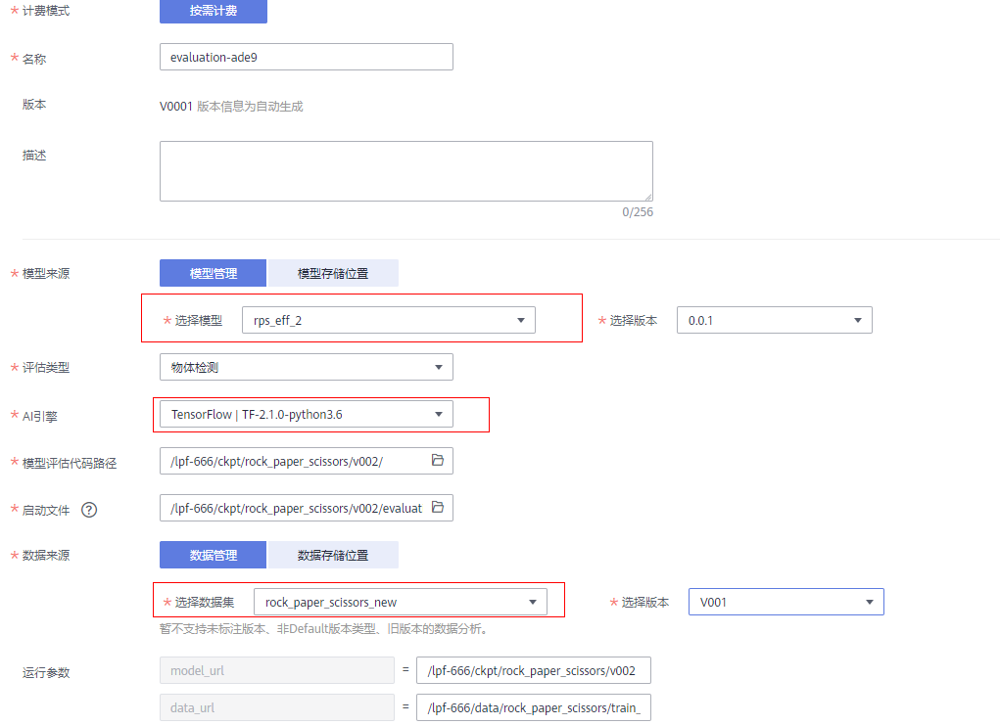

#### 分析评估结果

评估作业完成后，查看评估结果，点击预测结果中的图像，放大展示。发现错误推理大部分来自图像中有多个手的图片。

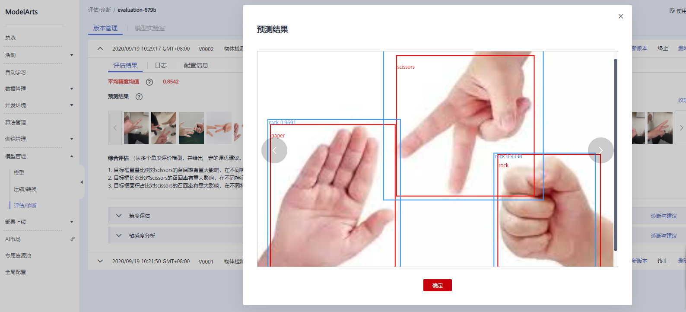

#### 部署在线服务

回到 <a href="https://console.huaweicloud.com/modelarts/?region=cn-north-4#/model?activeTab=myModels" target="_blank">模型管理</a> 页面，找到前面发布的模型，点击模型名称左侧下拉箭头，在弹出的页面中，点击“部署”按钮，选择点击“在线服务”按钮。

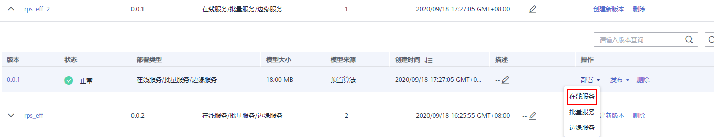

“在线服务”部署页面，选择带GPU的资源规格。

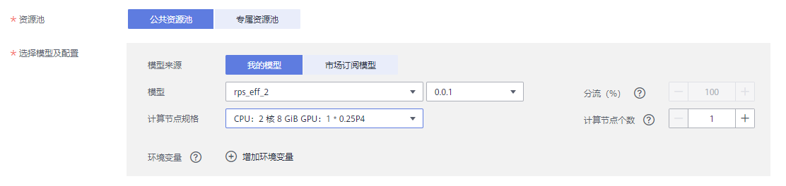

点击下一步进行提交，然后返回 <a href="https://console.huaweicloud.com/modelarts/?region=cn-north-4#/webservice/realTimeService" target="_blank">部署上线-在线服务</a> 页面可以查看服务部署状态，状态为“运行中”即可进行API调用和在线预测。

#### 手机端测试

在手机端，打开浏览器，输入网址：https://aidetect.huaweicloud.com；
进入服务页面，填写自己的用户名、密码进行登录，选择上面部署的服务名称，进行手机端推理。

    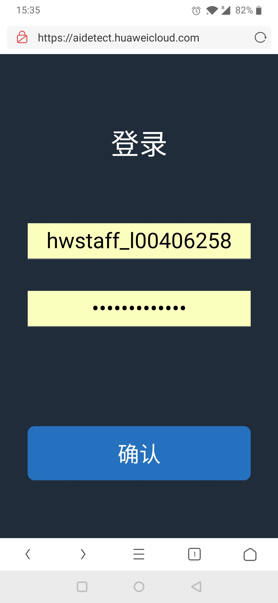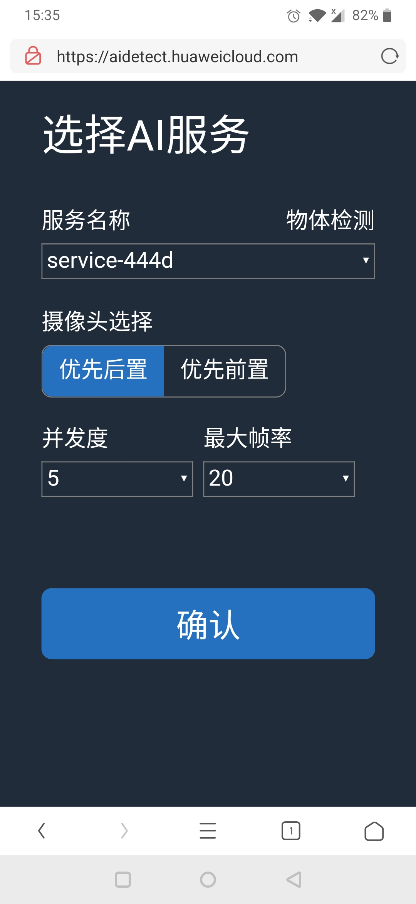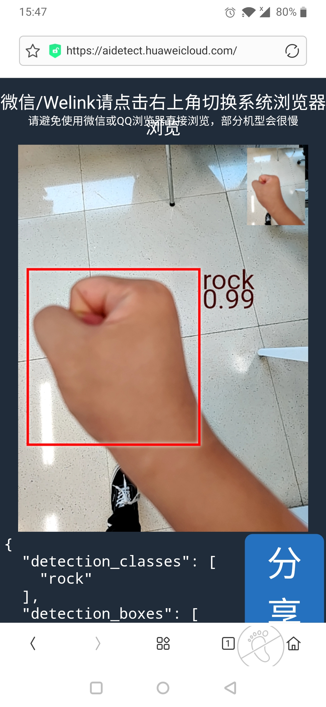

