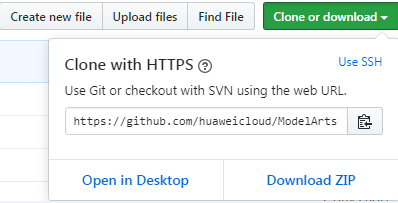
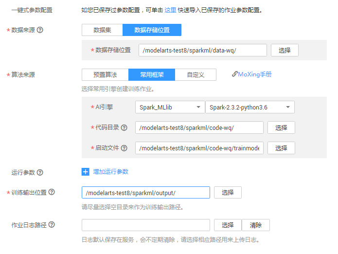
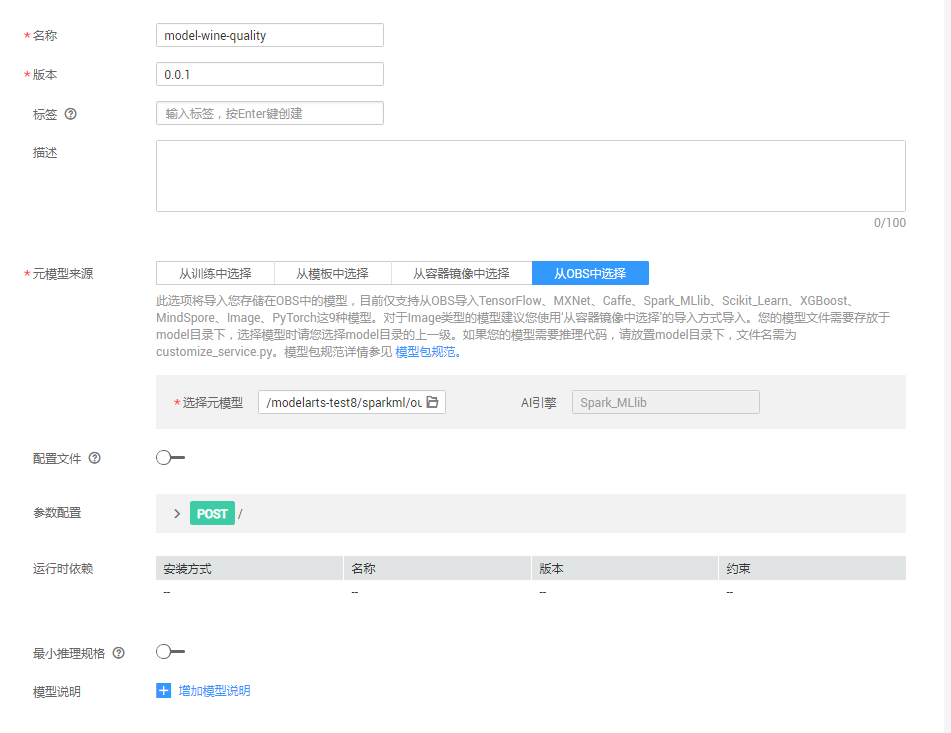

# 使用Spark MLlib实现葡萄酒质量预测<a name="modelarts_10_0016"></a>

葡萄酒市场现在主要有两个数据集，其中一个数据集是红葡萄酒数据集，有1599个样例，另一个是白葡萄酒数据集，有4898个样例。此次样例仅分析红葡萄酒数据。所有葡萄酒均在葡萄牙的特定地区生产。收集了葡萄酒的12种不同特性的数据，其中一种是质量，其余的是葡萄酒的化学特性，包括密度，酸度，酒精含量等。葡萄酒的所有化学特性都是连续变量。质量是一个有序变量，可能从1（最差）到10（最佳）排名。每种葡萄酒都由三个以上独立品尝者品尝，最终分数是由不同品尝者给出的分数中取得中位数。

本示例介绍如何使用Spark MLlib引擎实现红葡萄酒质量预测的应用。葡萄酒质量预测样例的操作流程如下所示。

1.  **[准备数据](#section055233642011)**：下载数据集、示例代码，然后上传至OBS桶中。
2.  **[训练模型](#section15883611781)**：编写基于Spark ML中梯度提升树算法的模型训练脚本，新建训练作业进行模型训练。
3.  **[部署模型](#section7124946131216)**：得到训练好的模型文件后，新建预测作业将模型部署为在线预测服务。
4.  **[预测结果](#section773012861716)**：发起预测请求获取预测结果。

## 准备数据<a name="section055233642011"></a>

ModelArts提供了用于训练的数据集和示例代码，执行如下步骤，下载数据集和示例代码，并上传至OBS中。

在Github的[ModelArts-Lab](https://github.com/huaweicloud/ModelArts-Lab)工程中，单击“Clone or download“，然后在如下页面中单击“Download Zip“，下载“ModelArts-Lab“工程。

**图 1**  下载ModelArts-Lab<a name="fig1230292013811"></a>  



<a name="li4572151143318"></a>下载完成后，解压缩“ModelArts-Lab-master.zip“文件，然后在“\\ModelArts-Lab-master\\offical\_examples\\Using\_Spark\_ML\_to\_Create\_a\_Wine_Quality\_Prediction\_Application“目录中获取到训练数据集“winequality-red.csv“  和示例代码“trainmodelswq.py“  。

**表 1**  文件说明

<a name="table1222116474916"></a>

<table><thead align="left"><tr id="row32211547796"><th class="cellrowborder" valign="top" width="33.26%" id="mcps1.2.3.1.1"><p id="p192213471498"><a name="p192213471498"></a><a name="p192213471498"></a>文件名称</p>
</th>
<th class="cellrowborder" valign="top" width="66.74%" id="mcps1.2.3.1.2"><p id="p122184710913"><a name="p122184710913"></a><a name="p122184710913"></a>说明</p>
</th>
</tr>
</thead>
<tbody><tr id="row52212471596"><td class="cellrowborder" valign="top" width="33.26%" headers="mcps1.2.3.1.1 "><p id="p52217471916"><a name="p52217471916"></a><a name="p52217471916"></a><span class="filepath" id="filepath153931422141017"><a name="filepath153931422141017"></a><a name="filepath153931422141017"></a>“winequality-red.csv”</span></p>
</td>
<td class="cellrowborder" valign="top" width="66.74%" headers="mcps1.2.3.1.2 "><p id="p1822217471397"><a name="p1822217471397"></a><a name="p1822217471397"></a>训练数据集。数据集的详情如<a href="#table7676140164111">表2 数据源的具体字段及意义</a> 和 <a href="#table151195314531">表3 数据集样本数据</a> 所示。</p>
</td>
</tr>
<tr id="row1622224711910"><td class="cellrowborder" valign="top" width="33.26%" headers="mcps1.2.3.1.1 "><p id="p1122217474914"><a name="p1122217474914"></a><a name="p1122217474914"></a><span class="filepath" id="filepath758772881017"><a name="filepath758772881017"></a><a name="filepath758772881017"></a>“trainmodelwq.py”</span></p>
</td>
<td class="cellrowborder" valign="top" width="66.74%" headers="mcps1.2.3.1.2 "><p id="p152224474913"><a name="p152224474913"></a><a name="p152224474913"></a>训练脚本。示例代码是使用梯度提升树算法编写的训练脚本。</p>
</td>
</tr>
</tbody>
</table>

**表 2**  数据源的具体字段及意义

<a name="table7676140164111"></a>

<table><thead align="left"><tr id="row1455111119140"><th class="cellrowborder" valign="top" width="33.33333333333333%" id="mcps1.2.4.1.1"><p id="p755181116146"><a name="p755181116146"></a><a name="p755181116146"></a>字段名</p>
</th>
<th class="cellrowborder" valign="top" width="33.33333333333333%" id="mcps1.2.4.1.2"><p id="p29351116101415"><a name="p29351116101415"></a><a name="p29351116101415"></a>含义</p>
</th>
<th class="cellrowborder" valign="top" width="33.33333333333333%" id="mcps1.2.4.1.3"><p id="p193651691412"><a name="p193651691412"></a><a name="p193651691412"></a>类型</p>
</th>
</tr>
</thead>
<tbody><tr id="row32021948141317"><td class="cellrowborder" valign="top" width="33.33333333333333%" headers="mcps1.2.4.1.1 "><p id="p20202948141312"><a name="p20202948141312"></a><a name="p20202948141312"></a>volatile acidity</p>
</td>
<td class="cellrowborder" valign="top" width="33.33333333333333%" headers="mcps1.2.4.1.2 "><p id="p1020284812137"><a name="p1020284812137"></a><a name="p1020284812137"></a>挥发性酸</p>
</td>
<td class="cellrowborder" valign="top" width="33.33333333333333%" headers="mcps1.2.4.1.3 "><p id="p27743714143"><a name="p27743714143"></a><a name="p27743714143"></a>number</p>
</td>
</tr>
<tr id="row8203104815131"><td class="cellrowborder" valign="top" width="33.33333333333333%" headers="mcps1.2.4.1.1 "><p id="p12031648171312"><a name="p12031648171312"></a><a name="p12031648171312"></a>fixed acidity</p>
</td>
<td class="cellrowborder" valign="top" width="33.33333333333333%" headers="mcps1.2.4.1.2 "><p id="p920344810132"><a name="p920344810132"></a><a name="p920344810132"></a>非挥发性酸</p>
</td>
<td class="cellrowborder" valign="top" width="33.33333333333333%" headers="mcps1.2.4.1.3 "><p id="p1577417771412"><a name="p1577417771412"></a><a name="p1577417771412"></a>number</p>
</td>
</tr>
<tr id="row8203104815131"><td class="cellrowborder" valign="top" width="33.33333333333333%" headers="mcps1.2.4.1.1 "><p id="p12031648171312"><a name="p12031648171312"></a><a name="p12031648171312"></a>citric acid</p>
</td>
<td class="cellrowborder" valign="top" width="33.33333333333333%" headers="mcps1.2.4.1.2 "><p id="p920344810132"><a name="p920344810132"></a><a name="p920344810132"></a>柠檬酸</p>
</td>
<td class="cellrowborder" valign="top" width="33.33333333333333%" headers="mcps1.2.4.1.3 "><p id="p1577417771412"><a name="p1577417771412"></a><a name="p1577417771412"></a>number</p>
</td>
</tr>
<tr id="row8203104815131"><td class="cellrowborder" valign="top" width="33.33333333333333%" headers="mcps1.2.4.1.1 "><p id="p12031648171312"><a name="p12031648171312"></a><a name="p12031648171312"></a>residual sugar</p>
</td>
<td class="cellrowborder" valign="top" width="33.33333333333333%" headers="mcps1.2.4.1.2 "><p id="p920344810132"><a name="p920344810132"></a><a name="p920344810132"></a>残余糖分</p>
</td>
<td class="cellrowborder" valign="top" width="33.33333333333333%" headers="mcps1.2.4.1.3 "><p id="p1577417771412"><a name="p1577417771412"></a><a name="p1577417771412"></a>number</p>
</td>
</tr>
<tr id="row112031148111318"><td class="cellrowborder" valign="top" width="33.33333333333333%" headers="mcps1.2.4.1.1 "><p id="p42031248161310"><a name="p42031248161310"></a><a name="p42031248161310"></a>chlorides</p>
</td>
<td class="cellrowborder" valign="top" width="33.33333333333333%" headers="mcps1.2.4.1.2 "><p id="p1220344851318"><a name="p1220344851318"></a><a name="p1220344851318"></a>氯化物</p>
</td>
<td class="cellrowborder" valign="top" width="33.33333333333333%" headers="mcps1.2.4.1.3 "><p id="p1177487181410"><a name="p1177487181410"></a><a name="p1177487181410"></a>number</p>
</td>
</tr>
<tr id="row1020314851311"><td class="cellrowborder" valign="top" width="33.33333333333333%" headers="mcps1.2.4.1.1 "><p id="p1520413484134"><a name="p1520413484134"></a><a name="p1520413484134"></a>free sulfur dioxide</p>
</td>
<td class="cellrowborder" valign="top" width="33.33333333333333%" headers="mcps1.2.4.1.2 "><p id="p5204194891314"><a name="p5204194891314"></a><a name="p5204194891314"></a>游离二氧化硫</p>
</td>
<td class="cellrowborder" valign="top" width="33.33333333333333%" headers="mcps1.2.4.1.3 "><p id="p87742078147"><a name="p87742078147"></a><a name="p87742078147"></a>number</p>
</td>
</tr>
<tr id="row19204248141320"><td class="cellrowborder" valign="top" width="33.33333333333333%" headers="mcps1.2.4.1.1 "><p id="p17204194841315"><a name="p17204194841315"></a><a name="p17204194841315"></a>total sulfur dioxide</p>
</td>
<td class="cellrowborder" valign="top" width="33.33333333333333%" headers="mcps1.2.4.1.2 "><p id="p1120464841312"><a name="p1120464841312"></a><a name="p1120464841312"></a>总二氧化硫</p>
</td>
<td class="cellrowborder" valign="top" width="33.33333333333333%" headers="mcps1.2.4.1.3 "><p id="p16774675147"><a name="p16774675147"></a><a name="p16774675147"></a>number</p>
</td>
</tr>
<tr id="row8203104815131"><td class="cellrowborder" valign="top" width="33.33333333333333%" headers="mcps1.2.4.1.1 "><p id="p12031648171312"><a name="p12031648171312"></a><a name="p12031648171312"></a>density</p>
</td>
<td class="cellrowborder" valign="top" width="33.33333333333333%" headers="mcps1.2.4.1.2 "><p id="p920344810132"><a name="p920344810132"></a><a name="p920344810132"></a>密度</p>
</td>
<td class="cellrowborder" valign="top" width="33.33333333333333%" headers="mcps1.2.4.1.3 "><p id="p1577417771412"><a name="p1577417771412"></a><a name="p1577417771412"></a>number</p>
</td>
</tr>
<tr id="row8203104815131"><td class="cellrowborder" valign="top" width="33.33333333333333%" headers="mcps1.2.4.1.1 "><p id="p12031648171312"><a name="p12031648171312"></a><a name="p12031648171312"></a>酒精度</p>
</td>
<td class="cellrowborder" valign="top" width="33.33333333333333%" headers="mcps1.2.4.1.2 "><p id="p920344810132"><a name="p920344810132"></a><a name="p920344810132"></a>酒精度</p>
</td>
<td class="cellrowborder" valign="top" width="33.33333333333333%" headers="mcps1.2.4.1.3 "><p id="p1577417771412"><a name="p1577417771412"></a><a name="p1577417771412"></a>number</p>
</td>
</tr>
<tr id="row8203104815131"><td class="cellrowborder" valign="top" width="33.33333333333333%" headers="mcps1.2.4.1.1 "><p id="p12031648171312"><a name="p12031648171312"></a><a name="p12031648171312"></a>pH</p>
</td>
<td class="cellrowborder" valign="top" width="33.33333333333333%" headers="mcps1.2.4.1.2 "><p id="p920344810132"><a name="p920344810132"></a><a name="p920344810132"></a>酸碱度</p>
</td>
<td class="cellrowborder" valign="top" width="33.33333333333333%" headers="mcps1.2.4.1.3 "><p id="p1577417771412"><a name="p1577417771412"></a><a name="p1577417771412"></a>number</p>
</td>
</tr>
<tr id="row8203104815131"><td class="cellrowborder" valign="top" width="33.33333333333333%" headers="mcps1.2.4.1.1 "><p id="p12031648171312"><a name="p12031648171312"></a><a name="p12031648171312"></a>sulphates</p>
</td>
<td class="cellrowborder" valign="top" width="33.33333333333333%" headers="mcps1.2.4.1.2 "><p id="p920344810132"><a name="p920344810132"></a><a name="p920344810132"></a>硫酸盐</p>
</td>
<td class="cellrowborder" valign="top" width="33.33333333333333%" headers="mcps1.2.4.1.3 "><p id="p1577417771412"><a name="p1577417771412"></a><a name="p1577417771412"></a>number</p>
</td>
</tr>
<tr id="row8203104815131"><td class="cellrowborder" valign="top" width="33.33333333333333%" headers="mcps1.2.4.1.1 "><p id="p12031648171312"><a name="p12031648171312"></a><a name="p12031648171312"></a>quality</p>
</td>
<td class="cellrowborder" valign="top" width="33.33333333333333%" headers="mcps1.2.4.1.2 "><p id="p920344810132"><a name="p920344810132"></a><a name="p920344810132"></a>质量等级</p>
</td>
<td class="cellrowborder" valign="top" width="33.33333333333333%" headers="mcps1.2.4.1.3 "><p id="p1577417771412"><a name="p1577417771412"></a><a name="p1577417771412"></a>number</p>
</td>
</tr>
</tbody>
</table>


进入OBS管理控制台，新建桶和文件夹，分别用于存储训练数据集和示例代码。例如新建“test-modelarts“桶，并在此桶下新建“sparkml/data-wq“和“sparkml/code-wq“文件夹。

将步骤[2](#li4572151143318)中获取的文件，上传至对应OBS路径下，即“sparkml/data-wq“和“sparkml/code-wq“文件夹。OBS上传文件的操作指导，请参见[上传文件](https://support.huaweicloud.com/usermanual-obs/zh-cn_topic_0045829661.html)。

## 训练模型<a name="section15883611781"></a>

1. 在ModelArts管理控制台，进入“训练作业“页面，单击左上角的“创建“。

2. 如图[图2 创建训练作业-基本信息](#fig64081416477)   和图  [图3 创建训练作业-详细参数](#fig16109143312477)  所示，参考图中示例，填写训练作业相关参数，然后单击“下一步“。

   其中，“数据来源“和“算法来源“即[准备数据](#section055233642011)上传的OBS路径及文件。“训练输出位置“，建议新建一个OBS文件夹，用于存储训练输出的模型及其预测文件，例如“sparkml/output“。

   **图 2** 创建训练作业-基本信息<a name="fig64081416477"></a>  

   **图 3**  创建训练作业-详细参数

3. 在规格确认页面，确认信息无误后，单击“立即创建“

4.  在“训练作业“管理页面，当训练作业变为“运行成功“时，即完成了模型训练过程。如有问题，可单击作业名称，进入作业详情界面查看训练作业日志信息。

    > **说明：**   
    >训练作业需要花费一些时间，预计几分钟。当训练时间超过一定时间（如1个小时），请及时手动停止，释放资源。否则会导致欠费，尤其对于使用GPU训练的模型项目。  


## 部署模型<a name="section7124946131216"></a>

待训练作业运行完成后，可以将训练好的模型发布成预测服务。

1. 在“模型管理“页面，单击左上角“导入“，进入“导入模型“页面。

2. 如 [图4 导入模型](#fig1170713597470)所示，参考图片示例填写参数，然后单击“立即创建“。

   其中，“选择元模型“的路径为训练作业中“训练输出位置“指定的路径。此时，系统将从选择的路径下自动匹配到“AI引擎“和“推理代码“。

   **图 4**  导入模型

   

3. 在模型管理中，当创建的模型处于“正常“状态时，表示模型导入成功。您可以在操作列单击“部署\>在线服务“，将模型部署为在线服务。

4.  在“部署“页面，请参考[图5 部署](#fig1575991174818)中的示例填写参数，然后单击“下一步“。

    **图 5**  模型部署
    
5. 在“规格确认“页面，确认信息无误后的，单击“立即创建“。

6. 在线服务创建完成后，系统自动跳转至“部署上线\>在线服务“页面。服务部署需要一定时间，耐心等待即可。当服务状态变为“运行中“时，表示服务部署成功。

## 预测结果<a name="section773012861716"></a>

待部署模型运行完成后，可以验证发布的预测服务是否正常。

1. 在“部署上线\>在线服务“页面，单击服务名称进入详情页面

2. 在“预测“页签，参考[图6 测试服务](#fig10527194111305)所示样例，输入预测代码，然后单击“预测“。在右侧“返回结果“中，查看预测结果。

   预测请求示例代码如下所示。

   ```
   {
   	"data": {
   		"req_data": [
   			{
   			 "fixed acidity": 5.1,
   			 "volatile acidity": 0.7,
   			 "citric acid":0,
   			 "residual sugar": 1.9,
   			 "chlorides":0.076,
   			 "free sulfur dioxide":11,
   			 "total sulfur dioxide":34,
   			 "density":0.99,
   			 "pH":3.51,
   			 "sulphates":9 ,
   			 "alcoho":0.8 
   			}
   		]
   	}
   }
   ```
   
**图 6**  测试服务
   

   
3.  在“调用指南“页签，可以获取调用API接口，并使用Postman工具进行测试。

    **图 7**  调用接口<a name="fig19673161519302"></a>  
    


