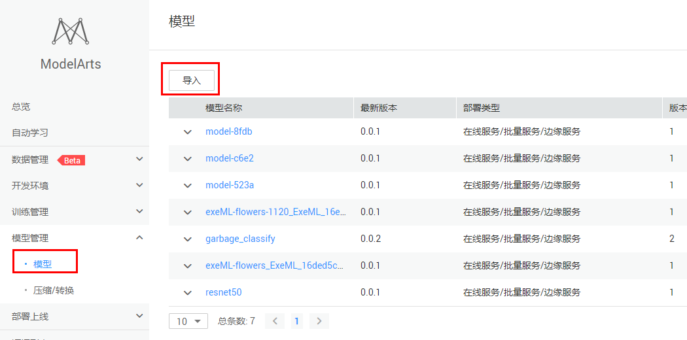
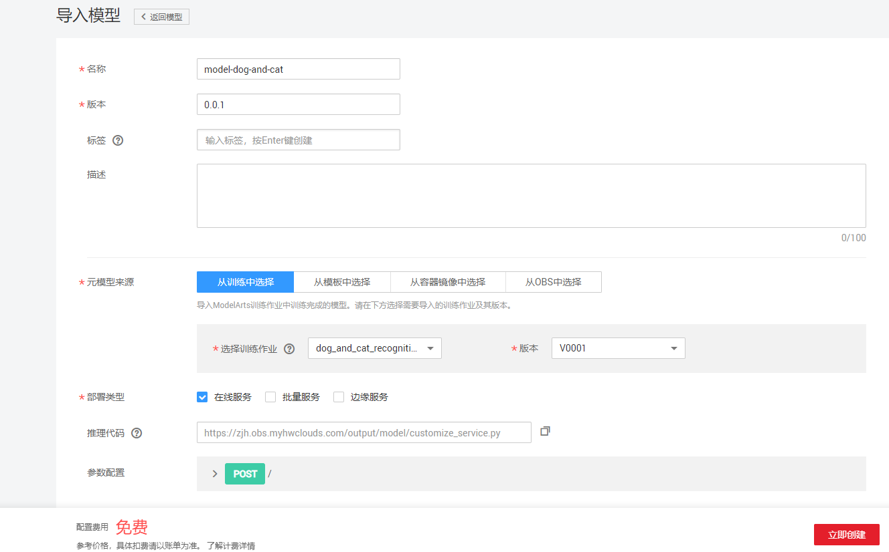
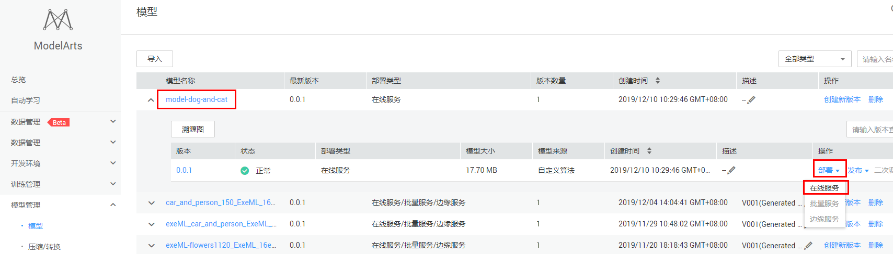
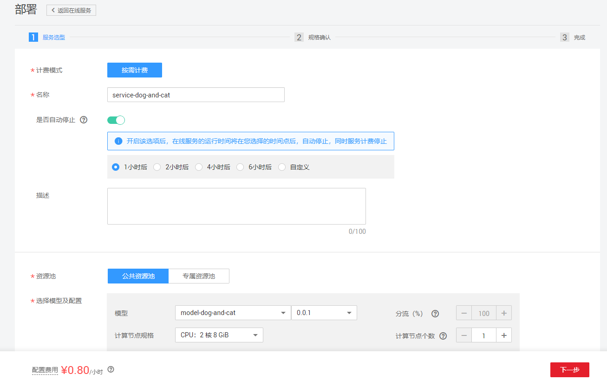

# 图像分类综合应用

本期实战为图像分类第二期。在第一期我们学习了图像分类的自动学习案例（自动学习可以零代码构建一个图像分类案例）和notebook案例（notebook案例是为让大家体验了交互式开发和代码调试）。本期实战，我们使用数据智能标注、模型训练和模型部署端到端模拟真实AI开发场景，构建一个图像分类应用。

### 1. 配置ModelArts访问秘钥
登录[ModelArts](https://console.huaweicloud.com/modelarts/?region=cn-north-1#/manage/dashboard)管理控制台，在“全局配置”界面添加访问秘钥，如下图（如已添加密钥，可跳过此步）：

### 2. 数据智能标注

在监督学习中，AI开发者首先需要给训练数据打标签。如果数据量比较大，给数据打标签的工作量会很大。ModelArts的智能标注功能可以只标注少量的数据，然后智能标注剩余的数据，从而减少开发者的工作量。此小节中，我们演示ModelArts智能标注功能。

**步骤 1**  &#160; &#160;[点击此处](https://modelarts-labs.obs.cn-north-1.myhuaweicloud.com/end2end/image_recognition/dog_and_cat_200.tar.gz)，下载小样本的猫狗识别数据集，然后解压压缩包至本地。

此数据集包含猫和狗的图片各100张，名称为dog_and_cat_200。

**步骤 2**  &#160; &#160;使用OBS Browser上传文件夹dog_and_cat_200至OBS路径`/ai-course-001/dog_and_cat_recognition/`下（其中，ai-course-001是OBS桶名，**在创建OBS桶的时候可以自己定义桶名**，dog_and_cat_recognition是OBS桶下的一个文件夹）。如果OBS桶和路径不存在，需要自己创建。**注意：OBS桶名全局唯一，如果创建桶时桶名冲突，需要选择其他桶名。**

OBS是对象储存服务的英文缩写，是华为云上的数据存储服务。

OBS Browser是OBS客户端的英文名称，用来上传本地文件至OBS。

OBS Browser的下载链接：<https://support.huaweicloud.com/clientogw-obs/zh-cn_topic_0045829056.html> 

使用OBS Browser创建OBS桶和创建文件夹，上传文件夹参考文档：<https://support.huaweicloud.com/qs-obs/obs_qs_0002.html> 

**步骤 3**  &#160; &#160;在ModelArts数据标注中创建数据集

在ModelArts中左侧找到“数据标注”，然后点击“创建数据集”。创建数据集页面填写方式如下：

数据集名称：自定义

数据集输入位置：dog_and_cat_200文件夹所在的OBS路径

数据集输出位置：标注后数据的输出OBS路径。如果不存在，需要自己创建

标注场景：物体

标注类型：图像分类

添加标签集："dog"和"cat"

填写完毕所有的字段后，点击创建。

**步骤 4**  &#160; &#160;手工标注部分数据

点击进入刚刚创建的数据集，手工标注部分数据。我们建议标注猫和狗各20到30张图片，剩余的图片采用智能标注。手工标注的方式参考数据集页面右上角的“标注样例说明”。

手工标注完的界面如下：

**步骤 5**  &#160; &#160;剩余的数据使用智能标注

点击“智能标注“页签，然后点击”启动智能标注“按钮。在弹出的对话框中，模型来源选择“自动选择”。然后点击提交。（智能标注作业运行过程预计3到5分钟左右，ModelArts使用高峰期可能会有时间延迟）

**步骤 6**  &#160; &#160;处理智能标注结果

智能标注作业完成后，**我们需要人工仔细确认每张图片的智能标注的结果**。

首先，对标注正确的图片进行接纳。

对智能标注结果进行分类，依次处理每个类别。点击类别下拉框，选择其中一类，比如cat，如下图所示：

人工确认每张图片，如果是cat，就选择图片（可以多选），然后点击按钮“将选中的图片确认为已标注”，接纳标注结果。注意，不是cat的图片，不要选，后面会处理。如下图：

cat类别的图片确认完之后，按照相同的方式处理dog类别。

对于错误的标注结果，我们在下一步中处理。

**步骤 7**  &#160; &#160;处理智能标注错误的结果

最后，对于智能标注错误的结果，可以在“未标注”页签统一查看到。

对于这些智能标注错误的图片，我们点击“启动智能标注”按钮，使用智能标注再次给这些图片标注。原理是：由于训练数据量增加，标注的精度会大大增加。

等待第二次的智能标注作业运行完成。

**步骤 8**  &#160; &#160;再次处理智能标注

依据之前处理智能标注结果的流程，处理第二次的智能标注作业。

迭代上述过程，直到完成所有图片的标注。

#### 小结

在本小节中，我们学习了如何使用ModelArts智能标注减少我们的标注工作量。**当数据量比较小时，减少工作量的效果不是很明显，但是当数据量较大、标注任务较复杂（比如目标检测、实例分割等任务）的时候，智能标注将会帮助开发者显著减少工作量**。你可以使用自己的大样本数据集体验ModelArts的智能标注功能。

在接下来的模型训练阶段，由于本小节标注得到的数据量较少，我们不会采用该小节标注得到的数据集，而是采用已经标注好的数据集来训练模型。

### 3. 模型训练

接下来，我们基于 [猫狗识别notebook案例](https://github.com/huaweicloud/ModelArts-Lab/blob/master/notebook/DL_image_recognition/image_recongition.ipynb) 中开发的算法，编写一个训练脚本，然后使用ModelArts训练作业训练一个模型。

本案例使用的神经网络模型是VGG16，VGG16模型是一个经典，而且简单有效的神经网络模型，可以有效地学习图像的一些简单的特征。VGG模型的解析见[此链接](<https://github.com/huaweicloud/ModelArts-Lab/wiki/VGG%E6%A8%A1%E5%9E%8B%E8%A7%A3%E6%9E%90> ) 。

具体的提交训练作业的步骤如下：

**步骤 1**  &#160; &#160; 在本地的ModelArts-Lab代码库`train_inference/image_recognition/codes/`路径下找到模型训练脚本<a href ="codes/dog_and_cat_train.py">dog_and_cat_train.py</a> （或者根据 [此FAQ](<https://github.com/huaweicloud/ModelArts-Lab/blob/master/docs/faqs.md#%E5%A6%82%E4%BD%95%E4%B8%8B%E8%BD%BDgithub%E4%BB%A3%E7%A0%81%E5%BA%93%E9%87%8C%E9%9D%A2%E7%9A%84%E5%8D%95%E4%B8%AA%E6%96%87%E4%BB%B6> ) 将训练脚本下载至本地），将训练脚本上传至OBS路径`/ai-course-001/dog_and_cat_recognition/codes/`下（codes文件夹如果不存在，需创建，该文件夹名称可以自定义）。

训练脚本的名称可以自定义。

**步骤 2**  &#160; &#160; 下载[训练数据集](https://modelarts-labs.obs.cn-north-1.myhuaweicloud.com/end2end/image_recognition/dog_and_cat_25000.tar.gz)至本地，**无需解压** （在训练脚本中会做解压操作）。然后上传训练数据集压缩包至OBS路径`/ai-course-001/dog_and_cat_recognition/data/`下（data文件夹如果不存在，需创建，该文件夹名称可以自定义）。

该训练数据集压缩包共五百多MB，包含猫和狗图片各12500张，数据集文件名称是 dog_and_cat_25000.tar.gz 。

**步骤 3**  &#160; &#160; 在ModelArts“训练作业”界面，单击“创建”按钮，进入创建训练作业页面。按照如下指导填写字段：

名称：自定义

数据来源：选择数据存储位置

数据存储位置：训练数据集的路径，选择OBS路径`/ai-course-001/dog_and_cat_recognition/data/`

算法来源：常用框架

AI引擎：TensorFlow，TF-1.13.1-python3.6

代码目录：训练脚本所在的目录，选择OBS路径`/ai-course-001/dog_and_cat_recognition/codes/`

启动文件：训练脚本，选择OBS路径`/ai-course-001/dog_and_cat_recognition/codes/dog_and_cat_train.py`

运行参数：添加max_epochs=20。运行参数中设置的变量会传入到训练脚本中，经过解析，可以使用。此字段用于设置算法中的超参。

训练输出位置：选择OBS路径`/ai-course-001/dog_and_cat_recognition/output/`（output文件夹如果不存在，该文件夹名称可以自定义，需创建）。训练输出位置用来保存训练输得到的模型和TensorBoard日志。

资源池：机器的规格，选择“计算型GPU(P100)实例”，表示这台机器包含一张GPU卡。

计算节点个数：选择1，表示我们运行一个单机训练任务。（注：本训练脚本不支持分布式训练）

所有字段填写好之后，确认参数无误，点击下一步，然后点击立即创建，开始训练。训练时长预计8到15分钟左右，ModelArts使用高峰期可能会有时间延迟。

**步骤 4**  &#160; &#160; 查看作业运行结果。在训练作业页面，点击作业名称，进入作业详情界面。可以查看到训练作业的详情，如下图所示：

其中，配置信息展示的是创建训练作业时填写的参数和配置信息；

日志展示的是训练脚本运行过程中输出的日志，如果作业运行失败，可以通过日志信息定位问题；

资源占用情况展示CPU、GPU和内存的利用率；

评估结果展示训练得到的模型的精度，本训练脚本只计算了准确率。**可以在以下位置查看模型精度**：

本次训练得到的模型的精度是0.82。

**步骤 5**  &#160; &#160;   创建TensorBoard查看训练过程，查看loss， accuracy等参数的变化信息。在训练详情页面，点击“创建TensorBoard”按钮，如下图所示：

会跳转到创建TensorBoard页面：

名称：自定义

日志路径：TensorBoard日志的OBS存储路径，会自动读取，请保持不变。

点击“下一步”，确认参数，然后点击“立即创建”。最后点击“返回TensorBoard”，等待TensorBoard创建完成。

当状态处于“运行中”时， 点击TensorBoard名称，进入TensorBoard，可以看到TensorBoard界面，如下所示：

TensorBoard可以直观地显示训练过程中loss、accuracy等评估指标的变化曲线，为开发者优化模型精度提供依据。

**注意：TensorBoard使用完后需要及时关闭，否则会继续扣费。**

### 4. 部署模型

模型训练完成后，可以在ModeArts上将模型部署为在线预测服务。

**步骤 1**  &#160; &#160; 在本地的ModelArts-Lab代码库`train_inference/image_recognition/codes/`路径下中找到推理脚本<a href ="codes/customize_service.py">customize_service.py</a>  和模型部署配置文件<a href ="codes/config.json">config.json</a> （或者根据 [此FAQ](<https://github.com/huaweicloud/ModelArts-Lab/blob/master/docs/faqs.md#%E5%A6%82%E4%BD%95%E4%B8%8B%E8%BD%BDgithub%E4%BB%A3%E7%A0%81%E5%BA%93%E9%87%8C%E9%9D%A2%E7%9A%84%E5%8D%95%E4%B8%AA%E6%96%87%E4%BB%B6> ) 将推理脚本和配置文件下载至本地），然后将这两个文件上传到训练输出位置`/ai-course-001/dog_and_cat_recognition/output/`下的model目录下（其中，model目录是训练作业保存模型的目录。如果使用多版本训练，注意训练输出位置中包含版本号）。

customize_service.py推理脚本中有两个方法。`_preprocess` 是预处理方法，在推理请求前调用，用于将API接口用户原始请求数据转换为模型期望输入数据。`_postprocess ` 是后处理方法，在推理请求完成后调用，用于将模型输出转换为API接口输出。

config.json 是模型部署配置信息，定义了AI引擎的类别，推理脚本需要的Python依赖等。

ModelArts平台约定：推理脚本的名称必须为customize_service.py，模型部署配置文件的名称必须为config.json。

**步骤 2**  &#160; &#160;导入模型。点击“模型管理”界面，然后点击“导入”按钮，如下图：

进入导入模型界面，按照下图指导，填写参数：

名称：自定义

版本：0.0.1

元数据来源：从训练中选择

选择训练作业：选择之前创建的猫狗识别训练作业

版本：选择相应的版本

其他参数会自动加载

点击立即创建按钮，等待模型导入完成。

**步骤 3**  &#160; &#160; 将模型部署成在线服务。

在模型管理页面， 找到之前导入的模型，点击“部署”下拉框中的“在线服务”，如下图：

进入部署页面，按照下图指导，填写相关参数：

名称：自定义

资源池：公共资源池

选择模型及配置：会自动加载，保持默认

点击“下一步”按钮，然后点击“立即创建”按钮，最后点击“查看服务详情”。等待在线服务部署成功（状态变成“运行中”），大概需要预计3到8分钟左右，ModelArts使用高峰期可能会有时间延迟。

### 5. 发起预测请求

当在线服务部署成功后，我们可以使用测试图片进行预测。

将本案例提供的[几张测试图片](./data)下载至本地，或者从网络上下载若干张包含猫或者狗的图片作为测试图片。

在“部署上线”->"在线服务"中，找到自己刚刚部署的在线服务，点击进入，然后点击“预测”页签。点击“上传”按钮，选择准备好的猫或者狗图片，并上传，如下图所示：

然后点击“预测”按钮，预测结果会出现在右侧输出框中，如下图所示：

如果上传的图片中不包含猫或者狗，可能会出现错误的结果。

**注意：实验完成后，为了防止继续扣费，需要把在线服务停止掉，在线服务停止后可以重新启动。点击“停止”按钮即可：**

**至此，本案例完成，下面只是该案例的扩展部分，供开发者探索。**

### 开放附加题

本案例提供的训练脚本，训练得到的模型的精度大概在82%左右（有一定的波动性）。在附加部分，我们提供几个思路，供优化模型的精度。

思路1：观察并分析TensorBoard中loss和accuracy的变化曲线，调节batch_size（批大小）、learning_rate（学习率）、max_epochs（最大训练轮数）等超参。

思路2：本案例中使用的VGG16神经网络结构可能不是最适合的，尝试使用其他的开源神经网络结构，比如ResNet50、Inception等。可以参考：<https://keras.io/zh/applications/#resnet50>  。

以上两个思路只供参考，不限于以上两个思路。只要能增加模型的精度，其他的模型调优技巧也可以。

**完成模型精度更高的代码和调优技巧，可以提交PR到社区contrib下，社区committers将根据扩展案例的价值评估积分奖励**

进行模型调优，建议基于我们之前的 [猫狗识别notebook案例](https://github.com/huaweicloud/ModelArts-Lab/blob/master/notebook/DL_image_recognition/image_recongition.ipynb)  在notebook中调试。notebook就是用于代码调试。

