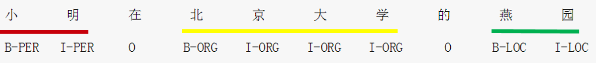
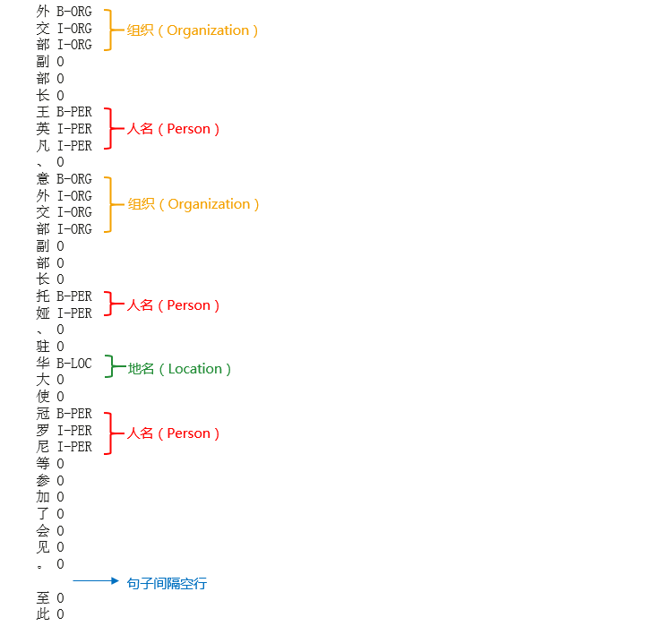
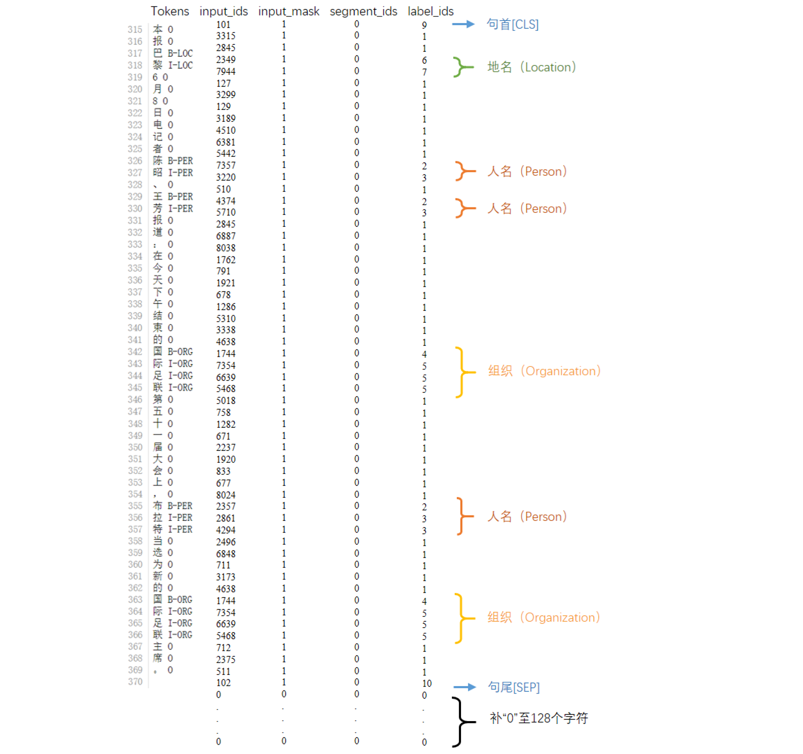
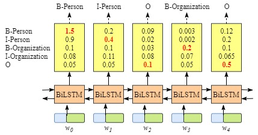
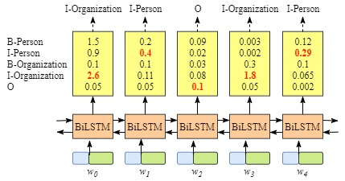

{
	"cells": [{
			"cell_type": "markdown",
			"metadata": {},
			"source": [
				"# NLP系列之二命名实体识别（NER）\n",
				"\n",
				"在上一篇里，我们运行了官方提供的BERT模型用于SQuAD数据集上进行阅读理解的例子，并学习使用了ModelArts深度学习开发平台，本篇将继续进行NLP任务实践。\n",
				"\n",
				"SQuAD的训练集和验证集的JSON文件，格式极其复杂，而且是英文的，本次选择来做一个基于中文的NLP实践。NLP里的一项基础的任务就是**命名实体识别**（Named EntitiesRecognition，NER），今天就来做一个基于BERT模型的中文命名实体识别。\n",
				"\n",
				"在所有涉及NLP的人工智能研究中，比如智能客服，NER都是一个必须首先攻克的任务。具体就是指从文本中识别出命名性指称项，为信息抽取、信息检索、机器翻译、问答系统等任务做铺垫。其目的是识别语料中人名、地名、组织机构名等命名实体。在特定的领域中，会相应地定义领域内的各种实体类型，如书名、歌曲名、期刊名等。\n",
				"\n",
				"命名实体是命名实体识别的研究主体，一般包括三大类（实体类、时间类和数字类）和七小类（人名、地名、机构名、时间、日期、货币和百分比）命名实体。其中人名、地名、机构名相对于其他实体识别较复杂，无法用模式匹配的方式获得较好的识别效果，是近年来研究的主要部分。\n",
				"\n",
				"NER的研究早期起于基于词典和规则的方法，之后是传统机器学习模型，包括生成式模型隐马尔可夫模型（HiddenMarkovMode，HMM）、判别式模型条件随机场（ConditionalRandom Fields，CRF）等。近年来随着神经网络的兴起，很多研究使用循环神经网络（Recurrent Neural Network，RNN）、长短记忆网络（Long Short-Term Memory，LSTM）等深度学习方法。今天我们就用BERT模型来做中文NER。\n",
				"\n",
				"说到中文，作为象形文字，相比于英文等拼音文字，针对中文的NER任务来说往往要更有挑战性，下面列举几点：\n",
				"\n",
				"1.  中文文本里不像英文那样有空格作为词语的界限标志，而且“词”在中文里本来就是一个很模糊的概念，中文也不具备英文中的字母大小写等形态指示。\n",
				"\n",
				"2. 中文的用字灵活多变，有些词语在脱离上下文语境的情况下无法判断是否是命名实体，而且就算是命名实体，当其处在不同的上下文语境下也可能是不同的实体类型。\n",
				"\n",
				"3. 命名实体存在嵌套现象，如“北京大学第三医院”这一组织机构名中还嵌套着同样可以作为组织机构名的“北京大学”，而且这种现象在组织机构名中尤其严重。\n",
				"\n",
				"4. 中文里广泛存在简化表达现象，如“北医三院”、“国科大”，乃至简化表达构成的命名实体，如“国科大桥”。\n",
				"\n",
				"常用的命名实体标注方法有BIO标注、BIOES标注、BMES等。在本案例中选择使用**BIO标注**：将每个元素标注为“B-X”、“I-X”或者“O”。\n",
				"\n",
				"1. “B-X”（Begin）表示此元素所在的片段属于X类型并且此元素在此片段的开头；\n",
				"2. “I-X”（Inside）表示此元素所在的片段属于X类型并且此元素在此片段的中间位置；\n",
				"3. “O”（Outside）表示不属于任何类型。\n",
				"\n",
				"即B-PER、I-PER代表人名首字、人名非首字，B-LOC、I-LOC代表地名首字、地名非首字，B-ORG、I-ORG代表组织机构名首字、组织机构名非首字，示例如下：\n",
				" \n",
				" \n",
				" \n",
				"### 数据集\n",
				"\n",
				"本实践使用的是《人民日报1998年中文标注语料库》，关于该数据集的介绍如下：\n",
				"\n",
				"以1998年人民日报语料为对象，由北京大学计算语言学研究所和富士通研究开发中心有限公司共同制作的标注语料库。该语料库对600多万字节的中文文章进行了分词及词性标注，其被作为原始数据应用于大量的研究和论文中。\n",
				"\n",
				"数据集格式如下图，每行的第一个是字，第二个是它的标签，字与标签之间使用空格分隔，两句话之间空一行。\n",
				" \n",
				"\n",
				"\n",
				"### 预训练模型\n",
				"\n",
				"本实践使用的是中文**BERT-Base,Chinese**预训练模型。从链接[BERT-Base, Chinese](https://storage.googleapis.com/bert_models/2018_11_03/chinese_L-12_H-768_A-12.zip)下载解压后得到如下预训练模型文件\n",
				"\n",
				"- bert_config.json\n",
				"- bert_model.ckpt.data-00000-of-00001\n",
				"- bert_model.ckpt.index\n",
				"- bert_model.ckpt.meta\n",
				"- vocab.txt\n",
				"\n",
				"其中\n",
				"* 一个config file(bert_config.json) ：存储预训练模型超参数\n",
				"* 三个tensorflow checkpoint (bert_model.ckpt) ：包含预训练模型checkpoint\n",
				"* 一个vocab文件(vocab.txt)：将WordPiece映射成word id  \n",
				"\n",
				"本实践所需条件：\n",
				"\n",
				"tensorflow >= 1.11.0   \n",
				"\n",
				"tensorflow-gpu  >= 1.11.0 \n",
				"\n",
				"**在此使用华为的AI深度学习开发平台**[**ModelArts**](https://support.huaweicloud.com/modelarts/index.html)\n",
				"\n",
				"**链接：https://support.huaweicloud.com/modelarts/index.html**\n",
				"\n",
				"\n",
				"下面开始真正动手——在ModelArts里运行命名实体识别任务\n",
				"\n",
				"觉得准备数据集&下载模型太麻烦耗时太长的同学可以移步[**这里（NER-BERT）**](https://github.com/huaweicloud/ModelArts-Lab/blob/master/%E7%BB%BC%E5%90%88AI%E5%BC%80%E5%8F%91%E6%A1%88%E4%BE%8B/NER-BERT/NER-BERT.ipynb)，不需要手动下载,直接按照流程运行notebook即可。\n",
				"\n",
				"下载预训练模型、BERT代码、数据集，形成如下文件夹结构如下：\n",
				"\n",
				"```bash\n",
				"NER\n",
				"├── bert\n",
				"│       ├── modeling.py\n",
				"│       ├── optimization.py\n",
				"│       └── tokenization.py\n",
				"│\n",
				"├── chinese_L-12_H-768_A-12\n",
				"│       ├──bert_config.json\n",
				"│       ├──bert_model.ckpt.data-00000-of-00001\n",
				"│       ├──bert_model.ckpt.index\n",
				"│       ├──bert_model.ckpt.meta\n",
				"│       └──vocab.txt\n",
				"├── data\n",
				"│       ├── train.txt  \n",
				"│       ├── dev.txt\n",
				"│       └── test.txt\n",
				"├── src\n",
				"│       ├── conlleval.pl  \n",
				"│       ├── conlleval.py\n",
				"│       ├── models.py\n",
				"│       └── terminal_predict.py\n",
				"└── output\n",
				"```\n",
				"\n",
				"路径参数&全局参数设置为：\n",
				"\n",
				"```\n",
				"数据集路径为： ./NER/data\n",
				"输出路径为： ./NER/output\n",
				"中文字典路径为： ./NER/chinese_L-12_H-768_A-12/vocab.txt\n",
				"预训练模型参数路径为： ./NER/chinese_L-12_H-768_A-12/bert_config.json\n",
				"预训练模型checkpoint路径为： ./NER/chinese_L-12_H-768_A-12/bert_model.ckpt\n",
				"预先设定的最大序列长度为： 128\n",
				"批尺寸为： 64\n",
				"训练轮数： 3.0\n",
				"```\n",
				"\n",
				"batch_size = 64 #批尺寸，本实践中为了加快训练速度只设置为64，如果需要提高训练精度可适当增大，如128。\n",
				"\n",
				"num_train_epochs = 3.0 #训练轮数，本实践中为了加快训练速度只设置为3，如果需要提高训练精度可适当增大，如10。\n",
				"\n",
				"通过BERT的tokenization.py读取预训练模型的中文字典vocab.txt。\n",
				"\n",
				"通过BERT的modeling.py配置config信息:\n",
				"\n",
				"```\n",
				"attention_probs_dropout_prob:0.1\n",
				"directionality:bidi\n",
				"hidden_act:gelu\n",
				"hidden_dropout_prob:0.1\n",
				"hidden_size:768\n",
				"initializer_range:0.02\n",
				"intermediate_size:3072\n",
				"max_position_embeddings:512\n",
				"num_attention_heads:12\n",
				"num_hidden_layers:12\n",
				"pooler_fc_size:768\n",
				"pooler_num_attention_heads:12\n",
				"pooler_num_fc_layers:3\n",
				"pooler_size_per_head:128\n",
				"pooler_type:first_token_transform\n",
				"type_vocab_size:2\n",
				"vocab_size:21128\n",
				"num_train_steps:978\n",
				"num_warmup_steps:97\n",
				"num_train_size:20864\n",
				"```\n",
				"\n",
				"首先使用BERT模型字向量、文本向量和位置向量作为模型输入，具体实现函数为convert_single_example和filed_based_convert_examples_to_features。以前五句为例：\n",
				"\n",
				"```\n",
				"    INFO:tensorflow:Writing example 0 of 20864\n",
				"    INFO:tensorflow:*** Example ***\n",
				"    INFO:tensorflow:guid: train-0\n",
				"    INFO:tensorflow:tokens: 全 国 人 民 代 表 大 会 澳 门 特 别 行 政 区 筹 备 委 员 会 第 一 次 全 体 会 议 今 天 上 午 在 北 京 人 民 大 会 堂 开 幕 ， 国 务 院 副 总 理 、 筹 委 会 主 任 委 员 钱 其 琛 在 致 开 幕 词 中 指 出 ， 筹 建 澳 门 特 别 行 政 区 的 工 作 已 经 启 动 ， 筹 委 会 面 临 的 工 作 是 大 量 的 、 紧 迫 的 ， 筹 委 们 任 重 道 远 ， 希 望 大 家 齐 心 协 力 为 澳 门 的 平 稳 过 渡\n",
				"    INFO:tensorflow:input_ids: 101 1059 1744 782 3696 807 6134 1920 833 4078 7305 4294 1166 6121 3124 1277 5040 1906 1999 1447 833 5018 671 3613 1059 860 833 6379 791 1921 677 1286 1762 1266 776 782 3696 1920 833 1828 2458 2391 8024 1744 1218 7368 1199 2600 4415 510 5040 1999 833 712 818 1999 1447 7178 1071 4422 1762 5636 2458 2391 6404 704 2900 1139 8024 5040 2456 4078 7305 4294 1166 6121 3124 1277 4638 2339 868 2347 5307 1423 1220 8024 5040 1999 833 7481 707 4638 2339 868 3221 1920 7030 4638 510 5165 6833 4638 8024 5040 1999 812 818 7028 6887 6823 8024 2361 3307 1920 2157 7970 2552 1291 1213 711 4078 7305 4638 2398 4937 6814 3941 102\n",
				"    INFO:tensorflow:input_mask: 1 1 1 1 1 1 1 1 1 1 1 1 1 1 1 1 1 1 1 1 1 1 1 1 1 1 1 1 1 1 1 1 1 1 1 1 1 1 1 1 1 1 1 1 1 1 1 1 1 1 1 1 1 1 1 1 1 1 1 1 1 1 1 1 1 1 1 1 1 1 1 1 1 1 1 1 1 1 1 1 1 1 1 1 1 1 1 1 1 1 1 1 1 1 1 1 1 1 1 1 1 1 1 1 1 1 1 1 1 1 1 1 1 1 1 1 1 1 1 1 1 1 1 1 1 1 1 1\n",
				"    INFO:tensorflow:segment_ids: 0 0 0 0 0 0 0 0 0 0 0 0 0 0 0 0 0 0 0 0 0 0 0 0 0 0 0 0 0 0 0 0 0 0 0 0 0 0 0 0 0 0 0 0 0 0 0 0 0 0 0 0 0 0 0 0 0 0 0 0 0 0 0 0 0 0 0 0 0 0 0 0 0 0 0 0 0 0 0 0 0 0 0 0 0 0 0 0 0 0 0 0 0 0 0 0 0 0 0 0 0 0 0 0 0 0 0 0 0 0 0 0 0 0 0 0 0 0 0 0 0 0 0 0 0 0 0 0\n",
				"    INFO:tensorflow:label_ids: 9 4 5 5 5 5 5 5 5 5 5 5 5 5 5 5 5 5 5 5 5 1 1 1 1 1 1 1 1 1 1 1 1 6 7 6 7 7 7 7 1 1 1 4 5 5 1 1 1 1 4 5 5 1 1 1 1 2 3 3 1 1 1 1 1 1 1 1 1 1 1 6 7 7 7 7 7 7 1 1 1 1 1 1 1 1 4 5 5 1 1 1 1 1 1 1 1 1 1 1 1 1 1 1 1 1 1 1 1 1 1 1 1 1 1 1 1 1 1 1 6 7 1 1 1 1 1 10\n",
				"    INFO:tensorflow:*** Example ***\n",
				"    INFO:tensorflow:guid: train-1\n",
				"    INFO:tensorflow:tokens: 全 国 人 大 常 委 会 副 委 员 长 周 光 召 、 信 息 产 业 部 部 长 吴 基 传 、 英 特 尔 公 司 董 事 长 安 德 鲁 · 葛 鲁 夫 等 应 邀 出 席 了 这 次 活 动 。\n",
				"    INFO:tensorflow:input_ids: 101 1059 1744 782 1920 2382 1999 833 1199 1999 1447 7270 1453 1045 1374 510 928 2622 772 689 6956 6956 7270 1426 1825 837 510 5739 4294 2209 1062 1385 5869 752 7270 2128 2548 7826 185 5867 7826 1923 5023 2418 6913 1139 2375 749 6821 3613 3833 1220 511 102 0 0 0 0 0 0 0 0 0 0 0 0 0 0 0 0 0 0 0 0 0 0 0 0 0 0 0 0 0 0 0 0 0 0 0 0 0 0 0 0 0 0 0 0 0 0 0 0 0 0 0 0 0 0 0 0 0 0 0 0 0 0 0 0 0 0 0 0 0 0 0 0 0 0\n",
				"    INFO:tensorflow:input_mask: 1 1 1 1 1 1 1 1 1 1 1 1 1 1 1 1 1 1 1 1 1 1 1 1 1 1 1 1 1 1 1 1 1 1 1 1 1 1 1 1 1 1 1 1 1 1 1 1 1 1 1 1 1 1 0 0 0 0 0 0 0 0 0 0 0 0 0 0 0 0 0 0 0 0 0 0 0 0 0 0 0 0 0 0 0 0 0 0 0 0 0 0 0 0 0 0 0 0 0 0 0 0 0 0 0 0 0 0 0 0 0 0 0 0 0 0 0 0 0 0 0 0 0 0 0 0 0 0\n",
				"    INFO:tensorflow:segment_ids: 0 0 0 0 0 0 0 0 0 0 0 0 0 0 0 0 0 0 0 0 0 0 0 0 0 0 0 0 0 0 0 0 0 0 0 0 0 0 0 0 0 0 0 0 0 0 0 0 0 0 0 0 0 0 0 0 0 0 0 0 0 0 0 0 0 0 0 0 0 0 0 0 0 0 0 0 0 0 0 0 0 0 0 0 0 0 0 0 0 0 0 0 0 0 0 0 0 0 0 0 0 0 0 0 0 0 0 0 0 0 0 0 0 0 0 0 0 0 0 0 0 0 0 0 0 0 0 0\n",
				"    INFO:tensorflow:label_ids: 9 4 5 5 5 5 5 5 1 1 1 1 2 3 3 1 4 5 5 5 5 1 1 2 3 3 1 4 5 5 5 5 1 1 1 2 3 3 3 3 3 3 1 1 1 1 1 1 1 1 1 1 1 10 0 0 0 0 0 0 0 0 0 0 0 0 0 0 0 0 0 0 0 0 0 0 0 0 0 0 0 0 0 0 0 0 0 0 0 0 0 0 0 0 0 0 0 0 0 0 0 0 0 0 0 0 0 0 0 0 0 0 0 0 0 0 0 0 0 0 0 0 0 0 0 0 0 0\n",
				"    INFO:tensorflow:*** Example ***\n",
				"    INFO:tensorflow:guid: train-2\n",
				"    INFO:tensorflow:tokens: 乡 党 委 书 记 韩 二 秃 介 绍 说 ， 西 柏 坡 乡 是 个 移 民 乡 ， 修 岗 南 水 库 把 各 村 的 好 地 都 占 了 ， 剩 下 的 就 是 荒 山 。\n",
				"    INFO:tensorflow:input_ids: 101 740 1054 1999 741 6381 7506 753 4901 792 5305 6432 8024 6205 3377 1786 740 3221 702 4919 3696 740 8024 934 2266 1298 3717 2417 2828 1392 3333 4638 1962 1765 6963 1304 749 8024 1197 678 4638 2218 3221 5774 2255 511 102 0 0 0 0 0 0 0 0 0 0 0 0 0 0 0 0 0 0 0 0 0 0 0 0 0 0 0 0 0 0 0 0 0 0 0 0 0 0 0 0 0 0 0 0 0 0 0 0 0 0 0 0 0 0 0 0 0 0 0 0 0 0 0 0 0 0 0 0 0 0 0 0 0 0 0 0 0 0 0 0 0\n",
				"    INFO:tensorflow:input_mask: 1 1 1 1 1 1 1 1 1 1 1 1 1 1 1 1 1 1 1 1 1 1 1 1 1 1 1 1 1 1 1 1 1 1 1 1 1 1 1 1 1 1 1 1 1 1 1 0 0 0 0 0 0 0 0 0 0 0 0 0 0 0 0 0 0 0 0 0 0 0 0 0 0 0 0 0 0 0 0 0 0 0 0 0 0 0 0 0 0 0 0 0 0 0 0 0 0 0 0 0 0 0 0 0 0 0 0 0 0 0 0 0 0 0 0 0 0 0 0 0 0 0 0 0 0 0 0 0\n",
				"    INFO:tensorflow:segment_ids: 0 0 0 0 0 0 0 0 0 0 0 0 0 0 0 0 0 0 0 0 0 0 0 0 0 0 0 0 0 0 0 0 0 0 0 0 0 0 0 0 0 0 0 0 0 0 0 0 0 0 0 0 0 0 0 0 0 0 0 0 0 0 0 0 0 0 0 0 0 0 0 0 0 0 0 0 0 0 0 0 0 0 0 0 0 0 0 0 0 0 0 0 0 0 0 0 0 0 0 0 0 0 0 0 0 0 0 0 0 0 0 0 0 0 0 0 0 0 0 0 0 0 0 0 0 0 0 0\n",
				"    INFO:tensorflow:label_ids: 9 4 5 5 1 1 2 3 3 1 1 1 1 6 7 7 7 1 1 1 1 1 1 1 6 7 7 7 1 1 1 1 1 1 1 1 1 1 1 1 1 1 1 1 1 1 10 0 0 0 0 0 0 0 0 0 0 0 0 0 0 0 0 0 0 0 0 0 0 0 0 0 0 0 0 0 0 0 0 0 0 0 0 0 0 0 0 0 0 0 0 0 0 0 0 0 0 0 0 0 0 0 0 0 0 0 0 0 0 0 0 0 0 0 0 0 0 0 0 0 0 0 0 0 0 0 0 0\n",
				"    INFO:tensorflow:*** Example ***\n",
				"    INFO:tensorflow:guid: train-3\n",
				"    INFO:tensorflow:tokens: 泰 国 总 理 川 · 立 派 最 近 在 讲 话 中 表 示 ， 泰 国 政 府 将 根 据 努 军 委 员 会 的 金 融 风 暴 调 查 总 结 报 告 和 专 案 审 查 委 员 会 的 审 查 ， 坚 决 、 果 断 处 理 造 成 国 家 巨 大 经 济 损 失 的 有 关 人 物 。\n",
				"    INFO:tensorflow:input_ids: 101 3805 1744 2600 4415 2335 185 4989 3836 3297 6818 1762 6382 6413 704 6134 4850 8024 3805 1744 3124 2424 2199 3418 2945 1222 1092 1999 1447 833 4638 7032 6084 7599 3274 6444 3389 2600 5310 2845 1440 1469 683 3428 2144 3389 1999 1447 833 4638 2144 3389 8024 1780 1104 510 3362 3171 1905 4415 6863 2768 1744 2157 2342 1920 5307 3845 2938 1927 4638 3300 1068 782 4289 511 102 0 0 0 0 0 0 0 0 0 0 0 0 0 0 0 0 0 0 0 0 0 0 0 0 0 0 0 0 0 0 0 0 0 0 0 0 0 0 0 0 0 0 0 0 0 0 0 0 0 0 0\n",
				"    INFO:tensorflow:input_mask: 1 1 1 1 1 1 1 1 1 1 1 1 1 1 1 1 1 1 1 1 1 1 1 1 1 1 1 1 1 1 1 1 1 1 1 1 1 1 1 1 1 1 1 1 1 1 1 1 1 1 1 1 1 1 1 1 1 1 1 1 1 1 1 1 1 1 1 1 1 1 1 1 1 1 1 1 1 0 0 0 0 0 0 0 0 0 0 0 0 0 0 0 0 0 0 0 0 0 0 0 0 0 0 0 0 0 0 0 0 0 0 0 0 0 0 0 0 0 0 0 0 0 0 0 0 0 0 0\n",
				"    INFO:tensorflow:segment_ids: 0 0 0 0 0 0 0 0 0 0 0 0 0 0 0 0 0 0 0 0 0 0 0 0 0 0 0 0 0 0 0 0 0 0 0 0 0 0 0 0 0 0 0 0 0 0 0 0 0 0 0 0 0 0 0 0 0 0 0 0 0 0 0 0 0 0 0 0 0 0 0 0 0 0 0 0 0 0 0 0 0 0 0 0 0 0 0 0 0 0 0 0 0 0 0 0 0 0 0 0 0 0 0 0 0 0 0 0 0 0 0 0 0 0 0 0 0 0 0 0 0 0 0 0 0 0 0 0\n",
				"    INFO:tensorflow:label_ids: 9 6 7 1 1 2 3 3 3 1 1 1 1 1 1 1 1 1 6 7 1 1 1 1 1 4 5 5 5 5 1 1 1 1 1 1 1 1 1 1 1 1 4 5 5 5 5 5 5 1 1 1 1 1 1 1 1 1 1 1 1 1 1 1 1 1 1 1 1 1 1 1 1 1 1 1 10 0 0 0 0 0 0 0 0 0 0 0 0 0 0 0 0 0 0 0 0 0 0 0 0 0 0 0 0 0 0 0 0 0 0 0 0 0 0 0 0 0 0 0 0 0 0 0 0 0 0 0\n",
				"    INFO:tensorflow:*** Example ***\n",
				"    INFO:tensorflow:guid: train-4\n",
				"    INFO:tensorflow:tokens: 本 报 巴 黎 6 月 8 日 电 记 者 陈 昭 、 王 芳 报 道 ： 在 今 天 下 午 结 束 的 国 际 足 联 第 五 十 一 届 大 会 上 ， 布 拉 特 当 选 为 新 的 国 际 足 联 主 席 。\n",
				"    INFO:tensorflow:input_ids: 101 3315 2845 2349 7944 127 3299 129 3189 4510 6381 5442 7357 3220 510 4374 5710 2845 6887 8038 1762 791 1921 678 1286 5310 3338 4638 1744 7354 6639 5468 5018 758 1282 671 2237 1920 833 677 8024 2357 2861 4294 2496 6848 711 3173 4638 1744 7354 6639 5468 712 2375 511 102 0 0 0 0 0 0 0 0 0 0 0 0 0 0 0 0 0 0 0 0 0 0 0 0 0 0 0 0 0 0 0 0 0 0 0 0 0 0 0 0 0 0 0 0 0 0 0 0 0 0 0 0 0 0 0 0 0 0 0 0 0 0 0 0 0 0 0 0 0 0 0\n",
				"    INFO:tensorflow:input_mask: 1 1 1 1 1 1 1 1 1 1 1 1 1 1 1 1 1 1 1 1 1 1 1 1 1 1 1 1 1 1 1 1 1 1 1 1 1 1 1 1 1 1 1 1 1 1 1 1 1 1 1 1 1 1 1 1 1 0 0 0 0 0 0 0 0 0 0 0 0 0 0 0 0 0 0 0 0 0 0 0 0 0 0 0 0 0 0 0 0 0 0 0 0 0 0 0 0 0 0 0 0 0 0 0 0 0 0 0 0 0 0 0 0 0 0 0 0 0 0 0 0 0 0 0 0 0 0 0\n",
				"    INFO:tensorflow:segment_ids: 0 0 0 0 0 0 0 0 0 0 0 0 0 0 0 0 0 0 0 0 0 0 0 0 0 0 0 0 0 0 0 0 0 0 0 0 0 0 0 0 0 0 0 0 0 0 0 0 0 0 0 0 0 0 0 0 0 0 0 0 0 0 0 0 0 0 0 0 0 0 0 0 0 0 0 0 0 0 0 0 0 0 0 0 0 0 0 0 0 0 0 0 0 0 0 0 0 0 0 0 0 0 0 0 0 0 0 0 0 0 0 0 0 0 0 0 0 0 0 0 0 0 0 0 0 0 0 0\n",
				"    INFO:tensorflow:label_ids: 9 1 1 6 7 1 1 1 1 1 1 1 2 3 1 2 3 1 1 1 1 1 1 1 1 1 1 1 4 5 5 5 1 1 1 1 1 1 1 1 1 2 3 3 1 1 1 1 1 4 5 5 5 1 1 1 10 0 0 0 0 0 0 0 0 0 0 0 0 0 0 0 0 0 0 0 0 0 0 0 0 0 0 0 0 0 0 0 0 0 0 0 0 0 0 0 0 0 0 0 0 0 0 0 0 0 0 0 0 0 0 0 0 0 0 0 0 0 0 0 0 0 0 0 0 0 0 0\n",
				"    INFO:tensorflow:Writing example 5000 of 20864\n",
				"    INFO:tensorflow:Writing example 10000 of 20864\n",
				"    INFO:tensorflow:Writing example 15000 of 20864\n",
				"    INFO:tensorflow:Writing example 20000 of 20864\n",
				"    INFO:tensorflow:Writing example 0 of 20864\n",
				"```\n",
				"\n",
				"以上输出了五个样本句子，分别标出了token embeddings，segment embeddings，position embeddings和label，预先设定的最大序列长度max_seq_length为128 ，少于128字符的用“0”补齐。其中labels的1-10分别代表：'O', 'B-PER', 'I-PER', 'B-ORG', 'I-ORG', 'B-LOC', 'I-LOC', 'X', '[CLS]', '[SEP]'。labels分别表示：\n",
				"\n",
				"- O：非标注实体\n",
				"- B-PER：人名首字\n",
				"- I-PER：人名非首字\n",
				"- B-ORG：组织首字\n",
				"- I-ORG：组织名非首字\n",
				"- B-LOC：地名首字\n",
				"- I-LOC：地名非首字\n",
				"- X：未知\n",
				"- [CLS]：句首\n",
				"- [SEP]：句尾\n",
				"\n",
				"以第五个示例（guid = train-4）为例，分别标识为：\n",
				" \n",
				"\n",
				"\n",
				"### BiLSTM+CRF层\n",
				"\n",
				"本实践以BERT作为上游模型，下游任务通过添加BiLSTM+CRF层完成，具体结构可从src文件夹下的models.py中的BLSTM_CRF类中找到。\n",
				"\n",
				"LSTM的全称是Long Short-Term Memory，它是RNN（Recurrent Neural Network，循环神经网络）的一种。LSTM区别于RNN的地方，主要就在于它在算法中加入了一个判断信息有用与否的结构，该结构中被放置了三扇门，分别叫做输入门、遗忘门和输出门。一个信息进入LSTM的网络当中，可以根据规则来判断是否有用。只有符合算法认证的信息才会留下，不符的信息则通过遗忘门被遗忘。LSTM由于其设计的特点，非常适合用于对时序数据的建模，如文本数据。BiLSTM是Bi-directional Long Short-Term Memory的缩写，是由前向LSTM与后向LSTM组合而成。这两个都连接着一个输出层。这个结构提供给输出层输入序列中每一个点的完整的过去和未来的上下文信息。\n",
				"\n",
				"我们可以单独使用BiLSTM命名实体识别模型，如图。\n",
				" \n",
				"\n",
				"因为每个单词的BiLSTM输出是标签分数。我们可以选择每个单词得分最高的标签。例如，对于w0，“B-Person”得分最高（1.5），因此我们可以选择“B-Person”作为其最佳预测标签。同样，我们可以为w1选择“I-Person”，w2选择”O“，w3选择“B-Organization”，w4选择\"O\"。\n",
				" \n",
				"虽然由此可以得到句子中每个单元的正确标签，但是我们不能保证标签每次都是预测正确的。例如，下图中的例子，标签序列是“I-Organization I-Person” and “B-Organization I-Person”，很显然这是错误的。\n",
				" \n",
				"\n",
				"而CRF层能从训练数据中获得约束性的规则。CRF（Conditional Random Fields，条件随机场）是给定一组输入随机变量条件下，另外一组输出随机变量的条件概率分布模型，其特点是假设输出变量构成马尔可夫随机场。CRF层可以为最后预测的标签添加一些约束来保证预测的标签是合法的。这些约束可以是：\n",
				"\n",
				"- 句子中第一个词总是以标签“B-“ 或 “O”开始，而不是“I-”\n",
				"- 标签“B-label1 I-label2 I-label3 I-…”,label1, label2, label3应该属于同一类实体。例如，“B-Person I-Person” 是合法的序列, 但是“B-Person I-Organization” 是非法标签序列\n",
				"- 标签序列“O I-label” is 非法的.实体标签的首个标签应该是 “B-“ ，而非 “I-“, 换句话说,有效的标签序列应该是“O B-label”。\n",
				"\n",
				"有了这些约束，标签序列预测中非法序列出现的概率将会大大降低。\n",
				" \n",
				"\n",
				"\n",
				"上图说明了BiLSTM层的输出是每个标签的分数。例如，对于w0，BiLSTM节点的输出为1.5（B-Person），0.9（I-Person），0.1（B-Organization），0.08（I-Organization）和0.05（O）。这些分数将是CRF层的输入。然后，BiLSTM块预测的所有分数被馈送到CRF层。在CRF层中，将选择具有最高预测分数的标签序列作为最佳答案。\n",
				"\n",
				"通过model_fn_builder函数创建模型model_fn后，即可进行训练，在ModelArts的GPU上训练大概十多分钟就结束了，还是非常快的！训练输出如下：\n",
				"\n",
				"```\n",
				"INFO:tensorflow:***** Running training *****\n",
				"INFO:tensorflow:  Num examples = 20864\n",
				"INFO:tensorflow:  Batch size = 64\n",
				"INFO:tensorflow:  Num steps = 978\n",
				"INFO:tensorflow:Using config: {'_model_dir': './NER/output', '_tf_random_seed': None, '_save_summary_steps': 500, '_save_checkpoints_steps': 500, '_save_checkpoints_secs': None, '_session_config': allow_soft_placement: true\n",
				", '_keep_checkpoint_max': 5, '_keep_checkpoint_every_n_hours': 10000, '_log_step_count_steps': 100, '_train_distribute': None, '_device_fn': None, '_protocol': None, '_eval_distribute': None, '_experimental_distribute': None, '_service': None, '_cluster_spec': <tensorflow.python.training.server_lib.ClusterSpec object at 0x7f3663340470>, '_task_type': 'worker', '_task_id': 0, '_global_id_in_cluster': 0, '_master': '', '_evaluation_master': '', '_is_chief': True, '_num_ps_replicas': 0, '_num_worker_replicas': 1}\n",
				"INFO:tensorflow:Calling model_fn.\n",
				"INFO:tensorflow:*** Features ***\n",
				"INFO:tensorflow:  name = input_ids, shape = (32, 128)\n",
				"INFO:tensorflow:  name = input_mask, shape = (32, 128)\n",
				"INFO:tensorflow:  name = label_ids, shape = (32, 128)\n",
				"INFO:tensorflow:  name = segment_ids, shape = (32, 128)\n",
				"进行训练，约20min\n",
				"shape of input_ids (32, 128)\n",
				"INFO:tensorflow:Done calling model_fn.\n",
				"INFO:tensorflow:Create CheckpointSaverHook.\n",
				"INFO:tensorflow:Graph was finalized.\n",
				"INFO:tensorflow:Running local_init_op.\n",
				"INFO:tensorflow:Done running local_init_op.\n",
				"INFO:tensorflow:Saving checkpoints for 0 into ./NER/output/model.ckpt.\n",
				"INFO:tensorflow:loss = 106.046326, step = 0\n",
				"INFO:tensorflow:global_steps = 0, loss = 106.046326\n",
				"INFO:tensorflow:global_step/sec: 1.46726\n",
				"INFO:tensorflow:loss = 46.631207, step = 100 (68.156 sec)\n",
				"INFO:tensorflow:global_steps = 100, loss = 46.631207 (68.155 sec)\n",
				"INFO:tensorflow:global_step/sec: 1.81712\n",
				"INFO:tensorflow:loss = 37.328934, step = 200 (55.033 sec)\n",
				"INFO:tensorflow:global_steps = 200, loss = 37.328934 (55.033 sec)\n",
				"INFO:tensorflow:global_step/sec: 1.82583\n",
				"INFO:tensorflow:loss = 37.050262, step = 300 (54.769 sec)\n",
				"INFO:tensorflow:global_steps = 300, loss = 37.050262 (54.769 sec)\n",
				"INFO:tensorflow:global_step/sec: 1.82732\n",
				"INFO:tensorflow:loss = 37.160378, step = 400 (54.725 sec)\n",
				"INFO:tensorflow:global_steps = 400, loss = 37.160378 (54.725 sec)\n",
				"INFO:tensorflow:Saving checkpoints for 500 into ./NER/output/model.ckpt.\n",
				"INFO:tensorflow:global_step/sec: 1.55118\n",
				"INFO:tensorflow:loss = 38.998734, step = 500 (64.466 sec)\n",
				"INFO:tensorflow:global_steps = 500, loss = 38.998734 (64.466 sec)\n",
				"INFO:tensorflow:global_step/sec: 1.82595\n",
				"INFO:tensorflow:loss = 40.138336, step = 600 (54.767 sec)\n",
				"INFO:tensorflow:global_steps = 600, loss = 40.138336 (54.767 sec)\n",
				"INFO:tensorflow:global_step/sec: 1.82669\n",
				"INFO:tensorflow:loss = 37.701122, step = 700 (54.744 sec)\n",
				"INFO:tensorflow:global_steps = 700, loss = 37.701122 (54.744 sec)\n",
				"INFO:tensorflow:global_step/sec: 1.82625\n",
				"INFO:tensorflow:loss = 38.045074, step = 800 (54.757 sec)\n",
				"INFO:tensorflow:global_steps = 800, loss = 38.045074 (54.757 sec)\n",
				"INFO:tensorflow:global_step/sec: 1.83092\n",
				"INFO:tensorflow:loss = 31.680422, step = 900 (54.617 sec)\n",
				"INFO:tensorflow:global_steps = 900, loss = 31.680422 (54.617 sec)\n",
				"INFO:tensorflow:Saving checkpoints for 978 into ./NER/output/model.ckpt.\n",
				"INFO:tensorflow:Loss for final step: 38.36219.\n",
				"```\n",
				"\n",
				"同样步骤来进行验证和测试，最终得到测试指标如下：\n",
				"\n",
				"```\n",
				"processed 2270 tokens with 78 phrases; found: 75 phrases; correct: 68.\n",
				"accuracy:  99.52%; precision:  90.67%; recall:  87.18%; FB1:  88.89\n",
				"              LOC: precision: 100.00%; recall:  97.78%; FB1:  98.88  44\n",
				"              ORG: precision:  77.78%; recall:  87.50%; FB1:  82.35  9\n",
				"              PER: precision:  77.27%; recall:  68.00%; FB1:  72.34  22\n",
				"```\n",
				"\n",
				"最后，还使用训练得到的模型对中文命名实体识别进行了在线测试的程序封装，执行src中的terminal_predict.py即可对输入的句子进行实体识别。下面是一些我在新闻上找的句子和识别结果：\n",
				"\n",
				"```\n",
				"checkpoint path:./NER/output/checkpoint\n",
				"going to restore checkpoint\n",
				"INFO:tensorflow:Restoring parameters from ./NER/output/model.ckpt-978\n",
				"{1: 'O', 2: 'B-PER', 3: 'I-PER', 4: 'B-ORG', 5: 'I-ORG', 6: 'B-LOC', 7: 'I-LOC', 8: 'X', 9: '[CLS]', 10: '[SEP]'}\n",
				"输入句子:\n",
				"“双打最佳搭档”许昕将与陈梦联手出战混双比赛。即将于5月28日至6月2日在深圳进行的国际乒联世界巡回赛中国公开赛上，他们将作为6号种子与头号种子中国香港组合黄镇廷/杜凯琹、2号种子斯洛伐克组合皮斯特耶/巴拉佐娃、8号种子日本组合张本智和/石川佳纯等展开对决。\n",
				"[['O', 'O', 'O', 'O', 'O', 'O', 'O', 'O', 'B-PER', 'I-PER', 'O', 'O', 'B-PER', 'I-PER', 'O', 'O', 'O', 'O', 'O', 'O', 'O', 'O', 'O', 'O', 'O', 'O', 'O', 'O', 'O', 'O', 'O', 'O', 'O', 'O', 'O', 'O', 'B-LOC', 'I-LOC', 'O', 'O', 'O', 'B-ORG', 'I-ORG', 'I-ORG', 'I-ORG', 'O', 'O', 'O', 'O', 'O', 'B-LOC', 'I-LOC', 'O', 'O', 'O', 'O', 'O', 'O', 'O', 'O', 'O', 'O', 'O', 'O', 'O', 'O', 'O', 'O', 'O', 'O', 'O', 'B-LOC', 'I-ORG', 'B-LOC', 'I-LOC', 'O', 'O', 'B-PER', 'I-PER', 'I-PER', 'O', 'B-PER', 'I-PER', 'I-PER', 'O', 'O', 'O', 'O', 'O', 'B-LOC', 'I-LOC', 'I-ORG', 'I-LOC', 'O', 'O', 'B-PER', 'I-PER', 'I-PER', 'I-PER', 'O', 'B-PER', 'I-PER', 'I-PER', 'I-PER', 'O', 'O', 'O', 'O', 'O', 'B-LOC', 'I-LOC', 'O', 'O', 'B-PER', 'I-PER', 'I-PER', 'I-PER', 'O', 'B-PER', 'I-PER', 'I-PER', 'I-PER', 'O', 'O', 'O', 'O']]\n",
				"LOC, 深圳, 中国, 香港, 斯洛伐克, 日本\n",
				"PER, 许昕, 陈梦, 黄镇廷, 杜凯[UNK], 皮斯特耶, 巴拉佐娃, 张本智和, 石川佳纯\n",
				"ORG, 国际乒联, 中国\n",
				"time used: 0.927599 sec\n",
				"输入句子:\n",
				"1976年5月17日，王力宏出生于美国纽约罗切斯特。奶奶许留芬是清华大学经济系的高材生，舅公许倬云是芝加哥大学博士。\n",
				"[['O', 'O', 'O', 'O', 'O', 'O', 'O', 'B-PER', 'I-PER', 'I-PER', 'O', 'O', 'O', 'B-LOC', 'I-LOC', 'B-LOC', 'I-LOC', 'B-LOC', 'I-LOC', 'I-LOC', 'I-LOC', 'O', 'O', 'O', 'B-PER', 'I-PER', 'I-PER', 'O', 'B-ORG', 'I-ORG', 'I-ORG', 'I-ORG', 'I-ORG', 'I-ORG', 'I-ORG', 'O', 'O', 'O', 'O', 'O', 'O', 'O', 'B-PER', 'I-PER', 'I-PER', 'O', 'B-ORG', 'I-ORG', 'I-ORG', 'I-ORG', 'I-ORG', 'O', 'O', 'O']]\n",
				"LOC, 美国, 纽约, 罗切斯特\n",
				"PER, 王力宏, 许留芬, 许倬云\n",
				"ORG, 清华大学经济系, 芝加哥大学\n",
				"time used: 0.060211 sec\n",
				"输入句子:\n",
				"由清华大学主办的“2019清华五道口全球金融论坛”于5月25日至26日举行，本次论坛主题为“金融供给侧改革与开放”。中国银行保险监督管理委员会主席郭树清、中国人民银行副行长陈雨露、中国证券监督管理委员会副主席阎庆民等重量级嘉宾出席论坛。\n",
				"[['O', 'B-ORG', 'I-ORG', 'I-ORG', 'I-ORG', 'O', 'O', 'O', 'O', 'O', 'B-LOC', 'I-ORG', 'B-LOC', 'I-LOC', 'I-LOC', 'O', 'O', 'O', 'O', 'O', 'O', 'O', 'O', 'O', 'O', 'O', 'O', 'O', 'O', 'O', 'O', 'O', 'O', 'O', 'O', 'O', 'O', 'O', 'O', 'O', 'O', 'O', 'O', 'O', 'O', 'O', 'O', 'O', 'O', 'O', 'O', 'O', 'O', 'B-ORG', 'I-ORG', 'I-ORG', 'I-ORG', 'I-ORG', 'I-ORG', 'I-ORG', 'I-ORG', 'I-ORG', 'I-ORG', 'I-ORG', 'I-ORG', 'I-ORG', 'O', 'O', 'B-PER', 'I-PER', 'I-PER', 'O', 'B-ORG', 'I-ORG', 'I-ORG', 'I-ORG', 'I-ORG', 'I-ORG', 'O', 'O', 'O', 'B-PER', 'I-PER', 'I-PER', 'O', 'B-ORG', 'I-ORG', 'I-ORG', 'I-ORG', 'I-ORG', 'I-ORG', 'I-ORG', 'I-ORG', 'I-ORG', 'I-ORG', 'I-ORG', 'O', 'O', 'O', 'B-PER', 'I-PER', 'I-PER', 'O', 'O', 'O', 'O', 'O', 'O', 'O', 'O', 'O', 'O', 'O']]\n",
				"LOC, 五道口\n",
				"PER, 郭树清, 陈雨露, 阎庆民\n",
				"ORG, 清华大学, 清华, 中国银行保险监督管理委员会, 中国人民银行, 中国证券监督管理委员会\n",
				"time used: 0.11861 sec\n",
				"\n",
				"```\n",
				"\n",
				"可以看到，识别的结果很好，速度也非常快。\n",
				"\n",
				"以上就是使用BERT模型进行的中文命名实体识别，接下来我会继续更新NLP领域的其他实践任务，敬请期待。\n",
				"\n",
				"### <span style=\"color:red\">注意，现阶段ModelArts创建环境5G以下的EVS配置免费，超过请在实践项目结束后停止并删除该开发环境，以免产生多余费用。</span>\n",
				"\n"
			]
		},
		{
			"cell_type": "code",
			"execution_count": null,
			"metadata": {},
			"outputs": [],
			"source": []
		}
	],
	"metadata": {
		"kernelspec": {
			"display_name": "Python 3",
			"language": "python",
			"name": "python3"
		},
		"language_info": {
			"codemirror_mode": {
				"name": "ipython",
				"version": 3
			},
			"file_extension": ".py",
			"mimetype": "text/x-python",
			"name": "python",
			"nbconvert_exporter": "python",
			"pygments_lexer": "ipython3",
			"version": "3.7.0"
		}
	},
	"nbformat": 4,
	"nbformat_minor": 2
}
