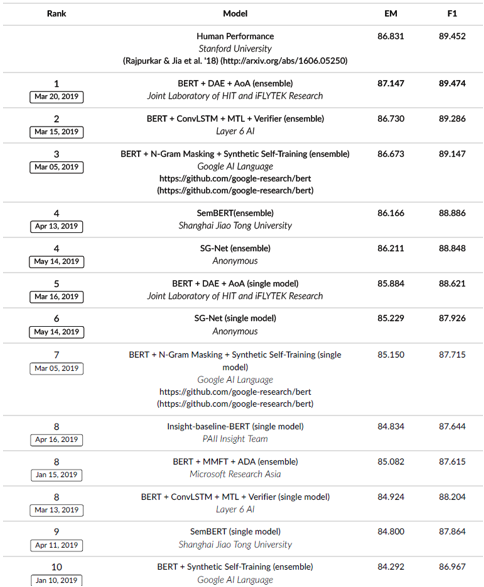
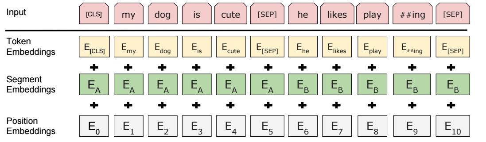
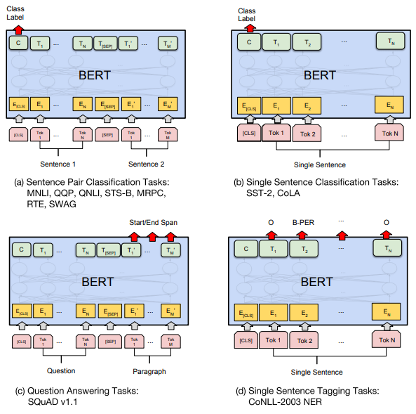
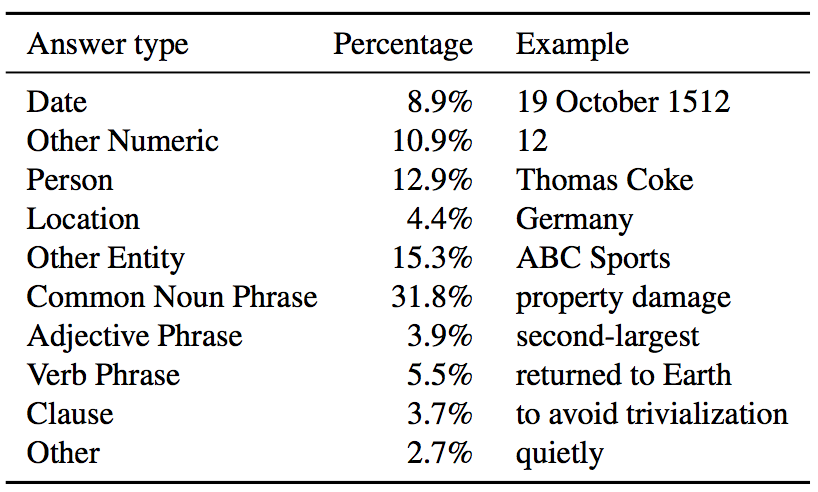
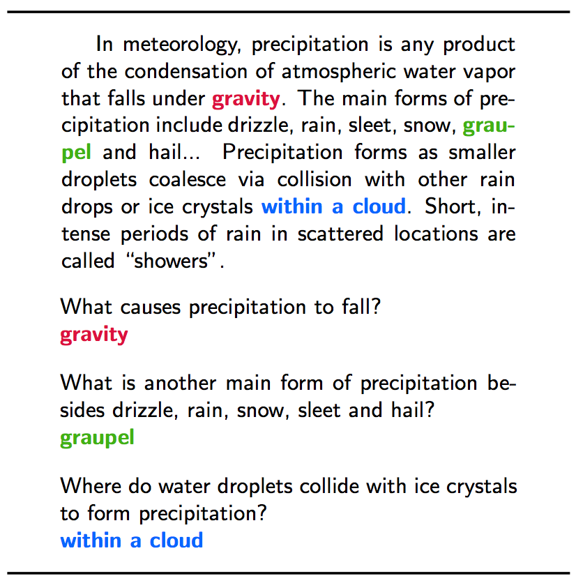
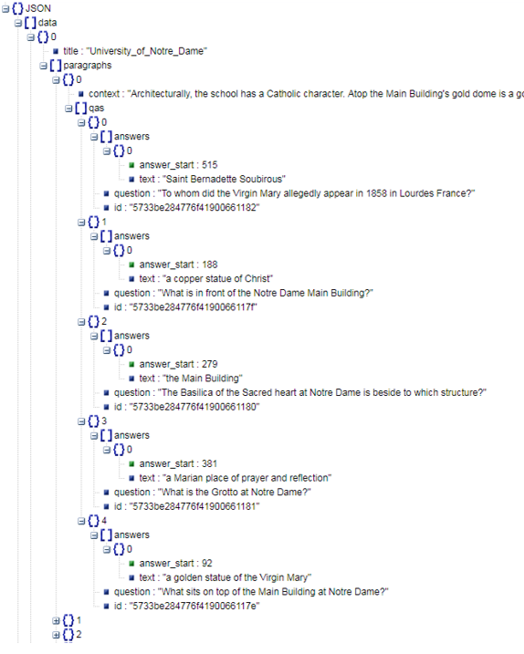

## NLP之一BERT介绍+SQuAD

近年来，AI大火，各行各业都做一些人工智能相关的项目，计算机视觉（CV）领域更一片红海，本人近期倒是对自然语言处理（NLP）起了兴趣。自然语言处理是人工智能最重要的领域之一，也是最困难的领域之一，本人开始着手NLP领域，充满挑战，故决定在此记录下心路历程，也希望能尽量帮助看到的人。

自然语言处理的任务大概可以分为以下几类：

- 词法分析：分词、词性标注、拼写校正等
- 分类任务：文本分类、情感计算等
- 信息抽取：命名实体识别、实体消歧、术语抽取、关系抽取等
- 顶层任务：机器翻译、文本摘要、问答系统、阅读理解等

如果能从小到大一步一步做下去，做出一个自己的siri或者微软小冰，对于学习NLP的人来说会很有成就。看了一些NLP相关的文章和博客后，了解到了一个自然语言处理领域的“大杀器”——谷歌发布的BERT模型。为什么说是“大杀器”？因为它在NLP领域各项任务中效果都特别好。

下面简单介绍BERT模型。

BERT（Bidirectional Encoder Representations from Transformers）是在2018年10月发布的论文[《BERT:Pre-training of Deep Bidirectional Transformers for Language Understanding》](https://arxiv.org/pdf/1810.04805.pdf)中提出。一出手就刷新了自然语言处理任务的11项记录，现在看也基本上是霸榜，比如行业内公认的机器阅读理解领域的顶级水平测试——[SQuAD](https://rajpurkar.github.io/SQuAD-explorer/)（Stanford Question Answering Dataset），前二十名有16个都用上了BERT模型，最高的成绩已经超过了人类的水平，最新的榜单如下：

 

BERT的通过联合调节所有层中的双向Transformer来训练预训练深度双向表示，只需要一个额外的输出层来对预训练BERT进行微调就可以满足各种任务，没有必要针对特定任务对模型进行修改，其先进性基于两点：其一，是使用Masked Langauge Model（MLM）和Next Sentense Prediction（NSP）的新预训练任务，两种方法分别捕捉词语和句子级别的representation；其二，是大量数据和计算能力满足BERT的训练强度，BERT训练数据采用了英文的开源语料BooksCropus 以及英文维基百科数据，一共有33亿个词,同时BERT模型的标准版本有1亿的参数量，而BERT的large版本有3亿多参数量。其团队训练一个预训练模型需要在64块TPU芯片上训练4天完成，而一块TPU的速度约是目前主流GPU的7-8倍。

模型开发团队开源了多个预训练模型，以供多种下游任务需求使用。开源的预训练模型如下：

- [BERT-Base, Uncased](https://storage.googleapis.com/bert_models/2018_10_18/uncased_L-12_H-768_A-12.zip): 12-layer, 768-hidden, 12-heads, 110M parameters
- [BERT-Large, Uncased](https://storage.googleapis.com/bert_models/2018_10_18/uncased_L-24_H-1024_A-16.zip): 24-layer, 1024-hidden, 16-heads, 340M parameters
- [BERT-Base, Cased](https://storage.googleapis.com/bert_models/2018_10_18/cased_L-12_H-768_A-12.zip): 12-layer, 768-hidden, 12-heads , 110M parameters
- [BERT-Large, Cased](https://storage.googleapis.com/bert_models/2018_10_18/cased_L-24_H-1024_A-16.zip): 24-layer, 1024-hidden, 16-heads, 340M parameters
- [BERT-Base, Multilingual Cased (New, recommended)](https://storage.googleapis.com/bert_models/2018_11_23/multi_cased_L-12_H-768_A-12.zip): 104 languages, 12-layer, 768-hidden, 12-heads, 110M parameters
- [BERT-Base, Multilingual Uncased (Orig, not recommended)](https://storage.googleapis.com/bert_models/2018_11_03/multilingual_L-12_H-768_A-12.zip)(Not recommended, use Multilingual Cased instead): 102 languages, 12-layer, 768-hidden, 12-heads, 110M parameters
- [BERT-Base, Chinese](https://storage.googleapis.com/bert_models/2018_11_03/chinese_L-12_H-768_A-12.zip): Chinese Simplified and Traditional, 12-layer, 768-hidden, 12-heads, 110M parameters

前4个是英文模型，Multilingual 是多语言模型，最后一个是中文模型（居然有单独中文的模型，中文最酷！）。其中 Uncased 是字母全部转换成小写，而Cased是保留了大小写。

BERT的输入部分是个线性序列，句子通过分隔符分割，句前和句后分别增加两个标识符号[CLS]和[SEP]，如下图：
 
 

- **token embeddings**：词向量，将各个词转换成固定维度的向量。在BERT中，每个词会被转换成768维的向量表示。输入文本在送入token embeddings 层之前要先进行tokenization处理。在目前的BERT模型中，文章作者还将英文词汇作进一步切割，划分为更细粒度的语义单位（WordPiece），例如：将playing分割为play和##ing。对于中文，目前作者尚未对输入文本进行分词，而是直接将单字作为构成文本的基本单位。

- **position embeddings**：位置向量，表示位置信息，由于词顺序是很重要的特征，出现在文本不同位置的字/词所携带的语义信息存在差异（比如：“我爱你”和“你爱我”），因此，BERT模型对不同位置的字/词分别附加一个不同的向量以作区分。

- **segment embeddings**：文本向量，用来区别两种句子，只有两种向量表示。前一个向量是把0赋给第一个句子中的各个token, 后一个向量是把1赋给第二个句子中的各个token。如果输入仅仅只有一个句子，那么它的segment embedding就是全0。

最后，BERT模型将字向量、文本向量和位置向量的加和作为模型输入。

BERT能够处理最长512个token的输入序列。论文作者通过让BERT在各个位置上学习一个向量表示来讲序列顺序的信息编码进来。这意味着Position Embeddings layer 实际上就是一个大小为 (512, 768) 的lookup表，表的第一行是代表第一个序列的第一个位置，第二行代表序列的第二个位置，以此类推。因此，如果有这样两个句子“Hello world” 和“Hi there”, “Hello” 和“Hi”会由完全相同的position embeddings，因为他们都是句子的第一个词。同理，“world” 和“there”也会有相同的position embedding。

### BERT预训练的两个重要步骤

#### Masked语言模型

为了训练深度双向语言表示向量，作者用了一个非常直接的方式，遮住句子里某些单词，让编码器预测这个单词是什么。

训练方法为：

1）80%的单词用***[MASK]*** token来代替

&nbsp;&nbsp;&nbsp;&nbsp;&nbsp;&nbsp;my dog is ***hairy*** → my dog is ***[MASK]***

2）10%单词用任意的词来进行代替

&nbsp;&nbsp;&nbsp;&nbsp;&nbsp;&nbsp;my dog is ***hairy*** → my dog is ***apple***

3）10%单词不变

&nbsp;&nbsp;&nbsp;&nbsp;&nbsp;&nbsp;my dog is ***hairy*** → my dog is ***hairy***

作者在论文中提到这样做的好处是，编码器不知道哪些词需要预测的，哪些词是错误的，因此被迫需要学习每一个token的表示向量。另外作者表示，每个batchsize只有15%的词被遮盖的原因，是性能开销。双向编码器比单项编码器训练要慢。

#### 预测下一个句子：Next Sentence Prediction（NSP）

预训练一个二分类的模型，来学习句子之间的关系。预测下一个句子的方法对学习句子之间关系很有帮助。
训练方法：正样本和负样本比例是1：1，50%的句子是正样本，随机选择50%的句子作为负样本。

Input = [CLS] the man went to *** [MASK] *** store [SEP] 

&nbsp;&nbsp;&nbsp;&nbsp;&nbsp;&nbsp;&nbsp;&nbsp;&nbsp;&nbsp;&nbsp;&nbsp;he bought a gallon *** [MASK] *** milk [SEP] 

Label = ***IsNext*** 

Input = [CLS] the man *** [MASK] *** to the store [SEP] 

&nbsp;&nbsp;&nbsp;&nbsp;&nbsp;&nbsp;&nbsp;&nbsp;&nbsp;&nbsp;&nbsp;&nbsp;penguin *** [MASK] *** are flight ##less birds [SEP] 

Label = ***NotNext***

由于BERT强大的普适性，对于不同的下游任务，BERT都可以通过改造输入输出来处理。


 
(a) 对于句子关系类任务：MultiNLI文本蕴含识别（M推理出N，蕴含/矛盾/中立），QQP（文本匹配），QNLI（自然语言问题推理），STS-B（语义文本相似度1-5），MRPC（微软研究释义语料库，判断文本对语音信息是否等价）、RTE（同MNLI，小数据），SWAG（113k多项选择问题组成的数据集，涉及丰富的基础情境）。加上一个起始和终结符号，句子之间加个分隔符即可。对于输出来说，把第一个起始符号对应的Transformer最后一层位置上面串接一个softmax分类层即可。

(b) 对于分类问题：SST-2（斯坦福情感分类树），CoLA（语言可接受性预测）。只需要增加起始和终结符号，输出部分和句子关系判断任务类似改造。

(c) 对于阅读理解问题：SQuAD（斯坦福问答数据集）。就只需要加softmax输出层。

(d) 对于序列标注问题：CoNLL-2003 NER（命名实体识别数据）。输入部分和单句分类是一样的，只需要输出部分Transformer最后一层每个单词对应位置都进行分类即可。

从这里可以看出，上面列出的NLP四大任务里面，除了生成类任务外，BERT其它都覆盖到了，而且改造起来很简单直观，根据任务选择不同的预训练数据初始化encoder和decoder即可。当然，也可以更简单一点，比如直接在单个Transformer结构上加装隐层产生输出也是可以的。不论如何，从这里可以看出，NLP四大类任务都可以比较方便地改造成Bert能够接受的方式。这其实是Bert的非常大的优点，这意味着它几乎可以做任何NLP的下游任务。

理论知识介绍到这，下面来动手操作，上手跑实验是熟悉模型的最有效的方法。

Google AI Research在[github](https://github.com/google-research/bert)上发布了BERT的相关代码。主要程序如下：
 


其中**run_squad.py**为BERT在SQuAD数据集上问答模型的程序，首先来运行一下这个程序。

### 关于SQuAD数据集

[SQuAD](https://rajpurkar.github.io/SQuAD-explorer/)（Stanford Question Answering Dataset）语料库为斯坦福大学的Rajpurkar等人于2016年在自然语言处理的顶级会议[EMNLP](https://www.aclweb.org/mirror/emnlp2016/)（Empirical Methods in Natural Language Processing）上发布，是行业内公认的机器阅读理解领域的顶级水平测试，给定一篇文章，准备相应问题，需要算法给出问题的答案。此数据集所有文章选自维基百科，数据集的量为当今其他数据集(例如，WikiQA)的几十倍之多。


#### 数据集的具体构建如下

1.	文章是随机选取的wiki百科，一共有536篇wiki被选中。而每篇wiki，会被切成段落，最终生成了23215个自然段。之后就对这23215个自然段进行阅读理解，对提出的107,785个问题进行自动问答。

2.	之后斯坦福利用众包的方式，进行了给定文章，提问题并给答案的人工标注。将两万多个段落给不同标注人员，要求对每个段落提五个问题。

3.	让另一些标注人员对提的这个问题用文中最短的片段给予答案，如果不会或者答案没有在文章中出现可以不给。之后经过验证，标注人员所提的问题在问题类型分布上足够多样，并且有很多需要推理的问题，也就意味着这个集合十分有难度。如下图所示，作者列出了该数据集答案的类别分布，我们可以看到19.8%的答案为日期和其他数字类；有32.6%的答案为三种不同类型的专有名词：人名、地名以及其它实体对象；31.8%为名词短语；其余15.8%由形容词短语、动词短语、从句和其它类型组成，各类别且比例相当。


 
4.	这个数据集的评测标准有两个，第一：F1（模糊匹配），第二：EM（Exact Match，完全匹配）。EM表示必须机器给出的和人给出的一样才算正确。哪怕有一个字母不一样，也会算错。而F1是将答案的短语切成词，和人的答案一起算recall，Precision和F1，即如果匹配了一些词但不全对，仍然算分。
下图为SQuAD语料库中的一个原文-问题-答案样本。
 
 

### 准备数据集

在本实践中，主要使用较小的SQuAD v1.1数据集，所需训练集和验证集可以在此下载：

- [train-v1.1.json](https://rajpurkar.github.io/SQuAD-explorer/dataset/train-v1.1.json)
- [dev-v1.1.json](https://rajpurkar.github.io/SQuAD-explorer/dataset/dev-v1.1.json)

该训练集和验证集JSON文件解析示例如下：
 
 


### 预训练模型

为方便教学，本案例使用**BERT-Base,Uncased**预训练模型。从链接[BERT-Base, Uncased](https://storage.googleapis.com/bert_models/2018_10_18/uncased_L-12_H-768_A-12.zip)下载解压后得到如下预训练模型文件

- bert_config.json
- bert_model.ckpt.data-00000-of-00001
- bert_model.ckpt.index
- bert_model.ckpt.meta
- vocab.txt

其中
* 一个config file(bert_config.json) ：存储预训练模型超参数
* 三个tensorflow checkpoint (bert_model.ckpt) ：包含预训练模型checkpoint
* 一个vocab文件(vocab.txt)：将WordPiece映射成word id  

BERT所需条件：

tensorflow >= 1.11.0   

tensorflow-gpu  >= 1.11.0 

**在此推荐选择使用华为的AI深度学习开发平台**[**ModelArts**](https://support.huaweicloud.com/modelarts/index.html)

**链接：https://support.huaweicloud.com/modelarts/index.html**

下面开始真正动手，在ModelArts里运行基于SQuAD语料的阅读理解任务。

可以自行下载上面列出的所需预训练模型、BERT代码和数据集，也可以直接到[**这里（SQUAD-BERT）**](https://github.com/huaweicloud/ModelArts-Lab/blob/master/%E7%BB%BC%E5%90%88AI%E5%BC%80%E5%8F%91%E6%A1%88%E4%BE%8B/SQUAD-BERT/SQUAD-BERT.ipynb)，不需要手动下载,直接按照流程运行notebook即可。

下载好预训练模型、BERT代码、数据集，形成如下文件夹结构：

```bash
squad
 ├── bert
 │       ├── modeling.py
 │       ├── optimization.py
 │       ├── run_squad.py
 │       └── tokenization.py
 │
 ├── uncased_L-12_H-768_A-12
 │       ├──bert_config.json
 │       ├──bert_model.ckpt.data-00000-of-00001
 │       ├──bert_model.ckpt.index
 │       ├──bert_model.ckpt.meta
 │       └──vocab.txt
 ├── data
 │       ├── train-v1.1.json  
 │       └── dev-v1.1.json
 ├── src
 │       └── evaluate-v1.1.py 
 └── output
```

然后就可以运行run_squad.py文件，如下。

```
python squad/bert/run_squad.py \
  --vocab_file=./squad/uncased_L-12_H-768_A-12/vocab.txt \
  --bert_config_file=./squad/uncased_L-12_H-768_A-12/bert_config.json \
  --init_checkpoint=./squad/uncased_L-12_H-768_A-12/bert_model.ckpt \
  --do_train=True \
  --train_file=./squad/data/train-v1.1.json \
  --do_predict=True \
  --predict_file=./squad/data/dev-v1.1.json \
  --train_batch_size=12 \
  --learning_rate=3e-5 \
  --num_train_epochs=2.0 \
  --max_seq_length=384 \
  --doc_stride=128 \
  --output_dir=./squad/output/
```  

训练时间比较长，运行时可以看到BERT处理输入段落的例子：

```
INFO:tensorflow:*** Example ***
INFO:tensorflow:unique_id: 1000000000
INFO:tensorflow:example_index: 0
INFO:tensorflow:doc_span_index: 0
INFO:tensorflow:tokens: [CLS] where was the second anti - labor party held in 1944 ? [SEP] men ##zie ##s called a conference of conservative parties and other groups opposed to the ruling australian labor party , which met in canberra on 13 october 1944 and again in al ##bury , new south wales in december 1944 . from 1942 onward men ##zie ##s had maintained his public profile with his series of " the forgotten people " radio talks – similar to franklin d . roosevelt ' s " fires ##ide chat ##s " of the 1930s – in which he spoke of the middle class as the " backbone of australia " but as nevertheless having been " taken for granted " by political parties . [SEP]
INFO:tensorflow:token_to_orig_map: 14:0 15:0 16:0 17:1 18:2 19:3 20:4 21:5 22:6 23:7 24:8 25:9 26:10 27:11 28:12 29:13 30:14 31:15 32:16 33:16 34:17 35:18 36:19 37:20 38:21 39:22 40:23 41:24 42:25 43:26 44:27 45:28 46:28 47:28 48:29 49:30 50:31 51:32 52:33 53:34 54:34 55:35 56:36 57:37 58:38 59:38 60:38 61:39 62:40 63:41 64:42 65:43 66:44 67:45 68:46 69:47 70:48 71:48 72:49 73:50 74:50 75:51 76:52 77:52 78:52 79:53 80:54 81:55 82:55 83:56 84:56 85:56 86:57 87:57 88:57 89:58 90:58 91:58 92:59 93:60 94:61 95:61 96:61 97:62 98:63 99:64 100:65 101:66 102:67 103:68 104:69 105:70 106:71 107:71 108:72 109:73 110:73 111:74 112:75 113:76 114:77 115:78 116:79 117:79 118:80 119:81 120:81 121:82 122:83 123:84 124:84
INFO:tensorflow:token_is_max_context: 14:True 15:True 16:True 17:True 18:True 19:True 20:True 21:True 22:True 23:True 24:True 25:True 26:True 27:True 28:True 29:True 30:True 31:True 32:True 33:True 34:True 35:True 36:True 37:True 38:True 39:True 40:True 41:True 42:True 43:True 44:True 45:True 46:True 47:True 48:True 49:True 50:True 51:True 52:True 53:True 54:True 55:True 56:True 57:True 58:True 59:True 60:True 61:True 62:True 63:True 64:True 65:True 66:True 67:True 68:True 69:True 70:True 71:True 72:True 73:True 74:True 75:True 76:True 77:True 78:True 79:True 80:True 81:True 82:True 83:True 84:True 85:True 86:True 87:True 88:True 89:True 90:True 91:True 92:True 93:True 94:True 95:True 96:True 97:True 98:True 99:True 100:True 101:True 102:True 103:True 104:True 105:True 106:True 107:True 108:True 109:True 110:True 111:True 112:True 113:True 114:True 115:True 116:True 117:True 118:True 119:True 120:True 121:True 122:True 123:True 124:True
INFO:tensorflow:input_ids: 101 2073 2001 1996 2117 3424 1011 4450 2283 2218 1999 3646 1029 102 2273 14272 2015 2170 1037 3034 1997 4603 4243 1998 2060 2967 4941 2000 1996 6996 2827 4450 2283 1010 2029 2777 1999 13107 2006 2410 2255 3646 1998 2153 1999 2632 4917 1010 2047 2148 3575 1999 2285 3646 1012 2013 3758 15834 2273 14272 2015 2018 5224 2010 2270 6337 2007 2010 2186 1997 1000 1996 6404 2111 1000 2557 7566 1516 2714 2000 5951 1040 1012 8573 1005 1055 1000 8769 5178 11834 2015 1000 1997 1996 5687 1516 1999 2029 2002 3764 1997 1996 2690 2465 2004 1996 1000 21505 1997 2660 1000 2021 2004 6600 2383 2042 1000 2579 2005 4379 1000 2011 2576 4243 1012 102 0 0 0 0 0 0 0 0 0 0 0 0 0 0 0 0 0 0 0 0 0 0 0 0 0 0 0 0 0 0 0 0 0 0 0 0 0 0 0 0 0 0 0 0 0 0 0 0 0 0 0 0 0 0 0 0 0 0 0 0 0 0 0 0 0 0 0 0 0 0 0 0 0 0 0 0 0 0 0 0 0 0 0 0 0 0 0 0 0 0 0 0 0 0 0 0 0 0 0 0 0 0 0 0 0 0 0 0 0 0 0 0 0 0 0 0 0 0 0 0 0 0 0 0 0 0 0 0 0 0 0 0 0 0 0 0 0 0 0 0 0 0 0 0 0 0 0 0 0 0 0 0 0 0 0 0 0 0 0 0 0 0 0 0 0 0 0 0 0 0 0 0 0 0 0 0 0 0 0 0 0 0 0 0 0 0 0 0 0 0 0 0 0 0 0 0 0 0 0 0 0 0 0 0 0 0 0 0 0 0 0 0 0 0 0 0 0 0 0 0 0 0 0 0 0 0 0 0 0 0 0 0 0 0 0 0 0 0 0 0 0 0 0 0 0 0 0 0 0 0 0 0 0 0 0 0 0 0
INFO:tensorflow:input_mask: 1 1 1 1 1 1 1 1 1 1 1 1 1 1 1 1 1 1 1 1 1 1 1 1 1 1 1 1 1 1 1 1 1 1 1 1 1 1 1 1 1 1 1 1 1 1 1 1 1 1 1 1 1 1 1 1 1 1 1 1 1 1 1 1 1 1 1 1 1 1 1 1 1 1 1 1 1 1 1 1 1 1 1 1 1 1 1 1 1 1 1 1 1 1 1 1 1 1 1 1 1 1 1 1 1 1 1 1 1 1 1 1 1 1 1 1 1 1 1 1 1 1 1 1 1 1 0 0 0 0 0 0 0 0 0 0 0 0 0 0 0 0 0 0 0 0 0 0 0 0 0 0 0 0 0 0 0 0 0 0 0 0 0 0 0 0 0 0 0 0 0 0 0 0 0 0 0 0 0 0 0 0 0 0 0 0 0 0 0 0 0 0 0 0 0 0 0 0 0 0 0 0 0 0 0 0 0 0 0 0 0 0 0 0 0 0 0 0 0 0 0 0 0 0 0 0 0 0 0 0 0 0 0 0 0 0 0 0 0 0 0 0 0 0 0 0 0 0 0 0 0 0 0 0 0 0 0 0 0 0 0 0 0 0 0 0 0 0 0 0 0 0 0 0 0 0 0 0 0 0 0 0 0 0 0 0 0 0 0 0 0 0 0 0 0 0 0 0 0 0 0 0 0 0 0 0 0 0 0 0 0 0 0 0 0 0 0 0 0 0 0 0 0 0 0 0 0 0 0 0 0 0 0 0 0 0 0 0 0 0 0 0 0 0 0 0 0 0 0 0 0 0 0 0 0 0 0 0 0 0 0 0 0 0 0 0 0 0 0 0 0 0 0 0 0 0 0 0 0 0 0 0 0 0
INFO:tensorflow:segment_ids: 0 0 0 0 0 0 0 0 0 0 0 0 0 0 1 1 1 1 1 1 1 1 1 1 1 1 1 1 1 1 1 1 1 1 1 1 1 1 1 1 1 1 1 1 1 1 1 1 1 1 1 1 1 1 1 1 1 1 1 1 1 1 1 1 1 1 1 1 1 1 1 1 1 1 1 1 1 1 1 1 1 1 1 1 1 1 1 1 1 1 1 1 1 1 1 1 1 1 1 1 1 1 1 1 1 1 1 1 1 1 1 1 1 1 1 1 1 1 1 1 1 1 1 1 1 1 0 0 0 0 0 0 0 0 0 0 0 0 0 0 0 0 0 0 0 0 0 0 0 0 0 0 0 0 0 0 0 0 0 0 0 0 0 0 0 0 0 0 0 0 0 0 0 0 0 0 0 0 0 0 0 0 0 0 0 0 0 0 0 0 0 0 0 0 0 0 0 0 0 0 0 0 0 0 0 0 0 0 0 0 0 0 0 0 0 0 0 0 0 0 0 0 0 0 0 0 0 0 0 0 0 0 0 0 0 0 0 0 0 0 0 0 0 0 0 0 0 0 0 0 0 0 0 0 0 0 0 0 0 0 0 0 0 0 0 0 0 0 0 0 0 0 0 0 0 0 0 0 0 0 0 0 0 0 0 0 0 0 0 0 0 0 0 0 0 0 0 0 0 0 0 0 0 0 0 0 0 0 0 0 0 0 0 0 0 0 0 0 0 0 0 0 0 0 0 0 0 0 0 0 0 0 0 0 0 0 0 0 0 0 0 0 0 0 0 0 0 0 0 0 0 0 0 0 0 0 0 0 0 0 0 0 0 0 0 0 0 0 0 0 0 0 0 0 0 0 0 0 0 0 0 0 0 0
INFO:tensorflow:start_position: 45
INFO:tensorflow:end_position: 50
INFO:tensorflow:answer: al ##bury , new south wales
```
运行成功后，在output文件夹下会输出一个predictions.json文件，执行src目录下的
[evaluate-v1.1.py](https://github.com/allenai/bi-att-flow/blob/master/squad/evaluate-v1.1.py)文件，可以得到验证集的预测指标，如下：

```
%run squad/src/evaluate-v1.1.py squad/data/dev-v1.1.json squad/output/predictions.json
```

得到结果

```
{"exact_match": 81.18259224219489, "f1": 88.52935610221716}
```

输出验证集的第一个问题所在**文章标题、段落、问题、标准答案**，并输出预测的答案，如下：

```
题目: Super_Bowl_50
段落: Super Bowl 50 was an American football game to determine the champion of the National Football League (NFL) for the 2015 season. The American Football Conference (AFC) champion Denver Broncos defeated the National Football Conference (NFC) champion Carolina Panthers 24–10 to earn their third Super Bowl title. The game was played on February 7, 2016, at Levi's Stadium in the San Francisco Bay Area at Santa Clara, California. As this was the 50th Super Bowl, the league emphasized the "golden anniversary" with various gold-themed initiatives, as well as temporarily suspending the tradition of naming each Super Bowl game with Roman numerals (under which the game would have been known as "Super Bowl L"), so that the logo could prominently feature the Arabic numerals 50.
问题: Which NFL team represented the AFC at Super Bowl 50?
答案: [{'answer_start': 177, 'text': 'Denver Broncos'}, {'answer_start': 177, 'text': 'Denver Broncos'}, {'answer_start': 177, 'text': 'Denver Broncos'}]

预测答案: Denver Broncos
```

这样，第一个使用BERT模型的程序就运行成功。接下来本系列文章会深入使用BERT模型进行各种自然语言处理任务，敬请期待。
